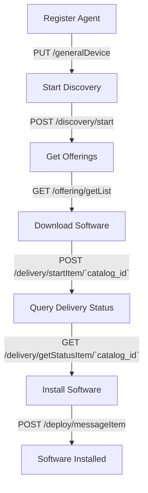

import ApiLogo from "@theme/ApiLogo";
import SchemaTabs from "@theme/SchemaTabs";
import TabItem from "@theme/TabItem";
import Export from "@theme/ApiExplorer/Export";

  Version: 0.5

<h1
  className={"openapi__heading"}
>
  GetApp Agent REST-API
</h1>

# Agent API Documentation

The Agent API allows you to manage software and maps. To activate the agent, you first need to register it by calling the appropriate API endpoint.

## Registration

To register the agent, use the following API call:

### Register Agent

**Endpoint**: `PUT /generalDevice`

**Description**: Registers the agent by providing the necessary platform and formation information.

## Software Management

### Discovery

To provide your software, start the discovery process:

**Endpoint**: `POST /discovery/start`

**Description**: Initiates the discovery of available software and updates.

### Get Offerings

To see all available software and updates:

**Endpoint**: `GET /offering/getList`

**Description**: Retrieves a list of all available software and updates.

### Download Software

When you decide to download a software update, use the following API call:

**Endpoint**: `POST /delivery/startItem/{catalog_id}`

**Description**: Starts the download of the specified software update.

### Query Delivery Status

To query the delivery status of a software update:

**Endpoint**: `GET /delivery/getStatusItem/{catalog_id}`

**Description**: Retrieves the status of the specified software update download.

**Parameters**:
- `catalog_id`: The ID of the catalog item to check the status for.

### Install Software

When the download is finished, install the software using the following API call:

**Endpoint**: `POST /deploy/messageItem/`

**Description**: Initiates the installation of the downloaded software.

**Parameters**:
- `deployStatus`: Set this to "Start" to begin the installation.

## Flow Diagram

Here is a visual representation of the flow:

  <h3
    style={{"marginBottom":"0.25rem"}}
  >
    License
  </h3>

      