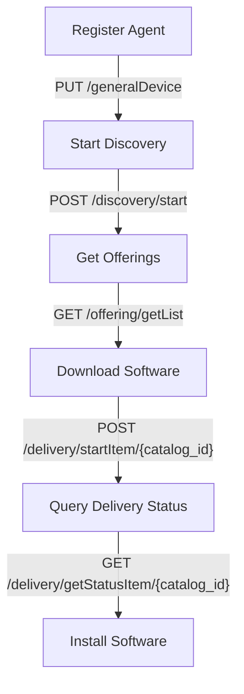
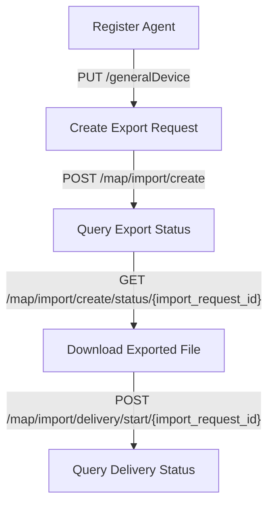

# GetApp Agent Documentation

Welcome to the documentation for the GetApp Agent API, which provides functionalities for managing software updates and exporting maps.

## Registration

To activate the agent, you must first register it by calling the appropriate API endpoint.

### Register Agent

**Endpoint**: `PUT /generalDevice`

**Description**: Registers the agent by providing necessary platform and formation information.

[View OpenAPI Docs](/docs/agent/update-general-device)

## Software Management

### Software Discovery

Initiate the discovery process to find available software updates.

**Endpoint**: `POST /discover/component`

**Description**: Starts the discovery of available software and updates.

[View OpenAPI Docs](/docs/agent/discover-comp)

### Get Software Offerings

Retrieve a list of all available software and updates.

**Endpoint**: `GET /offering/getList`

**Description**: Retrieves a list of available software and updates.

[View OpenAPI Docs](/docs/agent/get-offering)

### Download Software Update

Start downloading a specific software update identified by `catalog_id`.

**Endpoint**: `POST /delivery/startItem/{catalog_id}`

**Description**: Initiates the download of the specified software update.

[View OpenAPI Docs](/docs/agent/start-delivery)

### Query Delivery Status

Check the delivery status of a software update download.

**Endpoint**: `GET /delivery/getStatusItem/{catalog_id}`

**Description**: Retrieves the status of the specified software update download.

**Parameters**:
- `catalog_id`: ID of the software update to check.

[View OpenAPI Docs](/docs/agent/get-delivery-status)

### Install Software

Initiate the installation of downloaded software.

**Endpoint**: `POST /deploy/messageItem/`

**Description**: Initiates the installation of downloaded software.

**Parameters**:
- `deployStatus`: Set to "Start" to begin installation.

[View OpenAPI Docs](/docs/agent/deploy-message)

## Flow Diagram

Here is a visual representation of the workflows for software management:

   
## Map Export Process

The Map Export API allows exporting maps in GeoPackage (GPKG) format.

### Create Export Request

Initiate the export of a map by providing the bounding box or footprint.

**Endpoint**: `POST /map/import/create`

**Description**: Initiates the export of a map by specifying the bounding box or footprint.

[View OpenAPI Docs](/docs/agent/map-import-create)

### Query Export Status

Retrieve the status of a map export request.

**Endpoint**: `GET /map/import/create/status/{import_request_id}`

**Description**: Retrieves the status of the specified map export request.

**Parameters**:
- `import_request_id`: ID of the map export request.

[View OpenAPI Docs](/docs/agent/get-map-create-status)

### Download Exported File

Initiate the download of the exported map file.

**Endpoint**: `POST /map/import/delivery/start/{import_request_id}`

**Description**: Initiates the download of the exported map file for a specific request.

**Parameters**:
- `import_request_id`: ID of the map export request.

[View OpenAPI Docs](/docs/agent/get-map-delivery-start)

### Query Delivery Status

Check the delivery status of the exported map file.

**Endpoint**: `GET /map/import/delivery/status/{import_request_id}`

**Description**: Retrieves the delivery status of the exported map file for a specific request.

**Parameters**:
- `import_request_id`: ID of the map export request.

[View OpenAPI Docs](/docs/agent/get-map-delivery-status)

## Flow Diagram

Here is a visual representation of the workflows for map export:

