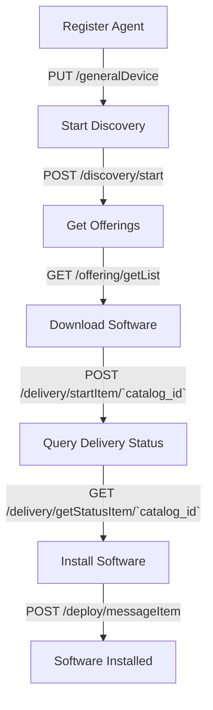
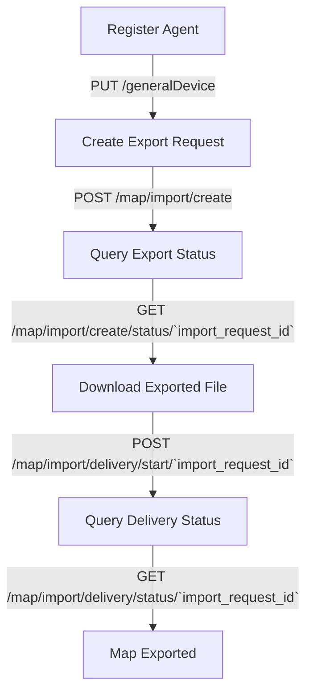

# GetApp Agent

The Agent API allows you to manage software and maps.

# Registration

To activate the agent, you first need to register it by calling the appropriate API endpoint.

### Register Agent

**Endpoint**: `PUT /generalDevice`

**Description**: Registers the agent by providing the necessary platform and formation information.

[View OpenAPI Docs](/docs/agent/update-general-device)

# Software Management

### Discovery

To provide your software, start the discovery process:

**Endpoint**: `POST /discovery/start`

**Description**: Initiates the discovery of available software and updates.

[View OpenAPI Docs](/docs/agent/start-discovery)

### Get Offerings

To see all available software and updates:

**Endpoint**: `GET /offering/getList`

**Description**: Retrieves a list of all available software and updates.

[View OpenAPI Docs](/docs/agent/get-offering)

### Download Software

When you decide to download a software update, use the following API call:

**Endpoint**: `POST /delivery/startItem/{catalog_id}`

**Description**: Starts the download of the specified software update.

[View OpenAPI Docs](/docs/agent/start-delivery)

### Query Delivery Status

To query the delivery status of a software update:

**Endpoint**: `GET /delivery/getStatusItem/{catalog_id}`

**Description**: Retrieves the status of the specified software update download.

**Parameters**:
- `catalog_id`: The ID of the catalog item to check the status for.

[View OpenAPI Docs](/docs/agent/get-delivery-status)

### Install Software

When the download is finished, install the software using the following API call:

**Endpoint**: `POST /deploy/messageItem/`

**Description**: Initiates the installation of the downloaded software.

**Parameters**:
- `deployStatus`: Set this to "Start" to begin the installation.

[View OpenAPI Docs](/docs/agent/deploy-message)

## Flow Diagram

Here is a visual representation of the flow:

  

# Map Export Process

The Map Export API allows you to export maps in a GeoPackage (GPKG) format. The process involves several steps, starting with initiating the export request and ending with downloading the exported file.

### Create Export Request

To start the export process, use the following API call:

**Endpoint**: `POST /map/import/create`

**Description**: Initiates the export of a map by providing the bounding box or footprint.

**Parameters**:
- `boundingBox`: The bounding box of the area to export, in string format.
- `footprint`: The footprint of the area to export, in string format.

[View OpenAPI Docs](/docs/agent/map-import-create)

### Query Export Status

To check the status of the export request, use the following API call:

**Endpoint**: `GET /map/import/create/status/{import_request_id}`

**Description**: Retrieves the status of the specified export request.

**Parameters**:
- `import_request_id`: The ID of the export request to check the status for.

[View OpenAPI Docs](/docs/agent/get-map-create-status)

### Download Exported File

Once the export is complete, download the file using the following API call:

**Endpoint**: `POST /map/import/delivery/start/{import_request_id}`

**Description**: Initiates the download of the exported map file.

**Parameters**:
- `import_request_id`: The ID of the export request to download the file for.

[View OpenAPI Docs](/docs/agent/get-map-delivery-start)

### Query Delivery Status

To check the delivery status of the exported file, use the following API call:

**Endpoint**: `GET /map/import/delivery/status/{import_request_id}`

**Description**: Retrieves the status of the file download for the specified export request.

**Parameters**:
- `import_request_id`: The ID of the export request to check the delivery status for.

[View OpenAPI Docs](/docs/agent/get-map-delivery-status)

## Flow Diagram

Here is a visual representation of the map export process:

