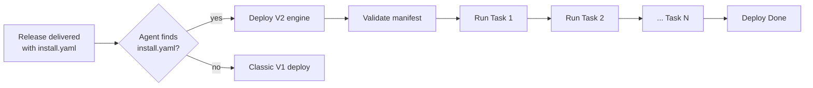
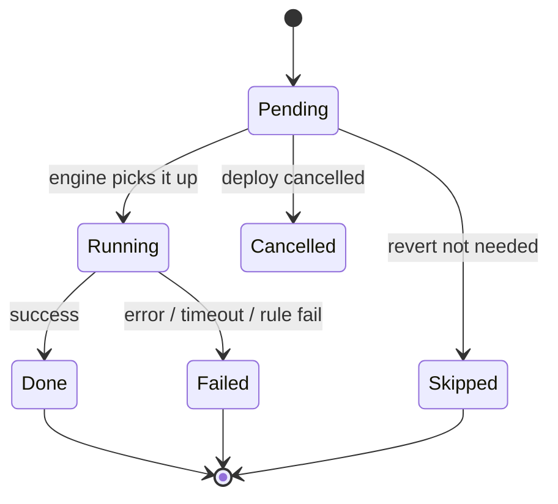
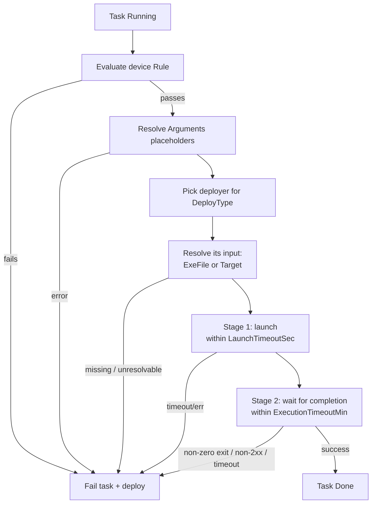
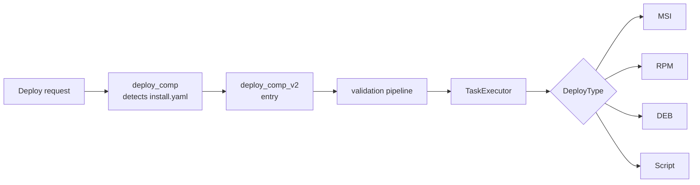
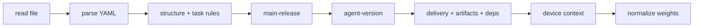

# Deploy V2 — Manifest-Driven Deployment

Deploy V2 lets a release describe **how it installs itself** with a small YAML file — `install.yaml` —
that ships inside the release. Instead of the agent applying one fixed recipe per package type
("this is an MSI, so run msiexec"), the release now carries an **ordered list of tasks**: install
this file, then run that script, but first make sure the device qualifies, and only after a required
companion release is installed. The agent reads the manifest, validates it end-to-end, and executes
the tasks one by one.

This page has two tracks:

- **Part A — Product overview**: what Deploy V2 is and why it matters, in plain terms.
- **Part B — Developer guide**: everything you need to author, validate, and debug a real
  `install.yaml`.

It starts broad and shallow, then goes progressively deeper.

:::info When does it activate?
Deploy V2 turns on **automatically** the moment a delivered release contains an `install.yaml` in its
artifacts directory. Releases without one keep using the classic ("V1") deploy path, unchanged.
:::

---

# Part A — Product overview

## What it is

Think of `install.yaml` as a short **to-do list** for one release. Each item on the list is a
**task**. Tasks run **top to bottom, one at a time**. If any task fails, the whole deploy fails and
stops.



The headline capability: **each file/artifact in a release gets its own dedicated deploy task**, with
its own method, arguments, conditions, and timeouts — and the release author controls the **order**
in which those tasks run.

## Why it exists

The classic deploy path had one implicit, hard-coded recipe per package type. That works for a single
file, but real installations often need more:

| Real-world need | Classic deploy (V1) | Deploy V2 |
|---|---|---|
| Install a package **and then** run a post-install script | Not possible in one deploy | Two ordered tasks |
| Give **each file** its own install behavior | One recipe for the whole release | One dedicated task per file |
| Only install on machines that match a condition | External policy only | Per-task rule, evaluated on the device |
| Pass install-time arguments that depend on the device | Static only | `{placeholders}` resolved at runtime |
| Require a companion release to be installed first | Manual, out-of-band | Declared **dependency**, driven automatically |
| Require a minimum agent version | Not enforced | `MinAgentVersion` gate |
| Survive an agent restart mid-install | Restarts from scratch | Resumes from where it stopped |

The core idea: **"how to install this release" becomes data that lives with the release.** One agent
can then install anything a manifest describes, in the right order, with the right guardrails —
without changing the agent.

## What it gives you today

- **Strict, up-front validation** — the whole manifest is checked **before any task runs**: structure,
  task ordering, per-method inputs, and cross-task rules. A bad manifest fails immediately with a
  precise, path-addressed reason (e.g. `Task[1.0.2]: …`) instead of half-installing.
- **A dedicated deploy flow per file/artifact** — each task has its own deploy method, arguments, rule,
  and timeouts.
- **Grouped, nested tasks** — a task can bind a group of child tasks and only completes once they do,
  so related steps succeed or fail as one unit.
- **Verify a step succeeded** — a **verification** task (HTTP, script, or event stream) gates a group:
  the install is not accepted until the check passes.
- **Undo on failure (revert)** — a **revert** task nested in a group cleans up the steps it covers when
  they fail their check, so a failed group does not leave a half-applied install behind.
- **Install *and* uninstall** — dedicated removal methods (MSI / RPM / DEB uninstall, script, or API).
- **Controllable task ordering** — tasks run in the order written.
- **Dependent-deployment control** — a task can install *and drive* another release's full deployment,
  waiting for it to finish before continuing.
- **Device-aware installs** — per-task rules and `{placeholder}` arguments adapt one manifest to many
  devices.
- **Reboot-aware** — a task can declare that it reboots the device and resume correctly afterwards.
- **Actionable status** — a structured status document with per-task progress and machine-readable
  **advisories** (e.g. “reboot required”, “retry with force”) a UI can act on.
- **Resilience** — crash recovery/resume, cancellation, and safe agent self-update.

## What's coming next

The manifest schema reserves a few fields and values for capabilities still on the roadmap, so today's
manifests stay forward-compatible:

- **`Config` and `Map` task types** — apply a named configuration group or a map/data step instead of
  running a file.
- **`DockerCompose` and `Helm`** deploy methods.
- **Orchestrated deployment across multiple devices** — a master agent driving a fleet of child
  agents and tracking each one's task-level progress.

See [Roadmap & the orchestrator](#roadmap--the-orchestrator) for detail.

---

# Part B — Developer guide

## 1. How it works (the mechanism)

### 1.1 Detection & entry

When a deploy is requested for a delivered release, the agent checks the release's artifacts
directory for `install.yaml`:

- **present** → the Deploy V2 engine takes over. It runs its **own** device-type, policy, and rule
  checks internally.
- **absent** → the classic V1 deploy path runs, unchanged.

The V2 deploy is launched asynchronously (it does not block the request) and the deploy record's
status is set to `Start` immediately, so a UI reflects progress right away.

### 1.2 Per-task flow

Each task is one unit of work — install a file, verify a step succeeded, undo one (revert), pull in a
dependency, or group several child tasks. A task carries its own:

- `Type` (what kind of task) and `DeployType` (the method that runs it),
- its input — an `ExeFile` (a delivered artifact) or a `Target` (an endpoint URL or removal handle),
- optional `Rule` (whether this device qualifies),
- optional `Arguments` (with runtime placeholders),
- optional `LaunchTimeoutSec` / `ExecutionTimeoutMin`,
- optionally its own nested `Tasks` — children it runs and waits for (see [§7.2](#72-grouping--nested-tasks)).

That's what makes "a dedicated deploy flow per artifact" possible: each file, check, or step is its
own independently configured task, and related tasks can be grouped so they succeed or fail together.

### 1.3 Task lifecycle & states

Tasks run **in manifest order** (by index). A task that groups child tasks runs those children and
only finishes once they do (see [§7](#7-task-order-nesting--dependencies)); leaf tasks run one at a
time.



| Status | Meaning |
|---|---|
| `Pending` | Not started yet. |
| `Running` | Currently executing. |
| `Done` | Completed successfully. |
| `Failed` | Errored, timed out, or its rule was not satisfied. Fails the whole deploy. |
| `Cancelled` | Skipped because the deploy was cancelled before it started. |
| `Skipped` | A **terminal, successful** state: a `Revert` task whose cleanup was not needed (its target succeeded and verified). It counts as complete for progress and status. |

:::warning Installs are all-or-nothing
An install step never silently “skips ahead”. A rule mismatch, error, or timeout **fails** the task
and the deploy — it does not move on. If a step should only apply to some devices, express that with a
`Rule`: on non-matching devices the deploy fails loudly rather than half-installing. The only task
that ends `Skipped` is a **`Revert`** whose cleanup was not required.
:::

### 1.4 What happens for one Execute task



Each `Execute` task is **two-phase and time-bounded**:

1. **Launch phase** — the process (or API request) must *start* within `LaunchTimeoutSec`.
2. **Execution phase** — it must *finish successfully* (a process exit code `0`, an API `2xx`) within
   `ExecutionTimeoutMin`.

The input a task resolves depends on its `DeployType`: a file installer (`MSI`/`RPM`/`DEB`/`Script`)
locates its delivered **`ExeFile`**; an `API` trigger or a `*_Uninstall` acts on a resolved **`Target`**
(a `*_Uninstall` also accepts an `ExeFile`). If either phase times out, or the process exits non-zero /
the API returns non-2xx, the task fails and the deploy stops.

### 1.5 Crash recovery & resume

Every task's status and timestamps are persisted to the agent database as they change. If the agent
restarts mid-deploy and the same deploy is requested again, the engine reloads saved state, **skips
tasks already `Done`**, and resumes from the first unfinished task. Task *definitions* always come
fresh from the manifest — only *progress* is restored.

### 1.6 Cancellation

Active deploys register a cancellation token. Cancelling marks all not-yet-started tasks `Cancelled`
and stops the chain. For nested dependency deploys, cancelling the parent propagates to the children.

### 1.7 Self-update (installing the agent itself)

When the deployed release **is the agent's own package**, the MSI stops the service and replaces the
running binary — the current process is killed mid-install. The engine handles this: it launches the
installer detached and exits; on the next startup it sees a task stuck in `Running` and reconciles —
if the running version now matches the target, the task is `Done`; otherwise it resets to `Pending`
and retries. No configuration is needed; the engine detects a self-update by matching the release's
project name against the agent's own name.

---

## 2. Why it's designed this way

Understanding the rationale helps you predict behavior in new situations:

| Design choice | Why |
|---|---|
| **Manifest-as-data** (recipe ships with the release) | One agent installs anything; releases evolve without agent releases. |
| **Installs are all-or-nothing** | Deterministic, safe outcome — a mismatched device fails loudly instead of half-installing; the only planned skip is a revert that was not needed. |
| **Strictly ordered, parent-awaits-child** | Predictable, resumable, easy to reason about; a group finishes only when its children do. |
| **Per-task state persisted** | Enables resume after a mid-install restart (critical for self-update). |
| **Dependencies are themselves full V2 manifests** | Recursion reuses one engine — "a plan is a manifest of manifests". |
| **Placeholders resolved on-device at execution time** | One manifest adapts per device instead of being pre-rendered per target. |
| **Single UTF-16LE deploy log** | Agent lines and msiexec's own log read back as one consistent document. |

---

## 3. Where it fits (architecture & dependencies)

### 3.1 Call chain



### 3.2 What Deploy V2 depends on

| Dependency | Role |
|---|---|
| **Delivery** | Artifacts and dependent releases must be delivered and "ready" before deploy. |
| **Rule engine** | Evaluates each task's `Rule` against device metadata/context. |
| **SettingsIO / CONFIG** | Backs `{Config.*}` placeholders, timeout defaults, and `DEPLOY_MAX_DEPENDENCY_DEPTH`. |
| **Deployers** | Runs each task by a method keyed on `DeployType` — MSI/RPM/DEB/Script installs, MSI/RPM/DEB uninstall, and API/SSE handlers. |
| **Database** | Persists per-task state for resume. |
| **SSE** | Pushes live status on every task transition. |

### 3.3 What uses it & the alternative

- **Consumers**: the deploy request path, the UI (status/progress), and — in future — the
  orchestrator.
- **Alternative / boundary**: the classic **V1 deploy** (no `install.yaml`). Detection is automatic;
  the two never mix within one release.

---

## 4. The manifest (YAML reference)

An `install.yaml` has two levels: the **manifest** (top-level) and its **tasks**.

### 4.1 Minimal example

The smallest valid manifest installs a single MSI:

```yaml
ReleaseId: ID.MyApp@1.4.0
Type: Deploy/V2
Tasks:
  - Type: Execute/v2
    DeployType: MSI
    ExeFile: my-app.msi
```

### 4.2 Manifest-level fields

```yaml
ReleaseId: ID.MyApp@1.4.0     # required — must match the release being deployed
Type: Deploy/V2               # required — always exactly "Deploy/V2"
MinAgentVersion: 2.0.0        # optional — minimum agent semver required to run this manifest
Tasks:                        # required — ordered, non-empty list of tasks
  - ...
```

| Field | Required | Description |
|---|---|---|
| `ReleaseId` | ✅ | The release this manifest installs. **Must equal** the catalog id of the release being deployed (guards against a stale/mismatched `install.yaml`). |
| `Type` | ✅ | The manifest kind. Must be the literal `Deploy/V2`. |
| `MinAgentVersion` | ❌ | A semver string. If the running agent is older, the deploy fails before any task runs. Omit to skip. |
| `Tasks` | ✅ | The ordered list of tasks. Must contain at least one. |

:::note Field-name casing
Manifest keys are **PascalCase** (`ReleaseId`, `Type`, `Tasks`). Placeholder **sources** (`Device`,
`Env`, `Config`, `Release`) are matched case-insensitively, but write manifest keys as shown.
:::

### 4.3 Task-level fields

```yaml
Tasks:
  - Type: Execute/v2           # required — the kind of task
    DeployType: MSI            # required — the method used to run it
    ExeFile: my-app.msi        # the delivered artifact to run
    Rule: { ... }              # optional — device must satisfy this or the deploy fails
    Arguments: "/qn PORT=8080" # optional — CLI arguments, may contain {placeholders}
    Weight: 60                 # optional — relative share of the progress bar
    LaunchTimeoutSec: 60       # optional — seconds allowed to *start* the process
    ExecutionTimeoutMin: 15    # optional — minutes allowed to *finish*
```

#### Task types

| `Type` | What it does |
|---|---|
| `Execute/v2` | **Run a thing** — install a file, run a script, call an endpoint, or remove a package. The workhorse task. |
| `Verification/v2` | **Check a step succeeded** — an HTTP, script, or event-stream check that *gates* its group (see [§ Verifying a step](#verifying-a-step)). |
| `Revert/v2` | **Undo a step** — nested cleanup that runs when the step it covers fails (see [§ Reverting a step](#reverting-a-step-undo)). |
| `Group/v2` | **Bind child tasks** — a container that runs no installer of its own; it groups several tasks (and their verification/revert) as one unit (see [§7](#7-task-order-nesting--dependencies)). |
| `Deploy/v2` | **Sub-deploy a dependent release** — delegates a full nested Deploy V2 of another release (see [§7.3](#73-dependencies-on-other-releases)). |
| `Config/v2`, `Map/v2` | Reserved — fail as “unsupported” if used today. |

#### Deploy methods (`DeployType`)

| Group | Values | Used by |
|---|---|---|
| **Install** | `MSI`, `RPM`, `DEB`, `Script`, `API` | `Execute` |
| **Uninstall** | `MSI_Uninstall`, `RPM_Uninstall`, `DEB_Uninstall` | `Execute`, `Revert` |
| **Verify** | `API` (2xx = pass), `Script` (exit 0 = pass), `SSE` (wait for a matching frame) | `Verification` |
| **Removal (revert)** | `MSI_Uninstall` / `RPM_Uninstall` / `DEB_Uninstall`, `Script`, `API` | `Revert` |
| **Reserved** | `DockerCompose`, `Helm` | — |

A **dependency** task looks different — it has `Type: Deploy/v2` and a `ReleaseId`, carrying no
`ExeFile`/`DeployType` (see [§7.3](#73-dependencies-on-other-releases)). A **group** task has
`Type: Group/v2` and a `Tasks` list, carrying no `DeployType`/`ExeFile` of its own.

#### Fields

| Field | Applies to | Description |
|---|---|---|
| `Type` | all | The task kind (table above). |
| `DeployType` | Execute, Verification, Revert | The method that runs the task (table above). Must be compatible with `Type`. |
| `ExeFile` | Execute, Revert (file/uninstall methods) | The delivered artifact to run — an installer, a script, or an uninstaller/package. |
| `Target` | Execute/Verification/Revert (API/SSE/uninstall) | A non-file handle: an endpoint URL (API/SSE) **or** a removal handle — product code / package name (uninstall). May contain `{placeholders}`. |
| `ReleaseId` | Deploy | The dependent release a `Deploy/v2` task sub-deploys. Required, and must **differ** from the manifest `ReleaseId`. |
| `Tasks` | all | A nested list of child tasks this task binds and awaits (see [§7](#7-task-order-nesting--dependencies)). |
| `Rule` | all | A rule-engine condition evaluated on the device right before the task runs. YAML object or inline JSON string. |
| `Arguments` | Execute, Revert | A single CLI argument string for the process. May contain `{placeholders}`. |
| `Message` | Verification (SSE) | The expected object a stream frame must match to pass; string values may be `{placeholders}`. |
| `Method` | Execute/Verification (API) | HTTP method for an API call (default `GET`). |
| `Header` | API / SSE | Request headers map. |
| `Body` | API / SSE | Request body. |
| `Params` | API / SSE | URL query parameters, percent-encoded; may contain `{placeholders}`. |
| `Weight` | all | The task's share of the progress bar **within its sibling list** (see [§8](#8-weights--progress)). |
| `CausesReboot` | Execute | Declares the task reboots the device. Requires a nested `Verification` child (see [§ Reboot tasks](#reboot-tasks)). |
| `Force` | Execute/Revert (uninstall methods) | Forces the removal — e.g. treat “not installed” as success, ignore dependencies. |
| `GraceTimeSec` | Verification (and any retryable task) | Grace window within which a failed run is retried before the task fails. |
| `RetryCount` | retryable tasks | Maximum attempts before failing. |
| `RetryBackoffSec` | retryable tasks | Delay between retries. |
| `LaunchTimeoutSec` | Execute | Time to *launch* before failing. Literal or `{placeholder}`. Default `60`; falls back to `Release.metadata.timeoutLaunch`. |
| `ExecutionTimeoutMin` | Execute + any parent/group | Time to *complete* before it's killed. Literal or `{placeholder}`. Default `15`; falls back to `Release.metadata.timeoutInstallation`. On a parent it bounds the **whole subtree**. |

**Reserved fields** (parsed but ignored today):

| Field | Future task type | Purpose |
|---|---|---|
| `ConfigGroup` | Config | The config group name to apply. |
| `TryRollbackToPrevious` | Revert | Reinstall the previous version before uninstalling. |

---

## 5. Validation & requirements

Before **any** task runs, the whole manifest is validated. A failure at any stage marks the deploy
`Error` and writes the reason to the deploy log. Validation is thorough on purpose: a manifest either
runs cleanly or is rejected up front — it never half-applies.



| Stage | What it checks |
|---|---|
| **read** | `install.yaml` can be read from disk. |
| **parse** | Valid YAML that deserializes into a manifest. |
| **structure + task rules** | `ReleaseId` not empty, `Type` is `Deploy/V2`, `Tasks` non-empty, **every task individually valid**, **task ordering valid** (each `Verification`/`Revert` has a target), **every `Group` non-empty**, and **every rebooting task has a nested `Verification`**. |
| **main-release** | The manifest's `ReleaseId` equals the release being deployed. |
| **agent-version** | Running agent semver ≥ `MinAgentVersion` (skipped if absent/unparsable). |
| **artifacts** | Across the **whole dependency tree**: every release's delivery is `Done` (download **status** and lifecycle **state**) with all its artifacts present on the agent's disk; every task's `ExeFile` exists; every `Deploy/v2` target is a **registered dependency** of its parent (declared in the component catalog), delivered and ready, and is itself a V2 component (ships its own `install.yaml`). |
| **device context** | Device metadata gathered for rule evaluation and placeholder resolution. |
| **normalize weights** | Weights scaled so **each sibling list** sums to 100. |

### 5.1 Per-task input rules

Each task must supply the inputs its method needs:

- **`Execute`** — needs the input for its `DeployType`:
  - a delivered **`ExeFile`** for `MSI` / `RPM` / `DEB` / `Script`;
  - a **`Target`** (endpoint URL) for `API`;
  - a removal handle — **`ExeFile` or `Target`** (product code / package name) — for `*_Uninstall`.
- **`Verification`** — needs a verify `DeployType` (`API` / `Script` / `SSE`). An **`SSE`** verification
  additionally requires a **`Message`** object to match stream frames against. An `API` call's
  `Method`, if given, must be a valid HTTP verb.
- **`Revert`** — needs a removal `DeployType` (`*_Uninstall` / `Script` / `API`) and its handle.
- **`Deploy`** — needs a **`ReleaseId`** that names the dependent release and is **not** the manifest's own.
- **`Group`** — must bind a **non-empty `Tasks`** list.
- `DeployType` must be **compatible** with `Type` (see the deploy-methods table in [§4.3](#43-task-level-fields)).
- A `Rule`, if present, must contain at least one condition (`and` / `or` / `none`).

### 5.2 Task-ordering rules (per sibling list)

A `Verification` or `Revert` only makes sense when it has something to act on. Validation checks this
**within each `Tasks` list** and reports the offending **chain path** (e.g. `Task[1.0.2]`):

- A **`Verification`** child is valid after a preceding **`Execute`** sibling in the same list, **or**
  as a child of an **actionable parent** (an `Execute` — it verifies the parent).
- A **`Revert`** child is valid after a preceding **`Execute`** sibling (or a `Verification` that
  follows one), **or** as a child of an actionable parent.
- A `Verification`/`Revert` with **no preceding `Execute` sibling and a pure-`Group` (or root) parent**
  is **rejected** — it has no target.
- A task that declares **`CausesReboot: true`** must bind a **nested `Verification`** child (a sibling
  verification does not count): after the reboot, that nested check is how the agent confirms the step
  took effect.

**Requirements checklist** — for a manifest to deploy successfully on a device:

- [ ] `ReleaseId` matches the deployed release exactly, and `Type` is `Deploy/V2`.
- [ ] Agent version ≥ `MinAgentVersion` (if set).
- [ ] Every release in the tree has a `Done` delivery (status **and** state) with all its artifacts present on disk.
- [ ] Every task supplies its method's input (`ExeFile` / `Target` / `ReleaseId` / non-empty `Tasks`).
- [ ] Every `Verification`/`Revert` has a target; every `Group` is non-empty; every rebooting task has a nested `Verification`.
- [ ] Every `Deploy/v2` target is a registered dependency of its parent, ready, and ships its own `install.yaml`.
- [ ] Every task's `Rule` passes on the target device, and every `{placeholder}` resolves to a scalar.

---

## 6. Placeholders — dynamic values at runtime

`Arguments` and both timeout fields can contain **placeholders** of the form `{Source.Path}`,
resolved on the device, just before the task runs.

### Syntax

```
{Source.Path}
```

- `Source` — one of `Device`, `Env`, `Config`, `Release` (case-insensitive).
- `Path` — a dotted path into that source.

### The four sources

| Source | Resolves from | Example | Resolves to |
|---|---|---|---|
| `Device` | The device metadata/context tree | `{Device.type}`, `{Device.os.name}` | `Namer`, `windows` |
| `Env` | An OS environment variable | `{Env.COMPUTERNAME}` | the env value |
| `Config` | The agent's runtime `config.yaml` (`SettingsIO`) | `{Config.device.name}` | the configured value |
| `Release` | The release (component) record; metadata under `Release.metadata.*` | `{Release.version}`, `{Release.metadata.timeoutInstallation}` | `1.4.0`, `20` |

### Example

```yaml
Tasks:
  - Type: Execute/v2
    DeployType: MSI
    ExeFile: my-app.msi
    Arguments: "/qn PORT=8080 DEVICE={Device.id} SITE={Config.device.site}"
```

On a device with id `dev-42` and configured site `north`, the resolved command line becomes:

```
/qn PORT=8080 DEVICE=dev-42 SITE=north
```

### Rules & gotchas

- A placeholder must resolve to a **scalar** (string, number, bool). An object/array is an error.
- If a placeholder **cannot** be resolved (missing key, unknown source), resolution fails and the
  task fails — placeholders are never left unresolved in the string.
- Timeout fields accept a literal **or** a placeholder:

  ```yaml
  LaunchTimeoutSec: 90
  ExecutionTimeoutMin: "{Release.metadata.timeoutInstallation}"
  ```

- When a timeout field is **omitted**, the engine uses, in order: the release-metadata default
  (`Release.metadata.timeoutLaunch` / `Release.metadata.timeoutInstallation`), then the built-in
  default (`60` s to launch, `15` min to complete).

---

## 7. Task order, nesting & dependencies

### 7.1 Ordering within a list

Tasks in a list run **in the order written**. Task 2 starts only after Task 1 is `Done`.

```yaml
Tasks:
  - Type: Execute/v2          # runs first
    DeployType: MSI
    ExeFile: core.msi
  - Type: Execute/v2          # runs only after core.msi succeeds
    DeployType: Script
    ExeFile: post-install.ps1
```

### 7.2 Grouping & nested tasks

Any task can carry its own **`Tasks`** list of children. The parent runs its children and only
finishes once **all** of them finish — a parent is never `Done` before its children are. This is how
you bind several related steps (and the check or cleanup that covers them) into one unit that
succeeds or fails together.

Use **`Type: Group/v2`** when you want a container that runs **nothing itself** — it installs no file,
it just groups its children under one node (with one rolled-up status, one subtree timeout, and its
own share of the progress bar). A `Group` must have a non-empty `Tasks` list.

```yaml
Tasks:
  - Type: Group/v2                # a container: bundles the two steps below as one unit
    Weight: 100
    Tasks:
      - Type: Execute/v2          # install
        DeployType: MSI
        ExeFile: app.msi
      - Type: Verification/v2     # then confirm it took effect (gates the group)
        DeployType: API
        Target: "http://localhost:9000/health"
```

Children are addressed by a **chain path** — `1` is the second root task, `1.0` its first child,
`1.0.2` the third grandchild — and that path appears in validation errors and the status trail so you
always know *where* in the tree something happened. A parent's **`ExecutionTimeoutMin`** bounds its
**whole subtree**: if the group runs past it, the engine stops the running children and fails the
group.

An `Execute` task can also bind children directly (not only a `Group`): it runs its own install
**first**, then its children — so a `Verification`/`Revert` child can target the parent install
itself.

### 7.3 Dependencies on other releases

Give a task `Type: Deploy/v2` and set its `ReleaseId` to the release it depends on to make it a
**dependency**. The engine delegates a full, nested Deploy V2 for that release and waits for it to
finish before continuing. A `Deploy/v2` task carries no `ExeFile`/`DeployType` — the dependent's own
`install.yaml` drives it.

```yaml
ReleaseId: ID.MainApp@2.0.0
Type: Deploy/V2
Tasks:
  - Type: Deploy/v2               # ← dependency: sub-deploy this release first
    ReleaseId: ID.Runtime@1.1.0
  - Type: Execute/v2
    DeployType: MSI
    ExeFile: main-app.msi         # ← then install the main app
```

A dependency must be a **registered dependency** of the parent release (declared in the component
catalog — a manifest cannot pull in a release the server never registered as a dependency, whether
direct or transitive), **delivered and ready** (delivery `Done` with all its artifacts present), and
must itself be a **Deploy V2** component (carry its own `install.yaml`). V2 releases can only depend on
V2 releases. The nested deploy is bounded by the task's `ExecutionTimeoutMin`, and its cancellation is
linked to the parent.

### 7.4 The dependency tree

Dependencies form a **tree** the engine walks depth-first and validates **entirely up front**:

```mermaid
flowchart TD
    Main[ID.MainApp@2.0.0] --> Rt[ID.Runtime@1.1.0]
    Main --> Plg[ID.Plugin@1.0.0]
    Rt --> Base[ID.Base@1.0.0]
    Plg --> Base
```

### 7.5 Cycles, depth, and de-duplication

| Guard | Behavior |
|---|---|
| **Cycle detection** | A release appearing as its own ancestor (A → B → A) fails with "dependency cycle detected". |
| **Depth limit** | The tree may not go deeper than `DEPLOY_MAX_DEPENDENCY_DEPTH` (env var, default `10`). |
| **Idempotency / diamond de-dup** | A release already deployed (`Done`) — e.g. `Base` reached via both `Runtime` and `Plugin` above — is **not** re-run; the second visit short-circuits. |

The whole tree logs into **one shared deploy-log file**, including which parent pulled in each
dependency.

---

## Verifying a step

A **`Verification/v2`** task checks that a step actually worked, and **gates** the group it sits in:
the group's install is not accepted as `Done` until the check passes. Place a verification as the
**last child** of a group (or as a child of an `Execute`) so it covers the install(s) before it.

Three check methods:

| `DeployType` | Passes when |
|---|---|
| `API` | The HTTP call to `Target` returns a **2xx** status. |
| `Script` | The script (`ExeFile`) exits **0**. |
| `SSE` | A frame on the `Target` event stream **matches the `Message` object** (every key/value present). |

- **Grace-time retry.** A verification is retried within `GraceTimeSec` (optionally capped by
  `RetryCount`, spaced by `RetryBackoffSec`) until it passes or the window elapses — then it fails.
- **Bounded wait.** An `SSE` verification waits for its signal but can never hang: the wait is bounded
  by the grace window / execution timeout, after which it fails.
- On pass, the group can finish `Done`; on failure the verification, its parent, and the deploy fail
  (and any `Revert` in the group fires — see below).

```yaml
- Type: Execute/v2
  DeployType: MSI
  ExeFile: app.msi
  Tasks:
    - Type: Verification/v2       # verifies the parent install
      DeployType: SSE
      Target: Radio
      GraceTimeSec: 120
      Message:
        status: ready
```

---

## Reverting a step (undo)

A **`Revert/v2`** task **undoes the install(s) it covers** when they don't succeed — a per-step
cleanup, not a version rollback. Place it as the **last child** of a group; it targets the preceding
`Execute` sibling(s) in that group (or its actionable parent).

**When it fires:**

- **Execute → Revert** (no verification between): the revert runs **only if the install failed**.
- **Execute → Verification → Revert**: the revert runs **only if the verification did not pass** (a
  failed install before the verification also triggers it).

**What happens:**

- A revert runs a **removal** method — `MSI_Uninstall` / `RPM_Uninstall` / `DEB_Uninstall`, `Script`,
  or `API` — reading its handle from `ExeFile` or `Target`, with optional `Force`.
- A **fired revert always ends the deploy in failure**: it is cleanup for a step that already failed,
  so even when the undo itself succeeds the parent is marked `Error` and the deploy stops.
- If the covered step **succeeded** (and verified), the revert is **not needed** and ends `Skipped`
  (a terminal, successful state that counts as complete) — a clean deploy still reaches 100%.
- Tasks **outside** the group are untouched.

```yaml
- Type: Group/v2
  Tasks:
    - Type: Execute/v2            # install
      DeployType: MSI
      ExeFile: app.msi
    - Type: Verification/v2       # check it
      DeployType: API
      Target: "http://localhost:9000/health"
    - Type: Revert/v2             # undo the install if the check fails
      DeployType: MSI_Uninstall
      Target: "{Msi.ProductCode}"
```

---

## Reboot tasks

A task that restarts the device declares **`CausesReboot: true`**. Because the agent process may be
killed by the reboot, such a task **must** bind a nested **`Verification`** child — that check is how
the agent confirms, after coming back up, that the step took effect. (A manifest with a rebooting task
and no nested verification is rejected at validation.)

```yaml
- Type: Execute/v2
  DeployType: MSI
  ExeFile: driver.msi
  CausesReboot: true
  Tasks:
    - Type: Verification/v2       # re-checked after the reboot
      DeployType: Script
      ExeFile: check-driver.ps1
```

On restart, the agent resumes the deploy and re-checks the reboot task's nested verification instead
of re-installing: **pass** → the task is `Done` and the deploy continues; **fail** → the install did
not take, so the task (and deploy) fail, firing any revert. A non-reboot deploy interrupted by a
restart is **not** auto-resumed — it is marked `Error` and must be re-triggered.

---

## 8. Weights & progress

Each task can carry a `Weight` — its share of the progress bar. Weights are **normalized per sibling
list**, so **each `Tasks` list sums to 100**:

- If **no** task in a list sets a weight, that list's progress is distributed **evenly**.
- If weights are set but don't sum to 100, they are scaled **proportionally** (the last task absorbs
  rounding so the total is exactly 100).
- **Nesting:** a parent with children carries no weight of its own — its progress is the roll-up of its
  children. A leaf's real share of the whole bar is its weight × the weight of each ancestor (each as a
  fraction of its own list). Because every list sums to 100, the leaves across the tree still sum to 100.

```yaml
Tasks:
  - Type: Execute/v2
    DeployType: MSI
    ExeFile: big-package.msi
    Weight: 80                 # 80% of this list
  - Type: Execute/v2
    DeployType: Script
    ExeFile: quick-config.ps1
    Weight: 20                 # 20%
```

Progress is the combined share of every leaf that reached a **terminal-complete** state — `Done` **or**
`Skipped` (a not-needed revert). Weights are cosmetic (progress reporting only) — they don't affect
ordering or success.

---

## 9. Logging & status

### 9.1 Deploy log file

Every Deploy V2 run writes a dedicated log file:

```
<logs_dir>/deployments/<catalog_id>.log
```

- The whole dependency tree writes into the **parent's** file — one file tells the full story.
- It's UTF-16LE encoded so Windows `msiexec`, which appends its own installer log to the same file,
  reads back as one consistent document.
- Every line is also mirrored to the agent's global log/console with the real caller module and line.

Deploy status is pushed live over SSE on every task transition, so a UI can follow progress in real
time.

### 9.2 The status document (`message_log`)

The deploy record's **`message_log`** is a **structured JSON document** in every state — running,
succeeded, and failed alike (a failed run's reason rides inside its task's own status line, not a bare
error string). Consumers parse it rather than reading raw text:

```json
{
  "total": 3,
  "completed": 1,
  "skipped": 0,
  "failed": 0,
  "cancelled": 0,
  "current": "task [1] (app.msi) (max 15 min)",
  "messages": [
    "task [0] (runtime) — done",
    "task [1] (app.msi) — running (max 15 min)",
    "task [1.0] verifying task [1] (app.msi) — running (max 2 min)"
  ],
  "advisories": [
    { "code": "REBOOT_REQUIRED", "message": "reboot required to finish" }
  ]
}
```

| Field | Meaning |
|---|---|
| `total` | Number of tasks in the tree. |
| `completed` | Tasks in a terminal-complete state (`Done` or `Skipped`). |
| `skipped` / `failed` / `cancelled` | Counts by state. |
| `current` | The running task as a `task [<path>] (<label>)` reference, with its max time when known. |
| `messages` | One chain-pathed status line per reached task, in order. A verify/revert line names the task it acts on; a failed task's reason is on its own line. |
| `advisories` | Machine-actionable hints (see below). |

### 9.3 Advisories

An **advisory** is a machine-actionable, user-facing hint a task raises during execution — something a
UI can turn into an action or an explanation. Advisories are aggregated across all tasks, de-duplicated,
and surfaced in `message_log.advisories`. Each has a stable `code` and a human `message`:

| `code` | Meaning | Typical UI |
|---|---|---|
| `REBOOT_REQUIRED` | A device reboot is needed to finish applying the step (e.g. an MSI returned exit `3010`). | Prompt the user to reboot. |
| `FORCE_POSSIBLE` | The step can be retried **with force** to get past what stopped it (e.g. an uninstall found the product “not installed”). | Offer a “retry with force” action. |

Because the `code` is stable, a UI reacts to it directly instead of parsing message text.

---

## 10. A complete, annotated example

This `install.yaml` exercises the main capabilities: a version gate, a dependency, a conditional
install with placeholders and metadata-driven timeouts, a grouped install that is **verified** and
**reverted on failure**, and a post-install script.

```yaml
# install.yaml — shipped inside release ID.MainApp@2.0.0
ReleaseId: ID.MainApp@2.0.0
Type: Deploy/V2
MinAgentVersion: 2.0.0

Tasks:
  # 1) Dependency: sub-deploy the runtime release first (a registered, delivered V2 dependency)
  - Type: Deploy/v2
    ReleaseId: ID.Runtime@1.1.0
    Weight: 30

  # 2) Main install as a verified, self-cleaning group — Windows only
  - Type: Group/v2
    Weight: 50
    Rule:
      conditions:
        and:
          - field: $.device.os.name
            operator: equals
            value: windows
    Tasks:
      - Type: Execute/v2          # install
        DeployType: MSI
        ExeFile: main-app.msi
        Arguments: '/qn INSTALLDIR="C:\Program Files\MainApp" DEVICE={Device.id}'
        LaunchTimeoutSec: 90
        ExecutionTimeoutMin: "{Release.metadata.timeoutInstallation}"
      - Type: Verification/v2      # confirm it is healthy (gates the group)
        DeployType: API
        Target: "http://localhost:9000/health"
        GraceTimeSec: 120
      - Type: Revert/v2            # if the check fails, uninstall what we just installed
        DeployType: MSI_Uninstall
        Target: "{Release.metadata.productCode}"

  # 3) Post-install script — rule written as an inline JSON string
  - Type: Execute/v2
    DeployType: Script
    ExeFile: post-install.ps1
    Weight: 20
    Rule: '{"conditions":{"and":[{"field":"$.device.type","operator":"equals","value":"Namer"}]}}'
    Arguments: "-Site {Config.device.site}"
```

What the agent does, in order:

1. Validates the whole manifest and the `ID.Runtime@1.1.0` sub-tree.
2. Confirms agent version ≥ `2.0.0`.
3. Installs `ID.Runtime@1.1.0` as a nested Deploy V2 (task 1).
4. On Windows devices, runs the group (task 2): installs `main-app.msi`, then verifies `/health`
   within the grace window. If the check **passes**, the revert ends `Skipped` and the group is `Done`;
   if it **fails**, the revert uninstalls the MSI and the deploy stops in failure.
5. On `Namer` devices, runs `post-install.ps1` with the resolved `-Site` argument (task 3).
6. Marks the deploy `Done` — or fails at the first task that errors, times out, or whose check/rule fails.

---

## 11. Validating your manifest

Before shipping, check a manifest against the rules in [§5](#5-validation--requirements):

1. **Schema** — PascalCase keys, `Type: Deploy/V2`, non-empty `Tasks`.
2. **Identity** — `ReleaseId` equals the release you'll deploy it in.
3. **Per-task** — each `Execute/v2` supplies its method's input (`ExeFile` for MSI/RPM/DEB/Script,
   `Target` for API, `ExeFile`/`Target` for `*_Uninstall`); each `Verification/v2` has a verify method
   (`API`/`Script`/`SSE`, and a `Message` for SSE); each `Revert/v2` has a removal method; each
   `Deploy/v2` has a `ReleaseId` (≠ the manifest's); each `Group/v2` is non-empty; any `Rule` has at
   least one condition.
4. **Ordering** — every `Verification`/`Revert` has a target (a preceding `Execute` sibling or an
   actionable parent); every rebooting task has a nested `Verification`.
5. **Artifacts** — every `ExeFile` is actually included in the release; every `Deploy/v2` target is a
   registered dependency, delivered (`Done` + artifacts on disk), and itself a V2 component.
6. **Placeholders** — every `{Source.Path}` uses a known source and resolves to a scalar on the
   target device.

At runtime the agent enforces all of these; a failure appears in
`<logs_dir>/deployments/<catalog_id>.log` with the failing stage or task index.

---

## 12. Troubleshooting

| Symptom | Likely cause | Where to look |
|---|---|---|
| Deploy `Error` immediately, no task ran | Validation failed (parse/structure/main-release/version) | Deploy log — the `Validation failed at stage '...'` line |
| "manifest ReleaseID … does not match requested deploy …" | `ReleaseId` ≠ the deployed release | Manifest `ReleaseId` vs. the release id |
| "Agent version … does not meet minimum required …" | Agent older than `MinAgentVersion` | Manifest `MinAgentVersion`; upgrade agent |
| "artifact not found for …" | An `ExeFile` wasn't delivered | Release contents vs. task `ExeFile` |
| "dependent … is not a registered dependency of …" | The `Deploy/v2` target isn't declared as a dependency of the parent in the catalog | The release's registered dependencies vs. the task `ReleaseId` |
| "delivery … has no artifacts" / "artifact … not found on disk" / "Item downloading not complete" | A release in the tree isn't fully delivered (status **and** state `Done`) or a file is missing | The delivery status/state and the on-disk artifacts |
| "dependent … is not a Deploy V2 component (no install.yaml)" | A dependency isn't V2 | Dependency release must ship `install.yaml` |
| "dependency cycle detected" / "dependency depth exceeded" | Circular or too-deep dependencies | The dependency tree; `DEPLOY_MAX_DEPENDENCY_DEPTH` |
| "Cannot resolve argument placeholder: `{…}`" | Unknown source, missing key, or non-scalar | The placeholder and its source |
| Task fails with "Launch timeout" / "did not complete within …min" | Installer slow or stuck | `LaunchTimeoutSec` / `ExecutionTimeoutMin`; installer behavior |
| Rule task fails on a device that "should" match | Rule condition/field mismatch | The task `Rule` and the device metadata in the log |
| `Task[…]: a Verification/Revert must have a target` | A `Verification`/`Revert` has no preceding `Execute` sibling and a pure-`Group`/root parent | Add an `Execute` before it, or nest it under an actionable task |
| `Task[…]: Group must have a non-empty tasks list` | An empty `Group/v2` | Give the group children, or remove it |
| `Task[…]: a task with CausesReboot: true must have a nested Verification child` | A rebooting task with no nested `Verification` | Add a `Verification` child under the reboot task |
| `Task[…]: SSE Verification requires a Message object` | An `SSE` verification with no `Message` | Add a `Message` object to match stream frames |
| `Task[…]: … requires an ExeFile or a Target` / `requires a Target` | A removal/API/SSE method missing its handle/endpoint | Supply `ExeFile` or `Target` as the method needs |

**Best practices**

- Keep tasks **idempotent** (safe to re-run on resume).
- Prefer **metadata-driven timeouts** over hard-coded numbers where installers vary.
- Scope tasks with **rules** instead of shipping the wrong artifact to the wrong device.
- Keep **dependency trees shallow**.

---

## Roadmap & the orchestrator

The schema reserves a few fields and enum values for capabilities still on the roadmap, so today's
manifests stay forward-compatible.

**Planned task types**

| Task type | What it will do |
|---|---|
| `Config/v2` | Apply a named configuration group (`ConfigGroup`) instead of running a file. |
| `Map/v2` | Map/data-oriented deployment steps. |

**Planned deploy methods**

| Deploy method | What it will do |
|---|---|
| `DockerCompose` | Bring up a compose stack. |
| `Helm` | Install/upgrade a Helm release. |

**The orchestrator.** Today's dependency mechanism — a task delegating a nested Deploy V2 for another
release — is the foundation for a broader orchestrator that will:

- **coordinate a set of releases** as one managed unit, in a planned order;
- **orchestrate across a fleet** — a master agent dispatching deploy plans to child agents (over the
  same A2A mesh used elsewhere) and tracking each child's task-level progress via SSE;
- **express richer ordering** — grouping and conditional branches at the plan level.

Because tasks, nesting, dependencies, per-task rules, weights, and live SSE progress already exist at
the manifest level, the orchestrator builds **on top of** the same primitives — a plan is "a manifest
of manifests".

---

## Quick reference

| Concept | Value |
|---|---|
| Manifest file | `install.yaml` (in the release's artifacts dir) |
| Manifest `Type` | `Deploy/V2` |
| Task types | `Execute/v2`, `Verification/v2`, `Revert/v2`, `Group/v2`, `Deploy/v2` |
| Deploy methods | Install: `MSI`, `RPM`, `DEB`, `Script`, `API` · Uninstall: `MSI_Uninstall`, `RPM_Uninstall`, `DEB_Uninstall` · Verify: `API`, `Script`, `SSE` |
| Placeholder sources | `Device`, `Env`, `Config`, `Release` (metadata via `Release.metadata.*`) |
| Default launch timeout | `60` s (or `Release.metadata.timeoutLaunch`) |
| Default execution timeout | `15` min (or `Release.metadata.timeoutInstallation`); a parent's bounds its whole subtree |
| Max dependency depth | `DEPLOY_MAX_DEPENDENCY_DEPTH` (default `10`) |
| Deploy log | `<logs_dir>/deployments/<catalog_id>.log` (UTF-16LE) |
| Status document | `message_log` — JSON `{ total, completed, skipped, failed, cancelled, current, messages, advisories }` |
| Failure model | Installs are all-or-nothing; the only `Skipped` task is a revert that wasn't needed |

---

## Critical changes

For teams upgrading manifests or tooling written against an earlier revision, these are the
breaking/behavioral changes across Deploy V2 releases.

### Phase 1 refinements

Changes made to the original Deploy V2 engine (still within Phase 1):

| Area | Before | Now |
|---|---|---|
| **Install artifact key** | `FileName:` on a task | **`ExeFile:`** — the task key was renamed; `FileName` is no longer recognized. |
| **Dependency detection** | A task was treated as a dependent sub-deploy when its `ReleaseID` differed from the manifest's | **Explicit `Type: Deploy/v2`** decides a dependency; a `ReleaseID` mismatch no longer does. An install task with a differing `ReleaseID` now runs **locally**. |
| **`ReleaseID` / `DeployType` scope** | `ReleaseID` doubled as the dependency discriminator; `DeployType` was always required | `ReleaseID` is used **only** by `Deploy/v2` tasks; `DeployType` is optional for a `Deploy/v2` task. |
| **Dependency registration** | A manifest could name any release as a dependency | A `Deploy/v2` target must be a **registered dependency** (`component_dependencies`) of its parent, or validation fails. |
| **Delivery pre-flight** | Only the delivery **status** `Done` and the single task file were checked | Every release in the tree must be delivered `Done` **and have all its artifacts present on disk** before any task runs. |

### Phase 1 → Phase 2

| Area | Phase 1 | Now |
|---|---|---|
| **Install task type** | `Type: Install/v2` | **`Type: Execute/v2`** — the actionable task was renamed. Manifests using `Install/v2` no longer validate. |
| **`message_log`** | A plain string (a bare error text on failure) | **Always a JSON `DeployV2StatusLog`** (`{ total, completed, skipped, failed, cancelled, current, messages, advisories }`). Consumers that read it as raw text must parse the JSON. |
| **New task types** | Only `Install/v2` / `Deploy/v2` ran; `Verification`/`Revert`/`Config`/`Map` were reserved | **`Verification/v2`, `Revert/v2`, `Group/v2` now run.** `Config/v2` and `Map/v2` remain reserved. |
| **Nested tasks** | Flat, strictly sequential list | Tasks form a **tree** — any task can bind a child `Tasks` list; a parent awaits its children. |
| **Removal methods** | none | **`MSI_Uninstall` / `RPM_Uninstall` / `DEB_Uninstall`** added; `Script`/`API` can also remove. |
| **Verify/remove endpoints** | `Endpoint` field (reserved) | Endpoints and removal handles now use the **`Target`** field; `Endpoint` is gone. |
| **`Skipped` status** | Never used | A **real terminal, successful** status — a `Revert` that wasn't needed. Counts as complete. |
| **Validation** | Structure + per-task + dependency checks | Adds **scoped type-order** (verify/revert need a target, chain-path errors), **non-empty `Group`**, and **rebooting task requires a nested `Verification`**. |
| **Progress weights** | One flat list summed to 100 | Normalized **per sibling list**; leaves carry effective weight up the tree. |
| **New fields** | — | `Tasks`, `Target`, `Message`, `Method`, `Header`, `Body`, `Params`, `GraceTimeSec`, `RetryCount`, `RetryBackoffSec`, `CausesReboot`, `Force`. |
| **Advisories** | — | `message_log.advisories` surfaces machine-actionable hints (`REBOOT_REQUIRED`, `FORCE_POSSIBLE`). |
