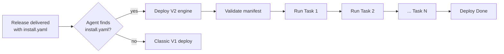
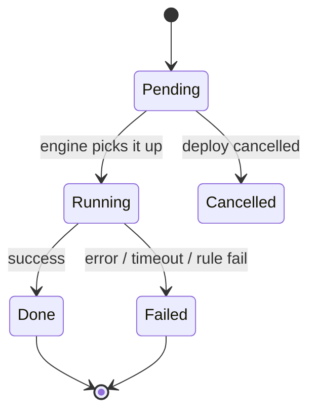
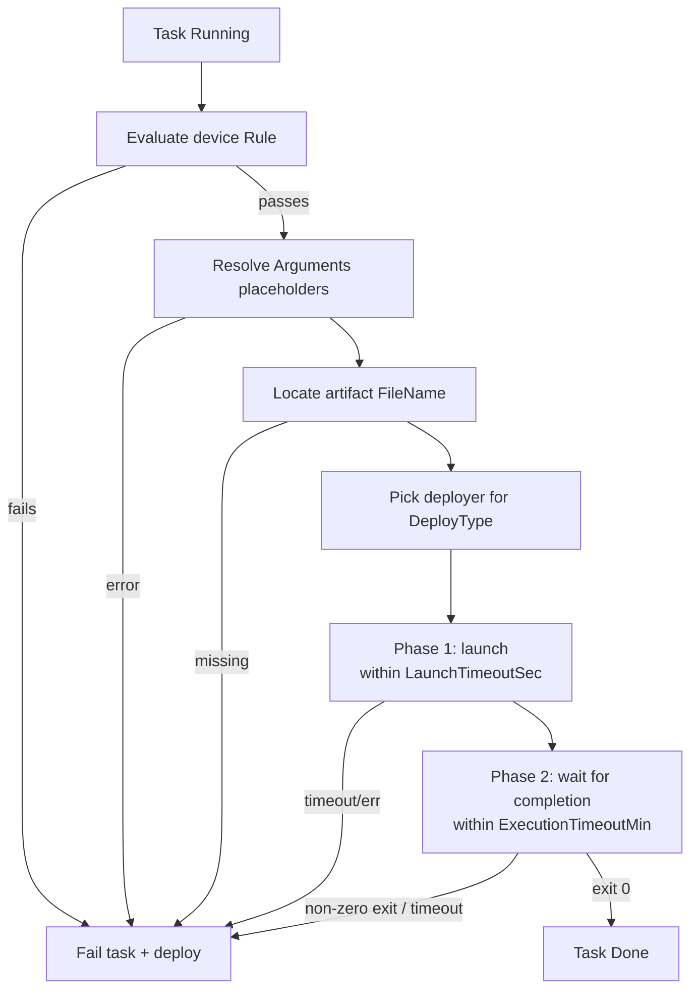
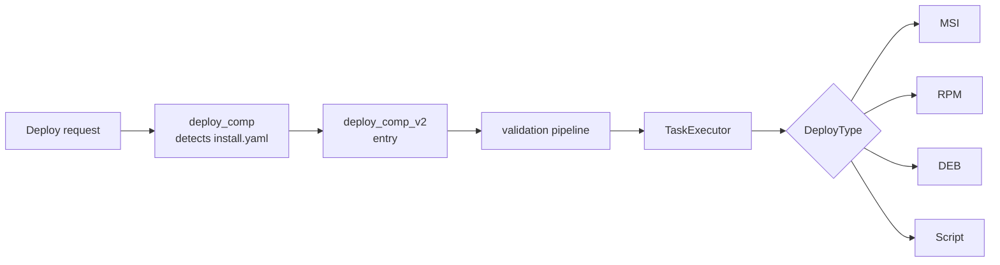
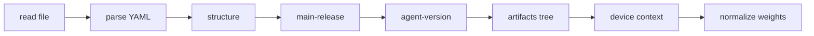

# Deploy V2 — Manifest-Driven Deployment

Deploy V2 lets a release describe **how it installs itself** with a small YAML file — `install.yaml` —
that ships inside the release. Instead of the agent applying one fixed recipe per package type
("this is an MSI, so run msiexec"), the release now carries an **ordered list of tasks**: install
this file, then run that script, but first make sure the device qualifies, and only after a required
companion release is installed. The agent reads the manifest, validates it end-to-end, and executes
the tasks one by one.

This page has two tracks:

- **Part A — Product overview**: what Deploy V2 is and why it matters, in plain terms.
- **Part B — Developer guide**: everything you need to author, validate, and debug a real
  `install.yaml`.

It starts broad and shallow, then goes progressively deeper.

:::info When does it activate?
Deploy V2 turns on **automatically** the moment a delivered release contains an `install.yaml` in its
artifacts directory. Releases without one keep using the classic ("V1") deploy path, unchanged.
:::

---

# Part A — Product overview

## What it is

Think of `install.yaml` as a short **to-do list** for one release. Each item on the list is a
**task**. Tasks run **top to bottom, one at a time**. If any task fails, the whole deploy fails and
stops.



The headline capability: **each file/artifact in a release gets its own dedicated deploy task**, with
its own method, arguments, conditions, and timeouts — and the release author controls the **order**
in which those tasks run.

## Why it exists

The classic deploy path had one implicit, hard-coded recipe per package type. That works for a single
file, but real installations often need more:

| Real-world need | Classic deploy (V1) | Deploy V2 |
|---|---|---|
| Install a package **and then** run a post-install script | Not possible in one deploy | Two ordered tasks |
| Give **each file** its own install behavior | One recipe for the whole release | One dedicated task per file |
| Only install on machines that match a condition | External policy only | Per-task rule, evaluated on the device |
| Pass install-time arguments that depend on the device | Static only | `{placeholders}` resolved at runtime |
| Require a companion release to be installed first | Manual, out-of-band | Declared **dependency**, driven automatically |
| Require a minimum agent version | Not enforced | `MinAgentVersion` gate |
| Survive an agent restart mid-install | Restarts from scratch | Resumes from where it stopped |

The core idea: **"how to install this release" becomes data that lives with the release.** One agent
can then install anything a manifest describes, in the right order, with the right guardrails —
without changing the agent.

## What it gives you today

- **A dedicated deploy flow per file/artifact** — each task has its own deploy type, arguments, rule,
  and timeouts.
- **Controllable task ordering** — tasks run strictly in the order written.
- **Dependent-deployment control** — a task can install *and drive* another release's full
  deployment, waiting for it to finish before continuing.
- **Device-aware installs** — per-task rules and `{placeholder}` arguments adapt one manifest to many
  devices.
- **Resilience** — crash recovery/resume, cancellation, and safe agent self-update.

## What's coming next

Deploy V2 is built in **phases**. The manifest schema already reserves fields and values for later
capabilities, so today's manifests stay forward-compatible:

- **Install *and* verification** task types (verify a deployment succeeded), plus config and revert.
- **Improved Docker Compose, Helm, RPM, and DEB** installation support, and API/SSE-driven deploys.
- **Orchestrated deployment across multiple devices** — a master agent driving a fleet of child
  agents and tracking each one's task-level progress.

See [Roadmap & the orchestrator](#roadmap--the-orchestrator) for detail.

---

# Part B — Developer guide

## 1. How it works (the mechanism)

### 1.1 Detection & entry

When a deploy is requested for a delivered release, the agent checks the release's artifacts
directory for `install.yaml`:

- **present** → the Deploy V2 engine takes over. It runs its **own** device-type, policy, and rule
  checks internally.
- **absent** → the classic V1 deploy path runs, unchanged.

The V2 deploy is launched asynchronously (it does not block the request) and the deploy record's
status is set to `Start` immediately, so a UI reflects progress right away.

### 1.2 Per-file / per-task flow

Each task is one unit of work — most commonly "install one file". A task carries its own:

- `DeployType` (how to run it), `FileName` (what to run),
- optional `Rule` (whether this device qualifies),
- optional `Arguments` (with runtime placeholders),
- optional `LaunchTimeoutSec` / `ExecutionTimeoutMin`.

That's what makes "a dedicated deploy flow per file" possible: five files in a release = up to five
tasks, each configured independently.

### 1.3 Task lifecycle & states

Tasks run strictly **in manifest order** (by index), one at a time:



| Status | Meaning |
|---|---|
| `Pending` | Not started yet. |
| `Running` | Currently executing. |
| `Done` | Completed successfully. |
| `Failed` | Errored, timed out, or its rule was not satisfied. Fails the whole deploy. |
| `Cancelled` | Skipped because the deploy was cancelled before it started. |
| `Skipped` | Reserved for future task types; Phase 1 never skips a task. |

:::warning No task is ever skipped
Deploy V2 is **all-or-nothing**. A rule mismatch does **not** skip the task and move on — it fails
the task and the deploy. If a task should only apply to some devices, that is exactly what a rule
expresses: on non-matching devices the deploy is expected to fail.
:::

### 1.4 What happens for one Install task



Each Install task is **two-phase and time-bounded**:

1. **Launch phase** — the installer process must *start* within `LaunchTimeoutSec`.
2. **Execution phase** — it must *finish* (exit code 0) within `ExecutionTimeoutMin`.

If either phase times out or the process exits non-zero, the task fails and the deploy stops.

### 1.5 Crash recovery & resume

Every task's status and timestamps are persisted to the agent database as they change. If the agent
restarts mid-deploy and the same deploy is requested again, the engine reloads saved state, **skips
tasks already `Done`**, and resumes from the first unfinished task. Task *definitions* always come
fresh from the manifest — only *progress* is restored.

### 1.6 Cancellation

Active deploys register a cancellation token. Cancelling marks all not-yet-started tasks `Cancelled`
and stops the chain. For nested dependency deploys, cancelling the parent propagates to the children.

### 1.7 Self-update (installing the agent itself)

When the deployed release **is the agent's own package**, the MSI stops the service and replaces the
running binary — the current process is killed mid-install. The engine handles this: it launches the
installer detached and exits; on the next startup it sees a task stuck in `Running` and reconciles —
if the running version now matches the target, the task is `Done`; otherwise it resets to `Pending`
and retries. No configuration is needed; the engine detects a self-update by matching the release's
project name against the agent's own name.

---

## 2. Why it's designed this way

Understanding the rationale helps you predict behavior in new situations:

| Design choice | Why |
|---|---|
| **Manifest-as-data** (recipe ships with the release) | One agent installs anything; releases evolve without agent releases. |
| **All-or-nothing, never skip** | Deterministic, safe outcome — a mismatched device fails loudly instead of half-installing. |
| **Strictly sequential** | Predictable, resumable, easy to reason about; ordering is explicit. |
| **Per-task state persisted** | Enables resume after a mid-install restart (critical for self-update). |
| **Dependencies are themselves full V2 manifests** | Recursion reuses one engine — "a plan is a manifest of manifests". |
| **Placeholders resolved on-device at execution time** | One manifest adapts per device instead of being pre-rendered per target. |
| **Single UTF-16LE deploy log** | Agent lines and msiexec's own log read back as one consistent document. |

---

## 3. Where it fits (architecture & dependencies)

### 3.1 Call chain



### 3.2 What Deploy V2 depends on

| Dependency | Role |
|---|---|
| **Delivery** | Artifacts and dependent releases must be delivered and "ready" before deploy. |
| **Rule engine** | Evaluates each task's `Rule` against device metadata/context. |
| **SettingsIO / CONFIG** | Backs `{Config.*}` placeholders, timeout defaults, and `DEPLOY_MAX_DEPENDENCY_DEPTH`. |
| **Deployers** | Reuses existing MSI/RPM/DEB/Script deployers via a factory keyed by `DeployType`. |
| **Database** | Persists per-task state for resume. |
| **SSE** | Pushes live status on every task transition. |

### 3.3 What uses it & the alternative

- **Consumers**: the deploy request path, the UI (status/progress), and — in future — the
  orchestrator.
- **Alternative / boundary**: the classic **V1 deploy** (no `install.yaml`). Detection is automatic;
  the two never mix within one release.

---

## 4. The manifest (YAML reference)

An `install.yaml` has two levels: the **manifest** (top-level) and its **tasks**.

### 4.1 Minimal example

The smallest valid manifest installs a single MSI:

```yaml
ReleaseId: ID.MyApp@1.4.0
Type: Deploy/V2
Tasks:
  - Type: Install/v2
    DeployType: MSI
    FileName: my-app.msi
```

### 4.2 Manifest-level fields

```yaml
ReleaseId: ID.MyApp@1.4.0     # required — must match the release being deployed
Type: Deploy/V2               # required — always exactly "Deploy/V2"
MinAgentVersion: 2.0.0        # optional — minimum agent semver required to run this manifest
Tasks:                        # required — ordered, non-empty list of tasks
  - ...
```

| Field | Required | Description |
|---|---|---|
| `ReleaseId` | ✅ | The release this manifest installs. **Must equal** the catalog id of the release being deployed (guards against a stale/mismatched `install.yaml`). |
| `Type` | ✅ | The manifest kind. Must be the literal `Deploy/V2`. |
| `MinAgentVersion` | ❌ | A semver string. If the running agent is older, the deploy fails before any task runs. Omit to skip. |
| `Tasks` | ✅ | The ordered list of tasks. Must contain at least one. |

:::note Field-name casing
Manifest keys are **PascalCase** (`ReleaseId`, `Type`, `Tasks`). Placeholder **sources** (`Device`,
`Env`, `Config`, `Release`) are matched case-insensitively, but write manifest keys as shown.
:::

### 4.3 Task-level fields

```yaml
Tasks:
  - Type: Install/v2           # required — the kind of task
    DeployType: MSI            # required — the method used to run it
    FileName: my-app.msi       # the artifact to run (required for a local install)
    ReleaseId: ID.Dep@1.0.0    # optional — set this to make the task a DEPENDENCY (see §7)
    Rule: { ... }              # optional — device must satisfy this or the deploy fails
    Arguments: "/qn PORT=8080" # optional — CLI arguments, may contain {placeholders}
    Weight: 60                 # optional — relative share of the progress bar
    LaunchTimeoutSec: 60       # optional — seconds allowed to *start* the process
    ExecutionTimeoutMin: 15    # optional — minutes allowed to *finish*
```

**Fields used in Phase 1 (today):**

| Field | Applies to | Description |
|---|---|---|
| `Type` | all | The task kind. **Only `Install/v2` runs today.** `Config/v2`, `Revert/v2`, `Verification/v2`, `Map/v2` are reserved and fail as "unsupported" if used now. |
| `DeployType` | all | How the task executes. Today: `MSI`, `RPM`, `DEB`, `Script`. Reserved: `DockerCompose`, `Helm`, `API`, `SSE`. |
| `FileName` | Install | The artifact file in the release's delivery directory. Required for a local install unless the task is a dependency (`ReleaseId` set). |
| `ReleaseId` | Install | Overrides the manifest release for this task. When it differs from the manifest `ReleaseId`, the task becomes a **dependency** (see §7). |
| `Rule` | all | A rule-engine condition evaluated against the device right before the task runs. If it doesn't pass, the task — and the deploy — fails. Accepts a YAML object **or** an inline JSON string. |
| `Arguments` | Install | A single CLI argument string passed to the installer. May contain `{Source.Path}` placeholders (see §6). |
| `Weight` | all | The task's share of the progress bar; normalized to sum to 100 (see §8). |
| `LaunchTimeoutSec` | Install | Time to *launch* before failing. Literal number or `{placeholder}`. Default `60`; falls back to `Release.metadata.timeoutLaunch`. |
| `ExecutionTimeoutMin` | Install | Time to *complete* before it's killed. Literal number or `{placeholder}`. Default `15`; falls back to `Release.metadata.timeoutInstallation`. |

**Fields reserved for future phases** (parsed but ignored today):

| Field | Future task type | Purpose |
|---|---|---|
| `Endpoint` | API / SSE | The endpoint URL to call. |
| `Header` | API / SSE | Request headers map. |
| `Body` | API / SSE | Request body. |
| `TryRollbackToPrevious` | Revert | Reinstall the previous version before uninstalling. |
| `GraceTimeSec` | Verification | Grace period before declaring a verification failure. |
| `ConfigGroup` | Config | The config group name to apply. |

---

## 5. Validation & requirements

Before **any** task runs, the whole manifest is validated. A failure at any stage marks the deploy
`Error` and writes the reason to the deploy log.



| Stage | What it checks |
|---|---|
| **read** | `install.yaml` can be read from disk. |
| **parse** | Valid YAML that deserializes into a manifest. |
| **structure** | `ReleaseId` not empty, `Type` is `Deploy/V2`, `Tasks` non-empty, every task individually valid. |
| **main-release** | The manifest's `ReleaseId` equals the release being deployed. |
| **agent-version** | Running agent semver ≥ `MinAgentVersion` (skipped if absent/unparsable). |
| **artifacts** | Every task artifact across the **whole dependency tree** exists; every dependency is delivered, ready, and is itself a V2 component. |
| **device context** | Device metadata gathered for rule evaluation and placeholder resolution. |
| **normalize weights** | Task weights scaled to sum to 100. |

**Per-task structural rules:**

- **Install** requires either a `FileName` (local install) or a `ReleaseId` (dependency).
- **API / SSE** deploy types require an `Endpoint`.
- `DeployType` must be **compatible** with `Type`. For `Install/v2` today: `MSI`, `RPM`, `DEB`, `Script`.
- If a `Rule` is present, it must contain at least one condition (`and` / `or` / `none`).

**Requirements checklist** — for a manifest to deploy successfully on a device:

- [ ] `ReleaseId` matches the deployed release exactly.
- [ ] `Type` is `Deploy/V2`.
- [ ] Agent version ≥ `MinAgentVersion` (if set).
- [ ] Every `FileName` artifact was delivered.
- [ ] Every dependency (`ReleaseId` override) is delivered, ready, and has its own `install.yaml`.
- [ ] Every task's `Rule` passes on the target device.
- [ ] Every `{placeholder}` resolves to a scalar value.

---

## 6. Placeholders — dynamic values at runtime

`Arguments` and both timeout fields can contain **placeholders** of the form `{Source.Path}`,
resolved on the device, just before the task runs.

### Syntax

```
{Source.Path}
```

- `Source` — one of `Device`, `Env`, `Config`, `Release` (case-insensitive).
- `Path` — a dotted path into that source.

### The four sources

| Source | Resolves from | Example | Resolves to |
|---|---|---|---|
| `Device` | The device metadata/context tree | `{Device.type}`, `{Device.os.name}` | `Namer`, `windows` |
| `Env` | An OS environment variable | `{Env.COMPUTERNAME}` | the env value |
| `Config` | The agent's runtime `config.yaml` (`SettingsIO`) | `{Config.device.name}` | the configured value |
| `Release` | The release (component) record; metadata under `Release.metadata.*` | `{Release.version}`, `{Release.metadata.timeoutInstallation}` | `1.4.0`, `20` |

### Example

```yaml
Tasks:
  - Type: Install/v2
    DeployType: MSI
    FileName: my-app.msi
    Arguments: "/qn PORT=8080 DEVICE={Device.id} SITE={Config.device.site}"
```

On a device with id `dev-42` and configured site `north`, the resolved command line becomes:

```
/qn PORT=8080 DEVICE=dev-42 SITE=north
```

### Rules & gotchas

- A placeholder must resolve to a **scalar** (string, number, bool). An object/array is an error.
- If a placeholder **cannot** be resolved (missing key, unknown source), resolution fails and the
  task fails — placeholders are never left unresolved in the string.
- Timeout fields accept a literal **or** a placeholder:

  ```yaml
  LaunchTimeoutSec: 90
  ExecutionTimeoutMin: "{Release.metadata.timeoutInstallation}"
  ```

- When a timeout field is **omitted**, the engine uses, in order: the release-metadata default
  (`Release.metadata.timeoutLaunch` / `Release.metadata.timeoutInstallation`), then the built-in
  default (`60` s to launch, `15` min to complete).

---

## 7. Task order & dependencies

### 7.1 Ordering within a manifest

Tasks are **strictly sequential** in the order written. Task 2 starts only after Task 1 is `Done`.

```yaml
Tasks:
  - Type: Install/v2          # runs first
    DeployType: MSI
    FileName: core.msi
  - Type: Install/v2          # runs only after core.msi succeeds
    DeployType: Script
    FileName: post-install.ps1
```

### 7.2 Dependencies on other releases

Set a task's `ReleaseId` to a **different** release than the manifest's to make it a **dependency**.
The engine delegates a full, nested Deploy V2 for that release and waits for it to finish before
continuing.

```yaml
ReleaseId: ID.MainApp@2.0.0
Type: Deploy/V2
Tasks:
  - Type: Install/v2
    DeployType: MSI
    ReleaseId: ID.Runtime@1.1.0   # ← dependency: install this release first
  - Type: Install/v2
    DeployType: MSI
    FileName: main-app.msi        # ← then install the main app
```

A dependency must be **delivered and ready** and must itself be a **Deploy V2** component (carry its
own `install.yaml`). V2 releases can only depend on V2 releases. The nested deploy is bounded by the
task's `ExecutionTimeoutMin`, and its cancellation is linked to the parent.

### 7.3 The dependency tree

Dependencies form a **tree** the engine walks depth-first and validates **entirely up front**:

```mermaid
flowchart TD
    Main[ID.MainApp@2.0.0] --> Rt[ID.Runtime@1.1.0]
    Main --> Plg[ID.Plugin@1.0.0]
    Rt --> Base[ID.Base@1.0.0]
    Plg --> Base
```

### 7.4 Cycles, depth, and de-duplication

| Guard | Behavior |
|---|---|
| **Cycle detection** | A release appearing as its own ancestor (A → B → A) fails with "dependency cycle detected". |
| **Depth limit** | The tree may not go deeper than `DEPLOY_MAX_DEPENDENCY_DEPTH` (env var, default `10`). |
| **Idempotency / diamond de-dup** | A release already deployed (`Done`) — e.g. `Base` reached via both `Runtime` and `Plugin` above — is **not** re-run; the second visit short-circuits. |

The whole tree logs into **one shared deploy-log file**, including which parent pulled in each
dependency.

---

## 8. Weights & progress

Each task can carry a `Weight` — its share of the progress bar. Weights are **normalized to sum to
100**:

- If **no** task sets a weight, progress is distributed **evenly**.
- If weights are set but don't sum to 100, they are scaled **proportionally** (the last task absorbs
  rounding so the total is exactly 100).

```yaml
Tasks:
  - Type: Install/v2
    DeployType: MSI
    FileName: big-package.msi
    Weight: 80                 # 80% of the progress bar
  - Type: Install/v2
    DeployType: Script
    FileName: quick-config.ps1
    Weight: 20                 # 20%
```

Weights are cosmetic (progress reporting) — they don't affect ordering or success.

---

## 9. Logging

Every Deploy V2 run writes a dedicated log file:

```
<logs_dir>/deployments/<catalog_id>.log
```

- The whole dependency tree writes into the **parent's** file — one file tells the full story.
- It's UTF-16LE encoded so Windows `msiexec`, which appends its own installer log to the same file,
  reads back as one consistent document.
- Every line is also mirrored to the agent's global log/console with the real caller module and line.

Deploy status is pushed live over SSE on every task transition, so a UI can follow progress in real
time.

---

## 10. A complete, annotated example

This `install.yaml` exercises most of Phase 1: a version gate, a dependency, a conditional task with
placeholders and custom timeouts, and a post-install script.

```yaml
# install.yaml — shipped inside release ID.MainApp@2.0.0
ReleaseId: ID.MainApp@2.0.0
Type: Deploy/V2
MinAgentVersion: 2.0.0

Tasks:
  # 1) Dependency: install the runtime release first (a delivered V2 component)
  - Type: Install/v2
    DeployType: MSI
    ReleaseId: ID.Runtime@1.1.0
    Weight: 30

  # 2) Main install — Windows only, device-derived argument, metadata-driven timeout
  - Type: Install/v2
    DeployType: MSI
    FileName: main-app.msi
    Weight: 50
    Rule:
      conditions:
        and:
          - field: $.device.os.name
            operator: equals
            value: windows
    Arguments: '/qn INSTALLDIR="C:\Program Files\MainApp" DEVICE={Device.id}'
    LaunchTimeoutSec: 90
    ExecutionTimeoutMin: "{Release.metadata.timeoutInstallation}"

  # 3) Post-install script — rule written as an inline JSON string
  - Type: Install/v2
    DeployType: Script
    FileName: post-install.ps1
    Weight: 20
    Rule: '{"conditions":{"and":[{"field":"$.device.type","operator":"equals","value":"Namer"}]}}'
    Arguments: "-Site {Config.device.site}"
```

What the agent does, in order:

1. Validates the whole manifest and the `ID.Runtime@1.1.0` sub-tree.
2. Confirms agent version ≥ `2.0.0`.
3. Installs `ID.Runtime@1.1.0` as a nested Deploy V2 (task 1).
4. On Windows devices, installs `main-app.msi` with the resolved arguments/timeout (task 2).
5. On `Namer` devices, runs `post-install.ps1` with the resolved `-Site` argument (task 3).
6. Marks the deploy `Done` — or fails at the first task that errors, times out, or whose rule fails.

---

## 11. Validating your manifest

Before shipping, check a manifest against the rules in [§5](#5-validation--requirements):

1. **Schema** — PascalCase keys, `Type: Deploy/V2`, non-empty `Tasks`.
2. **Identity** — `ReleaseId` equals the release you'll deploy it in.
3. **Per-task** — each Install has a `FileName` **or** a dependency `ReleaseId`; `DeployType` is one
   of `MSI`/`RPM`/`DEB`/`Script`; any `Rule` has at least one condition.
4. **Artifacts** — every `FileName` is actually included in the release; every dependency release is
   itself a delivered V2 component.
5. **Placeholders** — every `{Source.Path}` uses a known source and resolves to a scalar on the
   target device.

At runtime the agent enforces all of these; a failure appears in
`<logs_dir>/deployments/<catalog_id>.log` with the failing stage or task index.

---

## 12. Troubleshooting

| Symptom | Likely cause | Where to look |
|---|---|---|
| Deploy `Error` immediately, no task ran | Validation failed (parse/structure/main-release/version) | Deploy log — the `Validation failed at stage '...'` line |
| "manifest ReleaseID … does not match requested deploy …" | `ReleaseId` ≠ the deployed release | Manifest `ReleaseId` vs. the release id |
| "Agent version … does not meet minimum required …" | Agent older than `MinAgentVersion` | Manifest `MinAgentVersion`; upgrade agent |
| "artifact not found for …" | A `FileName` wasn't delivered | Release contents vs. task `FileName` |
| "dependent … is not a Deploy V2 component (no install.yaml)" | A dependency isn't V2 | Dependency release must ship `install.yaml` |
| "dependency cycle detected" / "dependency depth exceeded" | Circular or too-deep dependencies | The dependency tree; `DEPLOY_MAX_DEPENDENCY_DEPTH` |
| "Cannot resolve argument placeholder: `{…}`" | Unknown source, missing key, or non-scalar | The placeholder and its source |
| Task fails with "Launch timeout" / "did not complete within …min" | Installer slow or stuck | `LaunchTimeoutSec` / `ExecutionTimeoutMin`; installer behavior |
| Rule task fails on a device that "should" match | Rule condition/field mismatch | The task `Rule` and the device metadata in the log |

**Best practices**

- Keep tasks **idempotent** (safe to re-run on resume).
- Prefer **metadata-driven timeouts** over hard-coded numbers where installers vary.
- Scope tasks with **rules** instead of shipping the wrong artifact to the wrong device.
- Keep **dependency trees shallow**.

---

## Roadmap & the orchestrator

Deploy V2 is intentionally **phased**; the schema already reserves fields and enum values so today's
manifests stay forward-compatible.

**Planned task types**

| Task type | What it will do |
|---|---|
| `Verification/v2` | Verify a deployment succeeded, with a `GraceTimeSec` grace period before failing. |
| `Config/v2` | Apply a named configuration group (`ConfigGroup`) instead of running a file. |
| `Revert/v2` | Roll a release back, optionally reinstalling the previous version (`TryRollbackToPrevious`). |
| `Map/v2` | Map/data-oriented deployment steps. |

**Planned deploy types**

| Deploy type | What it will do |
|---|---|
| `DockerCompose` | Bring up a compose stack. |
| `Helm` | Install/upgrade a Helm release. |
| `RPM` / `DEB` | Richer Linux package handling. |
| `API` | Drive a deployment by calling an HTTP `Endpoint` with `Header` + `Body`. |
| `SSE` | Drive/observe a deployment over a server-sent-events `Endpoint`. |

The engine is already structured for these: deployer selection is a factory keyed by `DeployType`,
and the completion-wait step is overridable, so process-less types (API, SSE, Docker, Helm) plug in
with their own "when is this done?" semantics without changing the core loop.

**The orchestrator.** Today's dependency mechanism — a task delegating a nested Deploy V2 for another
release — is the foundation for a broader orchestrator that will:

- **coordinate a set of releases** as one managed unit, in a planned order;
- **orchestrate across a fleet** — a master agent dispatching deploy plans to child agents (over the
  same A2A mesh used elsewhere) and tracking each child's task-level progress via SSE;
- **express richer ordering** — grouping and conditional branches at the plan level.

Because tasks, dependencies, per-task rules, weights, and live SSE progress already exist at the
manifest level, the orchestrator builds **on top of** the same primitives — a plan is "a manifest of
manifests". Authoring a good `install.yaml` today is the direct on-ramp to the orchestrated features
as each phase merges.

---

## Quick reference

| Concept | Value |
|---|---|
| Manifest file | `install.yaml` (in the release's artifacts dir) |
| Manifest `Type` | `Deploy/V2` |
| Task types today | `Install/v2` |
| Deploy types today | `MSI`, `RPM`, `DEB`, `Script` |
| Placeholder sources | `Device`, `Env`, `Config`, `Release` (metadata via `Release.metadata.*`) |
| Default launch timeout | `60` s (or `Release.metadata.timeoutLaunch`) |
| Default execution timeout | `15` min (or `Release.metadata.timeoutInstallation`) |
| Max dependency depth | `DEPLOY_MAX_DEPENDENCY_DEPTH` (default `10`) |
| Deploy log | `<logs_dir>/deployments/<catalog_id>.log` (UTF-16LE) |
| Failure model | All-or-nothing; no task is ever skipped |
