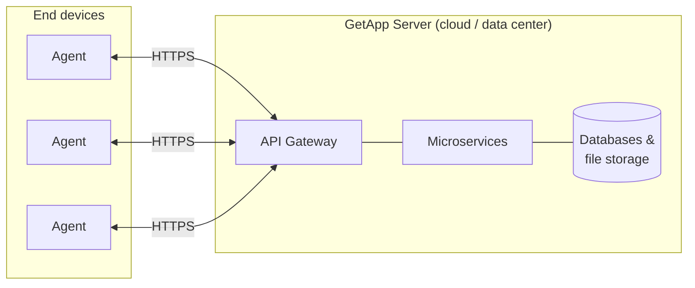
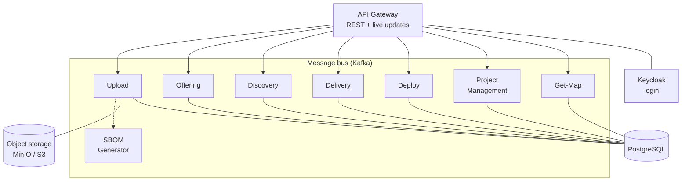
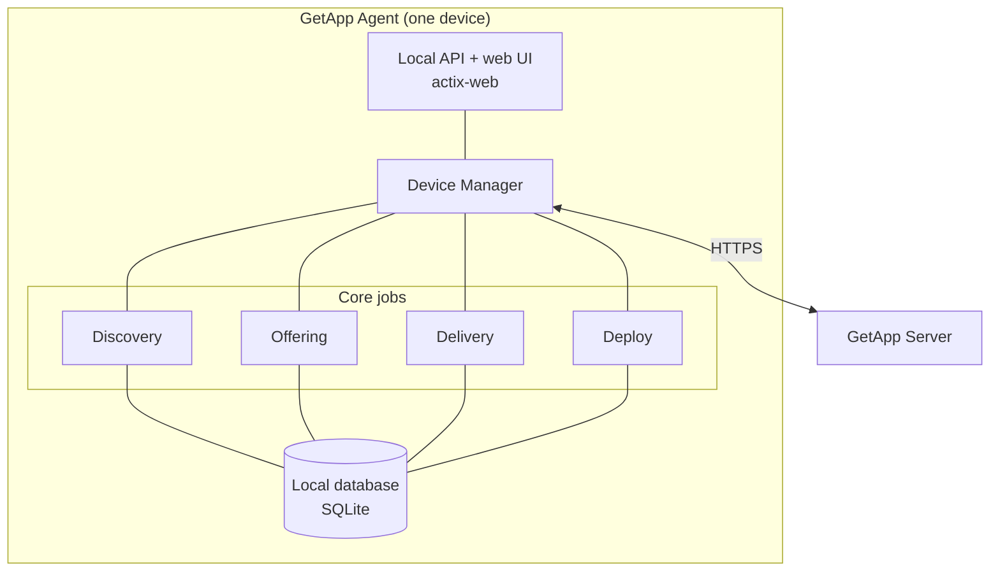
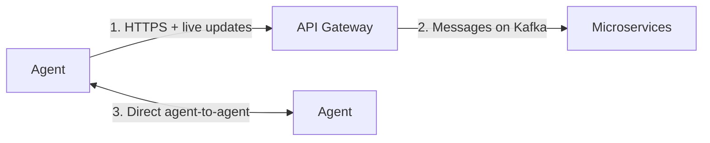
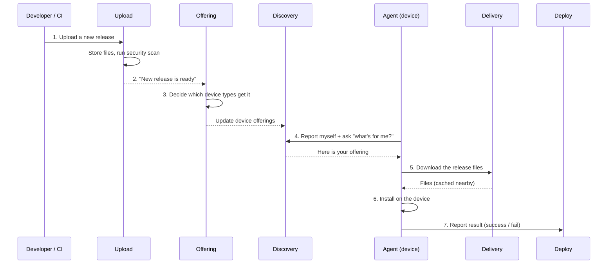
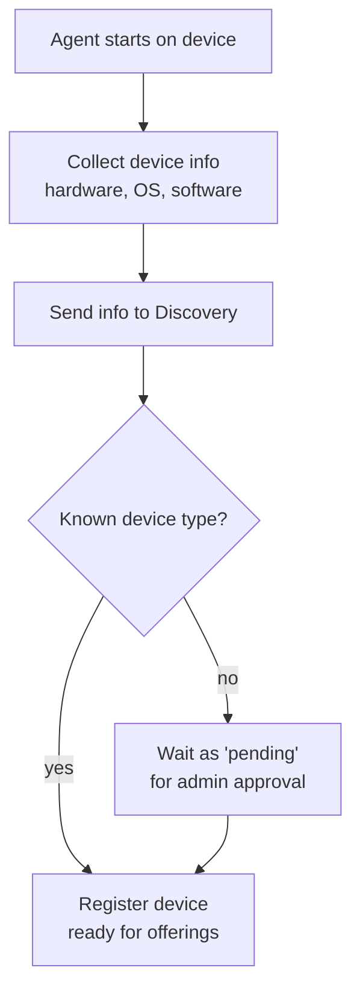
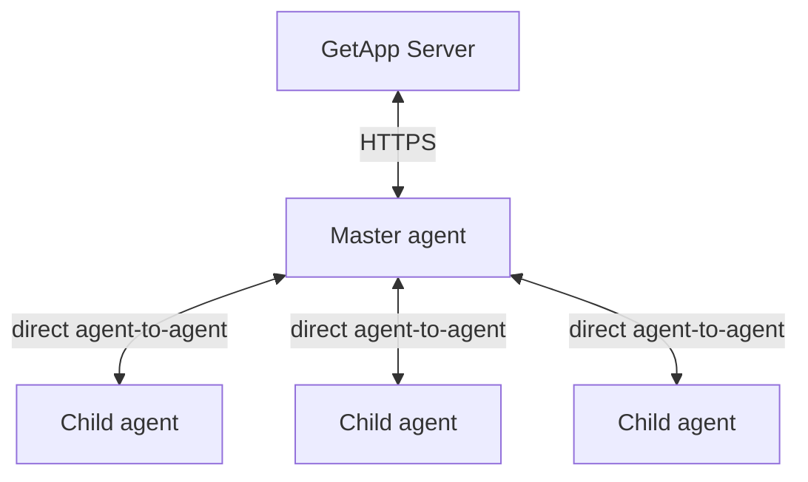

# Platform Architecture — How GetApp Works

This page explains how the GetApp platform is built and how the parts work together.
It is written for anyone who wants a clear picture of the system: administrators, developers,
and technicians. You do not need to read the code to understand it.

The page has two tracks:

- **Part A — The big picture**: what the platform is and how a release travels from a
  developer to an end device.
- **Part B — How to use it**: the day-to-day steps you follow to install the agent, connect it,
  publish software, and watch it deploy.

It starts simple and adds detail as you go.

:::info In one sentence
GetApp is an **"app store" for your whole network**. A central **server** decides *what* software each
device may receive, and a small **agent** on each device does the actual downloading and installing.
:::

---

# Part A — The big picture

## The two sides of GetApp

The platform has two main sides that talk to each other:

| Side | What it is | Where it runs | Built with |
|---|---|---|---|
| **Server** | A group of small services (microservices) that manage the catalog, the devices, and the deployments. | In the data center / cloud | Node.js (NestJS), talking over a message bus |
| **Agent** | A small program that runs on each end device. It reports the device, downloads software, and installs it. | On every end device | Rust |



The **server** never installs software by itself. It only keeps the truth about *what should happen*.
The **agent** is the one that acts on each device. This split lets one server manage many thousands
of devices, even across slow or separated networks.

---

## The server: a team of small services

Instead of one big program, the server is split into many **microservices**. Each service has one
clear job. This makes the system easier to scale and to update, because you can change one service
without breaking the others.

The services do **not** call each other directly over normal web requests. They send **messages** on a
shared **message bus** (Apache Kafka). Think of it as an internal post office: a service drops a
message, and the right service picks it up. This keeps the services loosely connected — if one is
busy, the message simply waits.



### What each service does

| Service | Its job, in plain words |
|---|---|
| **API Gateway** | The front door. All requests from the agent, the web UI, and other tools come here first. It checks the login and passes the work to the right service. It can also push **live updates** to clients. |
| **Upload** | Takes in new software (release packages, container images) and stores the files. It keeps track of versions, policies, and asks for a security scan. |
| **Offering** | The catalog brain. It decides **which release is offered to which kind of device**, based on rules set by an administrator. |
| **Discovery** | The device register. It knows every device: its type, its operating system, and what is installed on it. New, unknown devices wait here for approval. |
| **Delivery** | Prepares and **caches** the files close to the devices, so downloads are fast. It can run as a main (origin) node or as a nearby cache (proxy) node. |
| **Deploy** | Follows each installation. It stores the **result** (success or failure), the logs, and the metrics, and raises **alerts** when something goes wrong. |
| **Project Management** | Manages projects, members, roles, and permissions. It also connects to Git for GitOps-style releases. |
| **Get-Map** | Handles map and hardware inventory data for devices. |
| **SBOM Generator** | Scans software for known security problems and license issues, and produces a "bill of materials" (a list of everything inside a package). |

### Where the data lives

- **PostgreSQL** — the main database. It holds devices, releases, offerings, statuses, and settings.
- **MinIO / S3** — object storage for the large files (the actual packages and images).
- **Keycloak** — handles user login and permissions (single sign-on).
- Extra stores for logs and metrics (Elasticsearch and a time-series database) feed the **Deploy**
  dashboards.

---

## The agent: the worker on each device

The **agent** is a small, self-contained program written in Rust. It runs quietly in the background
(as a service) on each device. It has a few clear responsibilities:



| Agent job | What it does |
|---|---|
| **Discovery** | Looks at the device (hardware, operating system, installed software) and **reports** it to the server. |
| **Offering** | Asks the server **what software is available** for this device. |
| **Delivery** | **Downloads** the release files, checks they are complete and genuine, and can **resume** if the connection drops. |
| **Deploy** | **Installs** the software on the device and reports the result back. |

A few useful details:

- **Local database (SQLite)** — the agent remembers its own state on the device: what was downloaded,
  what was installed, and how far each job got. If the agent restarts, it can continue where it
  stopped.
- **Local API and web UI** — the agent runs a small web server on the device. A local user or UI can
  see status and trigger actions. The agent can also act as a **proxy**, forwarding requests to the
  server.
- **Verification** — downloaded files are checked with a signature (Cosign), so a device never
  installs a tampered package.

---

## How the parts talk to each other

There are three kinds of communication in the platform. It helps to keep them separate in your mind.



1. **Agent ↔ Server** — over the internet using **HTTPS** (normal secure web requests). The agent
   also receives **live updates** so it reacts quickly when something changes, without asking again
   and again.
2. **Service ↔ Service (inside the server)** — over the **Kafka** message bus. This is private to the
   server.
3. **Agent ↔ Agent** — some agents can talk **directly to each other**. This is used for separated or
   offline networks (see [Agent-to-agent](#agent-to-agent-and-offline-networks) below).

---

## The main flow: from a new release to an installed app

This is the most important flow in the platform. It shows how software moves from a developer all the
way to an end device.



Step by step:

1. **Upload** — a developer (or an automated CI pipeline) sends a new release to the **Upload**
   service. The files are stored and a **security scan** (SBOM) is started.
2. **Announce** — Upload tells **Offering** that a new release exists.
3. **Decide** — **Offering** applies the administrator's rules and decides **which device types** are
   allowed to receive this release.
4. **Discover** — each **agent** regularly reports its device to **Discovery** and asks what software
   is available for it.
5. **Deliver** — the agent **downloads** the files through **Delivery**, which serves them from a
   cache close to the device for speed.
6. **Deploy** — the agent **installs** the release on the device.
7. **Report** — the agent tells **Deploy** whether the installation worked. Administrators see this on
   the dashboard, with logs and alerts.

:::tip Push and pull
Software can arrive in two ways. In **pull**, the device checks for new offerings and installs when
ready. In **push**, an administrator sends a release to chosen devices. Both use the same flow above.
:::

---

## How a device first joins

Before a device can receive software, the server must know about it. This is the **discovery** flow.



- A brand-new device type is **not** trusted automatically. It waits as **pending** until an
  administrator approves it. This stops unknown devices from silently joining.
- Once approved, the device appears in the register and starts receiving offerings.

---

## Agent-to-agent and offline networks

Some networks are separated from the main server (for example, a tactical or air-gapped site). Here,
one agent can act as a **master** and manage other **child** agents nearby. This is called
**orchestration**, and the agents talk to each other **directly** (using a technology called DDS)
instead of going through the central server.



- The **master** agent stays in contact with the server and passes information to the children.
- The **children** can keep working even when the server is not reachable.
- For more detail, see [Agent-to-agent](technician/agent2agent.md) and
  [Disconnected environment](technician/disconnectedEnviorment.md).

---

# Part B — How to use it

This part gives the practical, ordered steps. Each step links to a full guide.

## 1. Install the agent

Install the GetApp Agent on the device. Installers exist for Windows (MSI) and Linux (DEB / RPM).

See [Getting Started](getting-started.md) for full installation steps.

## 2. Connect the agent to your server (enrollment)

The agent needs to know **which server** to talk to. This is set in a small configuration file called
`.env`, using the `BASE_URL` value:

```text
BASE_URL=http://your-getapp-server.local
```

Full details, including file locations for Windows and Linux, are in
[Enrollment](technician/enrollment.md).

After this, the agent starts its **discovery** job and reports the device to the server.

## 3. Approve the device (administrator)

If the device type is new, approve it so it can receive software. This happens in the web UI, backed
by the **Discovery** service. See [Roles and permissions](user-manual/roles-and-permissions.md) for
who is allowed to do this.

## 4. Publish software

A developer or CI pipeline uploads a release. You can also connect releases to Git — see
[GitOps releases](gitops-releases.md). The **Offering** rules then decide which devices may receive
it. To target specific devices, use the **push** option.

## 5. Watch the delivery and installation

Once a release is offered:

- The agent **downloads** it through **Delivery** (fast, cached, and resumable).
- The agent **installs** it. Simple releases use the classic install path; richer releases can carry
  their own step-by-step recipe — see [Deploy V2 (install.yaml)](deploy-v2.md).
- The **Deploy** dashboard shows the result, the logs, and any **alerts**.

## 6. Troubleshoot if needed

If something fails, start with the troubleshooting guides:

- [Tier 1 — App Store Agent](troubleshooting/tier1-appstore-agent.mdx)
- [Tier 2 — App Store Agent](troubleshooting/tier2-appstore-agent.mdx)
- [Tier 2 — Server](troubleshooting/tier2-server.mdx)

---

## Quick glossary

| Term | Meaning |
|---|---|
| **Agent** | The small program on each device that downloads and installs software. |
| **Server** | The central group of microservices that manage the catalog and devices. |
| **Microservice** | One small server program with a single job. |
| **Message bus (Kafka)** | The internal "post office" the server services use to talk. |
| **Release** | A specific version of a piece of software, ready to install. |
| **Offering** | The decision about which release is available to which device type. |
| **Discovery** | Reporting and registering devices with the server. |
| **Delivery** | Downloading and caching release files close to devices. |
| **Deploy** | Installing a release on a device and reporting the result. |
| **Push / Pull** | Push = the server sends software to chosen devices. Pull = the device asks for and takes software. |
| **SBOM** | "Software Bill of Materials" — a list of everything inside a package, used for security. |
| **Orchestration** | One master agent managing nearby child agents, often for offline networks. |

---

## See also

- [Intro](intro.md) — what GetApp is, in short.
- [Getting Started](getting-started.md) — install and first run.
- [Deploy V2 (install.yaml)](deploy-v2.md) — how a release can describe its own installation.
- [Terminology](Terminology.md) — the full list of platform terms.
