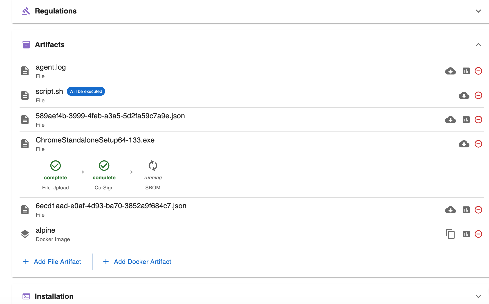
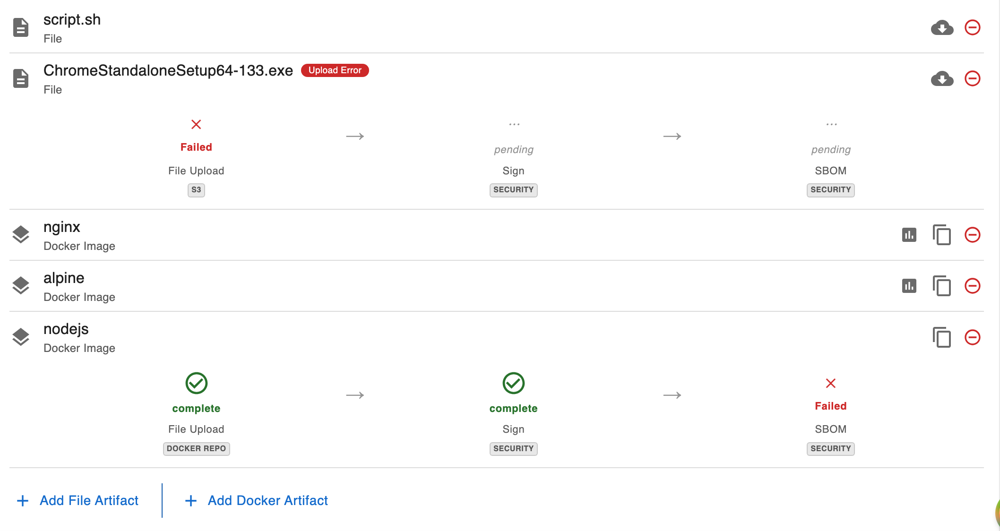
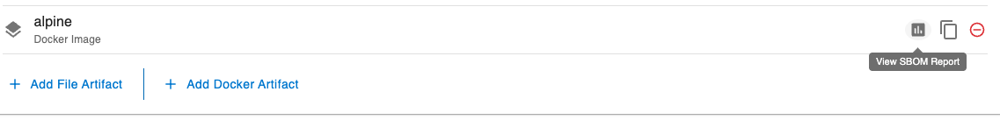
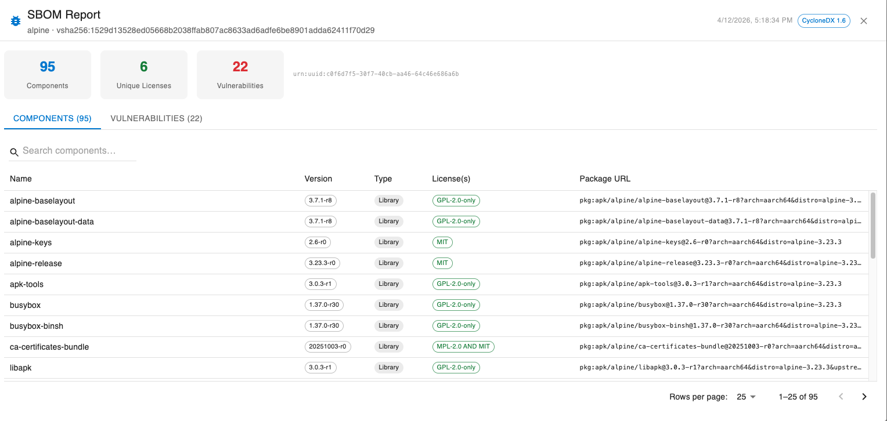
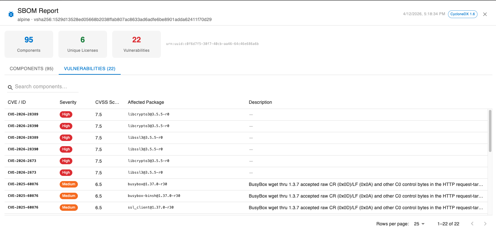

# SBOM Generator

The **sbom-generator** is a dedicated GetApp microservice responsible for generating Software Bill of Materials (SBOM) reports and vulnerability scans for uploaded artifacts.

---

## How It Works

### Overview

When an artifact is uploaded through the GetApp platform, the upload service automatically triggers an SBOM scan job. The sbom-generator microservice handles the job asynchronously and stores the resulting report in S3-compatible object storage (MinIO/AWS S3).

### Toolchain: Syft + Grype

The microservice uses two open-source security tools under the hood:

- **[Syft](https://github.com/anchore/syft)** — generates the SBOM by inspecting the artifact and cataloguing all software components it finds (packages, libraries, licenses, PURLs, CPEs). The output is a [CycloneDX](https://cyclonedx.org/) JSON document.
- **[Grype](https://github.com/anchore/grype)** — performs a vulnerability scan against the same target. Its results (CVE IDs, severity ratings, CVSS scores, affected packages) are merged into the CycloneDX JSON produced by Syft.

If Grype finds no vulnerabilities, the SBOM is saved as-is. If Grype itself fails, the SBOM is still saved without vulnerability data — a Grype failure is treated as non-blocking.

### Scan Lifecycle

```
Artifact uploaded
       │
       ▼
Upload service emits scan event (Kafka)
       │
       ▼
sbom-generator receives event → creates scan job (status: QUEUED)
       │
       ▼
Concurrency semaphore (default: 3 parallel scans)
       │
       ▼
Artifact downloaded from MinIO via presigned URL → temp file
       │
       ▼
Syft runs on temp file → CycloneDX JSON
       │
       ▼
Grype runs on same target → vulnerability data merged into CycloneDX JSON
       │
       ▼
Final report uploaded to MinIO (sbom-reports/<scanId>.json)
       │
       ▼
Upload service notified via Kafka (SCAN_COMPLETED event)
       │
       ▼
Scan job status set to COMPLETE — report available for download
```

The scan job status progresses through: `QUEUED` → `RUNNING` → `COMPLETE` (or `FAILED`).

---

## Helm Chart Configuration

### Enabling the Microservice

The sbom-generator is deployed as a standard Kubernetes/OpenShift Deployment. Its image version is controlled by the `tag.sbomgenerator` field in `values.yaml`:

```yaml
tag:
  sbomgenerator: 0.0.5-main
```

### Controlling SBOM Generation (`SBOM_ENABLED`)

The `upload.sbomEnabled` value in `values.yaml` maps to the `SBOM_ENABLED` environment variable on the upload microservice. It controls whether SBOM scanning is triggered for uploaded artifacts.

```yaml
#---------------------------------------------------------#
# Upload Microservice
#---------------------------------------------------------#
# SBOM_ENABLED: Controls SBOM (Software Bill of Materials) report
# generation for uploaded artifacts.
#
#   true  - SBOM reports will be generated for all uploaded artifacts.
#   false - SBOM reports will not be generated.
#   ""    - (default) Inferred automatically via the sbom-generator
#           microservice healthcheck.
#
# Leave empty (default) to let the sbom-generator healthcheck decide.
#---------------------------------------------------------#
upload:
  sbomEnabled: ""
```

| Value | Behaviour |
|-------|-----------|
| `true` | SBOM scanning is always enabled. |
| `false` | SBOM scanning is always disabled. |
| `""` *(default)* | The upload service health-checks the sbom-generator at startup to detect whether it is available. If the microservice is reachable and healthy, scanning is enabled automatically; otherwise it is disabled. |

**Auto-configuration note:** When `sbomEnabled` is left empty, no manual configuration is needed. Simply deploying the sbom-generator alongside the upload service is sufficient for SBOM scanning to be activated.

:::tip
Leave `upload.sbomEnabled` empty in production deployments. This ensures that if the sbom-generator is temporarily unavailable (e.g. during a rolling update), the upload service degrades gracefully rather than failing.
:::

---

## Dashboard UI

The SBOM scan progress and results are surfaced in the **Releases** view of the dashboard, inside the artifact upload pipeline.

### While the Scan Is Processing

The artifact upload pipeline shows an **SBOM** step with a spinner while the scan is queued or running. The step label is tagged as a security step.

> **📸 Screenshot placeholder — add screenshot of the artifact pipeline showing the SBOM step in "running" state (spinner visible).**


If a scan fails, the SBOM step turns red and displays the failure reason. A **Retry** button appears to re-queue the scan.

> **📸 Screenshot placeholder — add screenshot of the artifact pipeline showing the SBOM step in "failed" state with the Retry button.**


### When the Report Is Ready

Once the scan completes, a **View Report** button appears next to the artifact. Clicking it opens the SBOM report dialog.


#### Report Dialog

The dialog presents the CycloneDX report in a structured layout:

**Summary bar** — shows at a glance:
- Total component count
- Number of unique licenses
- Number of vulnerabilities found (highlighted in red if any exist)

**Components tab** — a searchable table of all detected software packages, with columns for:
- Name
- Version
- Type
- License(s)
- Package URL (PURL)

**Vulnerabilities tab** — a table of all CVEs found by Grype, with columns for:
- CVE / ID
- Severity (color-coded chip: critical/high → red, medium → orange, low → blue)
- CVSS Score
- Affected Package
- Description
 
> **📸 Screenshot placeholder — add screenshot of the SBOM report dialog with the Components tab open.**

> **📸 Screenshot placeholder — add screenshot of the SBOM report dialog with the Vulnerabilities tab open (ideally with some entries visible).**
