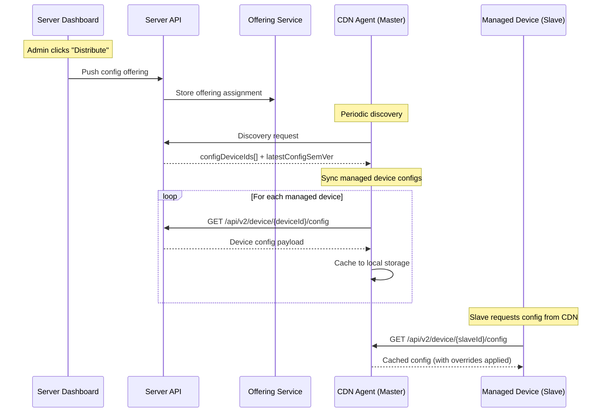

# CDN Configure

A **CDN agent** (also called a master node) acts as a local configuration — and command —
server for managed devices (slave nodes), for environments where those devices don't have
direct connectivity to the GetApp server.

## How CDN config distribution works



## Distributing config to CDN agents

From the Server Dashboard, push a device's configuration to CDN agents so they can serve it to
managed devices:

1. Navigate to the **Devices** list
2. Select the target device(s) or device group
3. Click **Distribute**
4. Select the config project(s) to distribute
5. Confirm the action

This creates an **offering assignment** in the server, which the CDN agent picks up during its
next discovery cycle.

## CDN agent config sync process

During discovery, the CDN agent receives two pieces of config-related information:

1. **`latestConfigSemVer`** — the version of the CDN agent's own config
2. **`configDeviceIds`** — config catalog IDs for every device whose config should be cached locally

It then:

1. **Syncs its own config** — downloads and applies its self-config (including `getapp_config` if present)
2. **Syncs managed device configs** — for each device ID (server-provided + locally known managed devices), downloads the config and caches it locally as `devices-config/{device_id}.json`

## Serving config to managed devices

Managed devices (slaves) connect to the CDN agent and request their configuration through the
**same endpoint** used for direct server communication:

```
GET /api/v2/device/{deviceId}/config
```

The CDN agent serves the locally cached config with any applicable overrides applied — a
managed device doesn't need to know whether it's talking to a CDN agent or the server.

## Managed device connectivity (SSE)

Managed devices maintain a live connection to the CDN agent via Server-Sent Events:

```
GET /api/cdn/events/managed/{device_id}
```

The CDN agent tracks which managed devices are currently connected — this is what determines
which devices are online and can receive pushed actions (discovery, push, delivery, deploy).
See [SSE](../interfaces/sse#managed-command-channel-a2a--cdn).

## CDN agent API endpoints

| Method | Endpoint | Description |
|---|---|---|
| `GET` | `/api/cdn/config` | Get CDN settings (TTL, platform management) |
| `PUT` | `/api/cdn/config` | Update CDN settings |
| `POST` | `/api/cdn/config/devices/sync` | Trigger bulk config sync for specific device IDs |
| `GET` | `/api/cdn/device` | Get device data for CDN-connected devices |
| `GET` | `/api/cdn/device/offering` | Get per-device offering with metadata |
| `POST` | `/api/cdn/devices/action` | Dispatch actions to managed devices (Push, Discovery, etc.) |
| `GET` | `/api/cdn/events/managed/{device_id}` | SSE stream for managed device commands |

## CDN settings

CDN-specific settings live separately in `cdn-config.yaml` on the CDN agent:

| Setting | Default | Description |
|---|---|---|
| `inactive_device_hours` | 24 | Hours before a device is considered inactive |
| `device_delete_after_days` | 30 | Days before an inactive device record is removed |
| `platform_management` | — | Platform-specific management configuration |
| `cdn_node_id` | — | Unique identifier for this CDN node |

## See also

- [GetConfig](../configurations/getconfig)
- [SSE](../interfaces/sse)
- [A2A Parent-Side Device Management](./a2a-parent-management)
