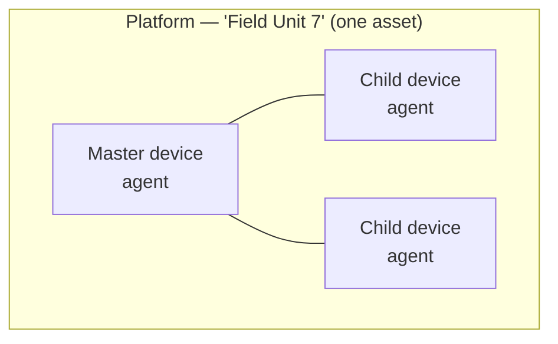
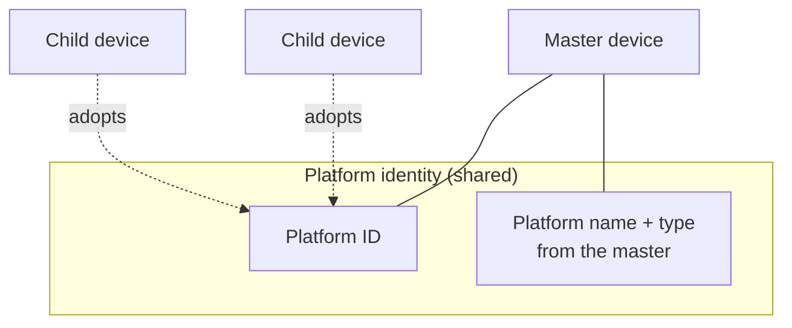
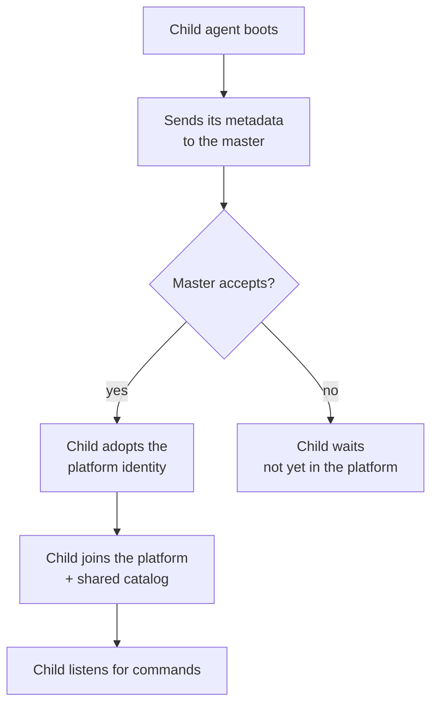
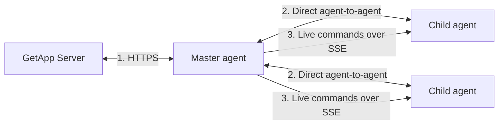
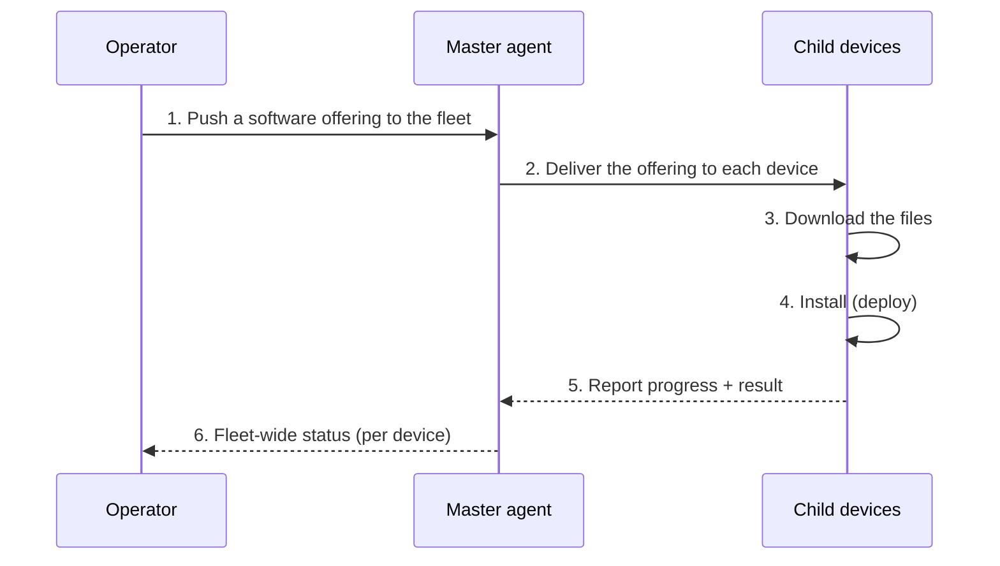

# Platform Architecture

This page explains what a **platform** is in GetApp and how it is built — especially when it is
made of **several devices** working together as one unit. It starts with the big picture, then
shows how the pieces connect and how to set one up.

- **Who this is for:** technicians and operators who install and manage agents in the field.
- **What you'll learn:** what a platform is, the role of the **master** and **child** agents,
  how devices join a platform, how they talk to each other, and how software reaches the whole
  fleet at once.

:::note At a glance
A **platform** = **one physical asset** · made of **one or more devices** · each running **one agent** · with **one master**
:::

## What is a platform

A **platform** is **one physical thing in the field** — a vehicle, a kiosk, a tablet, or a
workstation. Every platform is made of **one or more devices**, and each device runs its own
copy of the **GetApp agent**.

- A single device on its own is simply a **one-device platform**.
- When several devices belong to the **same physical asset**, they share one **platform ID**.
  Together they form a **multi-device platform** — the focus of this page.



*Diagram: one platform is a group of devices (agents) that represent a single physical asset.*

Even though a platform can contain many devices, the server and the operator treat it as **one
thing**: one row in the dashboard, one shared software catalog, one status view.

:::tip Platform vs. platform *type*
A **platform** is the physical asset itself. A **platform type** is the *category* it belongs to
( for example: 'tank' is a platform type, when specific tank ('tank-2c') is a platform). See [Platform — Overview](../../user-docs/admin/manage-platform/overview.md).
:::

---

## The parts of a platform

A multi-device platform has three building blocks.

| Part | What it is |
|---|---|
| **Devices (agents)** | Each device runs one GetApp agent. The agent carries the device's own identity — a **device ID** and a **device type**. |
| **Master (orchestrator)** | One device is confirmed as the **master**. It is the **command center**: it holds the platform's identity and manages every other device from a single app store interface. |
| **Children** | The remaining devices. They are managed by the master and report their status back to it. |

The **master owns the platform's identity** — the platform's **name** and **type** come from the
master, not from any single child. Each child still keeps its *own* device name and local details;
only the shared, platform-level information is owned by the master.



*Diagram: every device in the platform shares one platform ID; the master provides the platform's name and type.*

The platform ID is part of the agent's **enrollment** — see
[Platform Configure](configurations/platform-configure) for the exact fields
(`platform_id`, `platform`) and [Enrollment](configurations/enrollment) for how to set them.

---

## How devices join a platform

Devices join a platform through **orchestration** — an agent-to-agent (A2A) handshake between the
master and each child. A child asks to be managed; the master accepts.



*Diagram: a child joins only after the master confirms it (orchestration handshake).*

Orchestration is controlled by a single setting, `orchestrate_me`, and the two sides use **opposite**
values:

- **Master** — `orchestrate_me: false`. This is the **default**, so a master usually needs no change.
  A device that is itself orchestrated cannot manage others.
- **Child** — `orchestrate_me: true`. This is what makes the device **ask the master** to manage it.

```yaml
# On the master (default — can be left as is)
device:
  orchestrate_me: false

# On each child
device:
  orchestrate_me: true
```

A child also needs to point at the **master** instead of the server (its base URL is set to the
master's address). After the master confirms it, the child **adopts the platform identity** and
becomes part of the fleet.

:::note Two ways to connect
Both modes let the master send **live commands** to the device over SSE. They differ in whether the
device **joins the platform** and whether it needs the master's approval:

- **Orchestration mode** (`orchestrate_me`) — the device activates **only after the master confirms**
  it, then **adopts the master's platform identity** (platform ID, name, and type) and joins the
  shared catalog. If the master rejects it, it stays out. This is the main mode for a managed fleet.
- **Reactive mode** (`reactive_mode`) — the device activates **immediately, without waiting for
  confirmation**.


Full details and setup steps are in
[A2A Parent Management](fleet-connectivity/a2a-parent-management).
:::

---

## How the parts talk to each other

A platform uses three communication paths. Keeping them separate makes the picture clear.



*Diagram: the master bridges the server and the children; children talk to the master directly.*

1. **Master ↔ Server** — the master stays in contact with the GetApp server over **HTTPS**, on
   behalf of the whole platform.
2. **Master ↔ Children** — the agents talk **directly to each other** (A2A), without going through
   the central server.
3. **Live commands** — the master pushes commands and updates to the children over a live channel
   (**Server-Sent Events, SSE**), so they react immediately.

Because the master handles the server connection, the **children do not each need their own path to
the server** — this is what makes platforms work well in separated or offline networks.

---

## One platform, one app store

From the operator's side, the whole platform appears as **one app store**. The operator thinks in
terms of *"my fleet,"* not individual devices.

- All available software is shown in **one grid**.
- A single **push** action can target **many devices at once** — the whole fleet or a chosen subset.
- Progress (download and install) is tracked **per device** but shown in **one view**.

The apps are **not merged** behind the scenes — each app still belongs to a specific device, and
each device keeps its own download and install state. The single view is a convenient **presentation
layer** on top of many devices.

---

## How software reaches the platform

When an operator pushes software to the platform, the master delivers it to each device and reports
progress back.



*Diagram: a push travels from the operator, through the master, to every child — with status coming back.*

The operator can push an offering, start or stop a download, trigger an install, or ask a device to
refresh its information — all from the master's interface. See
[A2A Parent Management](fleet-connectivity/a2a-parent-management#operator-workflow) for the full list
of actions.

---

## Working offline

A platform is built to keep working even when the central server is **not reachable**.

- The **master** keeps managing the children locally over the direct A2A paths.
- The **children** keep running the software they already have.
- When the server comes back, the master syncs the platform's status again.

For separated or air-gapped sites, see
[Disconnected environment](deployment/disconnectedEnviorment.md).

---

# How to set one up

The practical, ordered steps. Each step links to a full guide.

## 1. Install the agent on every device

Install the GetApp Agent on each device that will be part of the platform. See
[Getting Started](../../getting-started.md) for installation steps.

## 2. Give them a shared platform identity

Set the same **platform ID** on every device that belongs to the asset, so the server and the master
know they are one platform. See [Platform Configure](configurations/platform-configure) for the
fields and [Enrollment](configurations/enrollment) for how to set them.

## 3. Choose the master and point the children at it

Leave the master as a normal agent — its own `orchestrate_me` stays **`false`** (the default), because
a device that is itself orchestrated cannot manage others. On each **child**, set
`orchestrate_me: true` and point its base URL at the **master** instead of the server.

## 4. Confirm the fleet

When a child boots, it asks to join and the master confirms it. The child then adopts the platform
identity and appears in the fleet view. Setup details are in
[A2A Parent Management](fleet-connectivity/a2a-parent-management#setting-up-parent-management).

## 5. Manage the platform from one place

From the master's app store, view every device, filter by status, and **push** software to the whole
fleet or to a chosen subset. Watch per-device progress in one view.

---

## See also

- [A2A Parent Management](fleet-connectivity/a2a-parent-management) — set up and operate a managed fleet.
- [Connect a Platform to a Group](fleet-connectivity/connect-platform-to-group) — organize platforms into groups.
- [Platform Configure](configurations/platform-configure) — the platform's identity fields.
- [Platform — Overview (Admin)](../../user-docs/admin/manage-platform/overview.md) — how the platform looks on the server side.
- [Terminology](../../Terminology.md) — the full list of platform terms.
