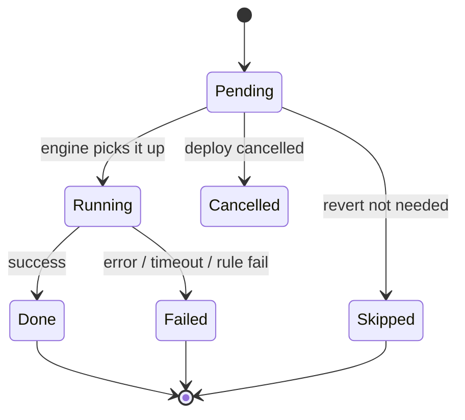
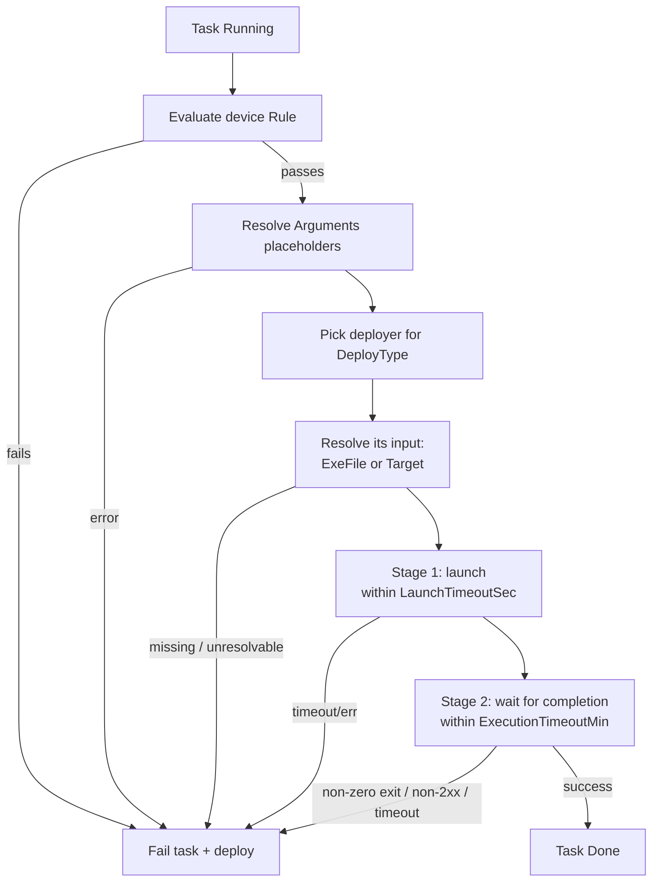
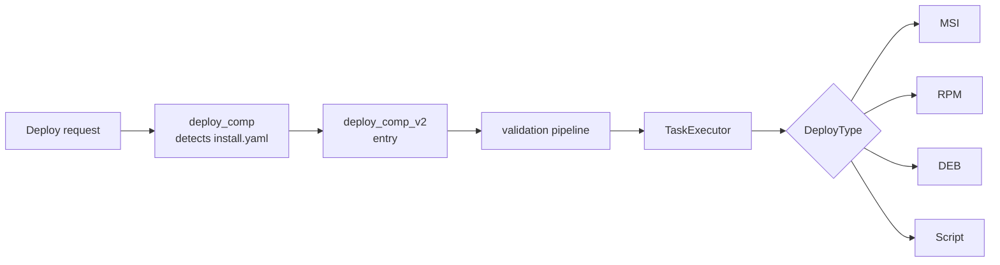

# How It Works

The runtime mechanics behind [Deploy V2](./deploy-v2-overview) — detection, execution, recovery.

## Detection & entry

When a deploy is requested for a delivered release, the agent checks the release's artifacts
directory for `install.yaml`:

- **present** → the Deploy V2 engine takes over. It runs its **own** device-type, policy, and
  rule checks internally.
- **absent** → the classic [V1](../v1/deploy-v1-overview) deploy path runs, unchanged.

The V2 deploy is launched asynchronously (it does not block the request) and the deploy
record's status is set to `Start` immediately, so a UI reflects progress right away.

## Per-task flow

Each task is one unit of work — install a file, verify a step succeeded, undo one (revert),
pull in a dependency, or group several child tasks. A task carries its own:

- `Type` (what kind of task) and `DeployType` (the method that runs it) — see [Action](./deploy-v2-action)
- its input — an `ExeFile` (a delivered artifact) or a `Target` (an endpoint URL or removal
  handle)
- optional `Rule` (whether this device qualifies)
- optional `Arguments` (with runtime placeholders)
- optional `LaunchTimeoutSec` / `ExecutionTimeoutMin`
- optionally its own nested `Tasks` — children it runs and waits for — see
  [Orchestrator](./deploy-v2-orchestrator)

That's what makes "a dedicated deploy flow per artifact" possible: each file, check, or step is
its own independently configured task, and related tasks can be grouped so they succeed or
fail together.

## Task lifecycle & states

Tasks run **in manifest order** (by index). A task that groups child tasks runs those children
and only finishes once they do (see [Orchestrator](./deploy-v2-orchestrator)); leaf tasks run one at a
time.

| Status | Meaning |
|---|---|
| `Pending` | Not started yet. |
| `Running` | Currently executing. |
| `Done` | Completed successfully. |
| `Failed` | Errored, timed out, or its rule was not satisfied. Fails the whole deploy. |
| `Cancelled` | Skipped because the deploy was cancelled before it started. |
| `Skipped` | A **terminal, successful** state: a `Revert` task whose cleanup was not needed (its target succeeded and verified). It counts as complete for progress and status. |

:::note Fleet rollouts add per-device outcomes
A [`FleetDeploy`](./deploy-v2-orchestrator#which-devices-are-acted-on) task also classifies each
**target device** — *targeted*, *excluded*, *rejected*, or *deferred* — on top of the task's own
status above.
:::

:::warning Installs are all-or-nothing
An install step never silently "skips ahead". A rule mismatch, error, or timeout **fails** the
task and the deploy — it does not move on. If a step should only apply to some devices,
express that with a `Rule`: on non-matching devices the deploy fails loudly rather than
half-installing. The only task that ends `Skipped` is a **`Revert`** whose cleanup was not
required.
:::

## What happens for one Execute task

Each `Execute` task is **two-phase and time-bounded**:

1. **Launch phase** — the process (or API request) must *start* within `LaunchTimeoutSec`.
2. **Execution phase** — it must *finish successfully* (a process exit code `0`, an API `2xx`)
   within `ExecutionTimeoutMin`.

The input a task resolves depends on its `DeployType`: a file installer
(`MSI`/`RPM`/`DEB`/`Script`) locates its delivered `ExeFile`; an `API` trigger or a
`*_Uninstall` acts on a resolved `Target` (a `*_Uninstall` also accepts an `ExeFile`). If
either phase times out, or the process exits non-zero / the API returns non-2xx, the task
fails and the deploy stops.

## Crash recovery & resume

Every task's status and timestamps are persisted to the agent database as they change. If the
agent restarts mid-deploy and the same deploy is requested again, the engine reloads saved
state, **skips tasks already `Done`**, and resumes from the first unfinished task. Task
*definitions* always come fresh from the manifest — only *progress* is restored.

## Cancellation

Active deploys register a cancellation token. Cancelling marks all not-yet-started tasks
`Cancelled` and stops the chain. For nested dependency deploys, cancelling the parent
propagates to the children.

## Self-update (installing the agent itself)

When the deployed release **is the agent's own package**, the MSI stops the service and
replaces the running binary — the current process is killed mid-install. The engine handles
this: it launches the installer detached and exits; on the next startup it sees a task stuck
in `Running` and reconciles — if the running version now matches the target, the task is
`Done`; otherwise it resets to `Pending` and retries. No configuration is needed; the engine
detects a self-update by matching the release's project name against the agent's own name.

## Why it's designed this way

Understanding the rationale helps you predict behavior in new situations:

| Design choice | Why |
|---|---|
| **Manifest-as-data** (recipe ships with the release) | One agent installs anything; releases evolve without agent releases. |
| **Installs are all-or-nothing** | Deterministic, safe outcome — a mismatched device fails loudly instead of half-installing; the only planned skip is a revert that was not needed. |
| **Strictly ordered, parent-awaits-child** | Predictable, resumable, easy to reason about; a group finishes only when its children do. |
| **Per-task state persisted** | Enables resume after a mid-install restart (critical for self-update). |
| **Dependencies are themselves full V2 manifests** | Recursion reuses one engine — "a plan is a manifest of manifests". |
| **Placeholders resolved on-device at execution time** | One manifest adapts per device instead of being pre-rendered per target. |
| **Single UTF-16LE deploy log** | Agent lines and msiexec's own log read back as one consistent document. |

## Where it fits (architecture & dependencies)

### Call chain

### What Deploy V2 depends on

| Dependency | Role |
|---|---|
| **Delivery** | Artifacts and dependent releases must be delivered and "ready" before deploy. |
| **Rule engine** | Evaluates each task's `Rule` against device metadata/context. |
| **SettingsIO / CONFIG** | Backs `{Config.*}` placeholders, timeout defaults, and `DEPLOY_MAX_DEPENDENCY_DEPTH`. |
| **Deployers** | Runs each task by a method keyed on `DeployType` — MSI/RPM/DEB/Script installs, MSI/RPM/DEB uninstall, and API/SSE handlers. |
| **Database** | Persists per-task state for resume. |
| **SSE** | Pushes live status on every task transition. |

### What uses it, and the alternative

- **Consumers** — the deploy request path, the UI (status/progress), and — in future — the
  [orchestrator](./deploy-v2-orchestrator#roadmap)
- **Alternative / boundary** — the classic [V1 deploy](../v1/deploy-v1-overview) (no `install.yaml`).
  Detection is automatic; the two never mix within one release

## See also

- [Overview](./deploy-v2-overview)
- [Tasks](./deploy-v2-tasks)
- [Logging & Status](./deploy-v2-logging-and-status)
