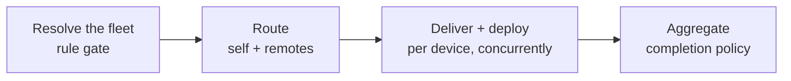

# Orchestrator

How [tasks](./deploy-v2-tasks) run relative to each other — ordering, nesting, and pulling in other
releases as dependencies.

## Ordering within a list

Tasks in a list run **in the order written**. Task 2 starts only after Task 1 is `Done`.

```yaml
Tasks:
  - Type: Execute/v2          # runs first
    DeployType: MSI
    ExeFile: core.msi
  - Type: Execute/v2          # runs only after core.msi succeeds
    DeployType: Script
    ExeFile: post-install.ps1
```

## Grouping & nested tasks

Any task can carry its own `Tasks` list of children. The parent runs its children and only
finishes once **all** of them finish — a parent is never `Done` before its children are. This
is how you bind several related steps (and the check or cleanup that covers them) into one
unit that succeeds or fails together.

Use `Type: Group/v2` when you want a container that runs **nothing itself** — it installs no
file, it just groups its children under one node (one rolled-up status, one subtree timeout,
its own share of the progress bar). A `Group` must have a non-empty `Tasks` list.

```yaml
Tasks:
  - Type: Group/v2                # a container: bundles the two steps below as one unit
    Weight: 100
    Tasks:
      - Type: Execute/v2          # install
        DeployType: MSI
        ExeFile: app.msi
      - Type: Verification/v2     # then confirm it took effect (gates the group)
        DeployType: API
        Target: "http://localhost:9000/health"
```

Children are addressed by a **chain path** — `1` is the second root task, `1.0` its first
child, `1.0.2` the third grandchild — and that path appears in validation errors and the
status trail so you always know *where* in the tree something happened. A parent's
`ExecutionTimeoutMin` bounds its **whole subtree**: if the group runs past it, the engine stops
the running children and fails the group.

An `Execute` task can also bind children directly (not only a `Group`): it runs its own
install first, then its children — so a `Verification`/`Revert` child can target the parent
install itself. See [Action](./deploy-v2-action) for how verification and revert actually trigger.

## Dependencies on other releases

Give a task `Type: Deploy/v2` and set its `ReleaseId` to the release it depends on to make it a
**dependency**. The engine delegates a full, nested Deploy V2 for that release and waits for
it to finish before continuing. A `Deploy/v2` task carries no `ExeFile`/`DeployType` — the
dependent's own `install.yaml` drives it.

```yaml
ReleaseId: ID.MainApp@2.0.0
Type: Deploy/V2
Tasks:
  - Type: Deploy/v2               # ← dependency: sub-deploy this release first
    ReleaseId: ID.Runtime@1.1.0
  - Type: Execute/v2
    DeployType: MSI
    ExeFile: main-app.msi         # ← then install the main app
```

A dependency must be a **registered dependency** of the parent release (declared in the
component catalog — a manifest cannot pull in a release the server never registered as a
dependency, whether direct or transitive), **delivered and ready** (delivery `Done` with all
its artifacts present), and must itself be a **Deploy V2** component (carry its own
`install.yaml`). V2 releases can only depend on V2 releases. The nested deploy is bounded by
the task's `ExecutionTimeoutMin`, and its cancellation is linked to the parent.

## The dependency tree

Dependencies form a **tree** the engine walks depth-first and validates entirely up front:

```mermaid
flowchart TD
    Main[ID.MainApp@2.0.0] --> Rt[ID.Runtime@1.1.0]
    Main --> Plg[ID.Plugin@1.0.0]
    Rt --> Base[ID.Base@1.0.0]
    Plg --> Base
```

## Cycles, depth, and de-duplication

| Guard | Behavior |
|---|---|
| **Cycle detection** | A release appearing as its own ancestor (A → B → A) fails with "dependency cycle detected". |
| **Depth limit** | The tree may not go deeper than `DEPLOY_MAX_DEPENDENCY_DEPTH` (env var, default `10`). |
| **Idempotency / diamond de-dup** | A release already deployed (`Done`) — e.g. `Base` reached via both `Runtime` and `Plugin` above — is not re-run; the second visit short-circuits. |

The whole tree logs into **one shared deploy-log file**, including which parent pulled in each
dependency.

## Fleet deploy across managed devices

A `Deploy/v2` task sub-deploys a release on **this** device. A **`FleetDeploy/v2`** task goes
wider: it rolls a release out across the **managed fleet** — this agent plus the child agents it
orchestrates over the A2A mesh — selecting targets by rule.

```yaml
ReleaseId: ID.MainApp@2.0.0
Type: Deploy/V2
Tasks:
  - Type: FleetDeploy/v2
    ReleaseId: ID.EdgeApp@3.1.0       # the release to deliver + deploy on the fleet
    Scope: Platform                   # which slice of the fleet to consider
    Rule:                             # the gate — only matching devices are targeted
      and:
        - { field: device.deviceType, operator: equals, value: "edge-sensor" }
```

**The rule is a gate.** The release is deployed to every device the rule passes — this agent and
any matched child. Devices the rule rejects are not targets. A rule that matches **no** device
fails the task (there is nothing to roll out).

**`Scope`** chooses which devices are candidates:

| `Scope` | Candidates |
|---|---|
| `Platform` (default) | Devices enrolled into the platform (orchestrated). |
| `Reactive` | Reactive-mode devices only. |
| `All` | Both. |

**`CompletionPolicy`** decides how success and failure propagate across the matched devices:

| `CompletionPolicy` | Unreachable match | One device fails |
|---|---|---|
| `AllConnected` (default) | tolerated — reported *deferred* | aborts the rest; the task fails |
| `Partial` | tolerated — reported *deferred* | others continue; the task succeeds if **any** device did |
| `AllReachable` | **fails the task up front** | aborts the rest; the task fails |

### How a rollout runs



1. **Resolve** — the agent refreshes device metadata, then evaluates the rule against itself and
   every in-scope managed device, yielding the matched set.
2. **Route** — if this agent matched, it runs the release as a local nested deploy (exactly like a
   `Deploy/v2` dependency); each matched child is driven remotely. Self and children run
   concurrently.
3. **Deliver + deploy per device** — each child is taken through its lifecycle: make the release
   discoverable → refresh its state → deliver (download) → deploy (install), awaiting each stage.
   Already-satisfied devices and stages are skipped, so a re-run is safe and resumable.
4. **Aggregate** — per-device outcomes roll up under the completion policy into the task result,
   and each device contributes a progress number split evenly between its delivery and deploy
   phases.

A child agent is **unaware** it is driven by a peer — it receives the same commands and reports
the same status as if talking to the server. Each child's progress and full deploy status fold
back into *this* deploy's status tree **live** — see
[Logging & Status](./deploy-v2-logging-and-status#fleet-and-nested-status).

### Which devices are acted on

Before resolving the rule, the agent asks each in-scope device to refresh its metadata, then
evaluates the rule against the freshest data. Every candidate lands in one of these buckets, and
the reason is recorded in the deploy status so an operator can see *why* a device was or wasn't
acted on:

| Outcome | Meaning |
|---|---|
| **Targeted** | The rule passed; the device is driven through delivery + deploy. |
| **Excluded** | The device has never reported metadata, so the rule can't be evaluated ("no stored device data"). |
| **Rejected** | The rule was evaluated and did not match ("rule did not match"). |
| **Deferred** | The rule matched, but the device was not driven to completion — unreachable under a tolerant policy, or stopped when the run aborted after another device failed. |

**Reachability** means the child currently holds an active managed connection to this agent. A
device that matches the rule but is offline is *deferred* under `AllConnected`/`Partial`; under
`AllReachable` an unreachable match **fails the task up front**, before any device is driven. A
device that goes offline **mid-rollout** is bounded by the same delivery and execution timeouts a
local deploy uses — reconnect within the window and the rollout resumes, otherwise that device
fails.

## Roadmap

Today's dependency and fleet-deploy mechanisms are the foundation for a broader orchestrator
that will:

- **coordinate a set of releases** as one managed unit, in a planned order
- **express richer ordering** — grouping and conditional branches at the plan level
- **generalize beyond deploy** — the same rule-gated, fleet-wide engine applied to delivery
  (distributing artifacts across the fleet) and monitoring (recurring health checks)

Because tasks, nesting, dependencies, per-task rules, weights, and live SSE progress already
exist at the manifest level, the orchestrator builds **on top of** the same primitives — a
plan is "a manifest of manifests".

The schema also reserves task types and deploy methods for capabilities still on this
roadmap — see [Action](./deploy-v2-action) and [Tasks](./deploy-v2-tasks) for where they'll plug in:

| Reserved | Kind | For |
|---|---|---|
| `Config/v2`, `Map/v2` | Task type | Config-group and map/data delivery |
| `Up/v2`, `Down/v2`, `Restart/v2` | Task type | Service/stack lifecycle control (bring up, tear down, restart a running deploy — e.g. a `DockerCompose` stack) |
| `DockerCompose`, `Helm` | Deploy method | Compose-stack and Helm-release installs |
| `Command` | Deploy method | A raw command line, alongside `API`, without a delivered script file |

## See also

- [Tasks](./deploy-v2-tasks)
- [Action](./deploy-v2-action)
- [How It Works](./deploy-v2-how-it-works)
