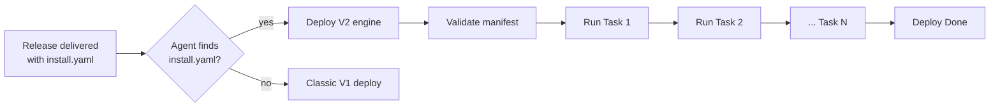

# Deploy V2 — Overview

Deploy V2 lets a release describe **how it installs itself** with a small YAML file —
`install.yaml` — that ships inside the release. Instead of the agent applying one fixed recipe
per package type ("this is an MSI, so run msiexec"), the release carries an **ordered list of
tasks**: install this file, then run that script, but first make sure the device qualifies,
and only after a required companion release is installed. The agent reads the manifest,
validates it end-to-end, and executes the tasks one by one.

:::info When does it activate?
Deploy V2 turns on **automatically** the moment a delivered release contains an `install.yaml`
in its artifacts directory. Releases without one keep using the classic
([V1](../v1/deploy-v1-overview)) deploy path, unchanged.
:::

## What it is

Think of `install.yaml` as a short **to-do list** for one release. Each item on the list is a
**task**. Tasks run **top to bottom, one at a time**. If any task fails, the whole deploy fails
and stops.

The headline capability: **each file/artifact in a release gets its own dedicated deploy
task**, with its own method, arguments, conditions, and timeouts — and the release author
controls the **order** in which those tasks run.

## Why it exists

The classic deploy path had one implicit, hard-coded recipe per package type. That works for a
single file, but real installations often need more:

| Real-world need | Classic deploy (V1) | Deploy V2 |
|---|---|---|
| Install a package **and then** run a post-install script | Not possible in one deploy | Two ordered tasks |
| Give **each file** its own install behavior | One recipe for the whole release | One dedicated task per file |
| Only install on machines that match a condition | External policy only | Per-task rule, evaluated on the device |
| Pass install-time arguments that depend on the device | Static only | `{placeholders}` resolved at runtime |
| Require a companion release to be installed first | Manual, out-of-band | Declared **dependency**, driven automatically |
| Require a minimum agent version | Not enforced | `MinAgentVersion` gate |
| Survive an agent restart mid-install | Restarts from scratch | Resumes from where it stopped |

The core idea: **"how to install this release" becomes data that lives with the release.** One
agent can then install anything a manifest describes, in the right order, with the right
guardrails — without changing the agent.

## What it gives you today

- **Strict, up-front validation** — the whole manifest is checked **before any task runs**:
  structure, task ordering, per-method inputs, and cross-task rules. A bad manifest fails
  immediately with a precise, path-addressed reason (e.g. `Task[1.0.2]: …`) instead of
  half-installing.
- **A dedicated deploy flow per file/artifact** — each task has its own deploy method,
  arguments, rule, and timeouts.
- **Grouped, nested tasks** — a task can bind a group of child tasks and only completes once
  they do, so related steps succeed or fail as one unit.
- **Verify a step succeeded** — a verification task (HTTP, script, or event stream) gates a
  group: the install is not accepted until the check passes.
- **Undo on failure (revert)** — a revert task nested in a group cleans up the steps it covers
  when they fail their check, so a failed group does not leave a half-applied install behind.
- **Install *and* uninstall** — dedicated removal methods (MSI / RPM / DEB uninstall, script,
  or API).
- **Fleet rollout** — a `FleetDeploy` task rolls a release out across the managed fleet,
  selecting target devices by rule and tracking every device in one live status tree.
- **Controllable task ordering** — tasks run in the order written.
- **Dependent-deployment control** — a task can install *and drive* another release's full
  deployment, waiting for it to finish before continuing.
- **Device-aware installs** — per-task rules and `{placeholder}` arguments adapt one manifest
  to many devices.
- **Reboot-aware** — a task can declare that it reboots the device and resume correctly
  afterwards.
- **Actionable status** — a structured status document with per-task progress and
  machine-readable advisories (e.g. "reboot required", "retry with force") a UI can act on.
- **Resilience** — crash recovery/resume, cancellation, and safe agent self-update.

## What's coming next

The manifest schema reserves a few fields and values for capabilities still on the roadmap, so
today's manifests stay forward-compatible:

- **`Config` and `Map` task types** — apply a named configuration group or a map/data step
  instead of running a file
- **`Up`, `Down`, `Restart` task types** — service/stack lifecycle control for a running deploy
- **`DockerCompose` and `Helm`** deploy methods, plus a **`Command`** method for a raw command
  line without a delivered script
- **Orchestrated deployment across multiple devices** — a master agent driving a fleet of
  child agents and tracking each one's task-level progress

See [Orchestrator](./deploy-v2-orchestrator#roadmap) for detail.

## Quick reference

| Concept | Value |
|---|---|
| Manifest file | `install.yaml` (in the release's artifacts dir) |
| Manifest `Type` | `Deploy/V2` |
| Task types | `Execute/v2`, `Verification/v2`, `Revert/v2`, `Group/v2`, `Deploy/v2`, `FleetDeploy/v2` |
| Deploy methods | Install: `MSI`, `RPM`, `DEB`, `Script`, `API` · Uninstall: `MSI_Uninstall`, `RPM_Uninstall`, `DEB_Uninstall` · Verify: `API`, `Script`, `SSE` |
| Placeholder sources | `Device`, `Env`, `Config`, `Release` (metadata via `Release.metadata.*`) |
| Default launch timeout | `60` s (or `Release.metadata.timeoutLaunch`) |
| Default execution timeout | `15` min (or `Release.metadata.timeoutInstallation`); a parent's bounds its whole subtree |
| Max dependency depth | `DEPLOY_MAX_DEPENDENCY_DEPTH` (default `10`) |
| Deploy log | `<logs_dir>/deployments/<catalog_id>.log` (UTF-16LE) |
| Status document | `message_log` — JSON `{ total, completed, skipped, failed, cancelled, current, messages, advisories }` |
| Failure model | Installs are all-or-nothing; the only `Skipped` task is a revert that wasn't needed |

## See also

- [How It Works](./deploy-v2-how-it-works)
- [Tasks](./deploy-v2-tasks)
- [Action](./deploy-v2-action)
- [Orchestrator](./deploy-v2-orchestrator)
- [Deploy V1](../v1/deploy-v1-overview)
