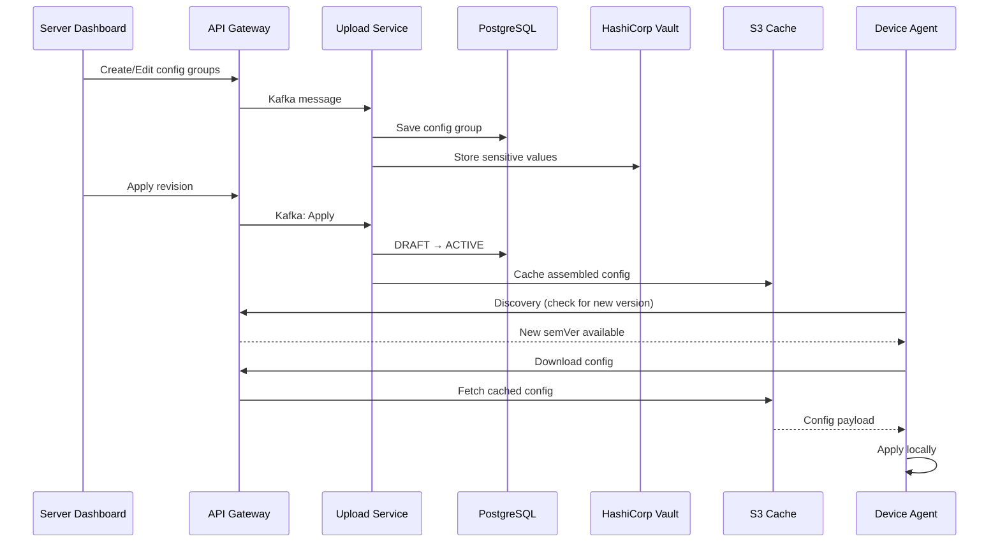

# GetConfig - Configuration Management

## Introduction

GetConfig is a centralized configuration management system that enables you to define, version, and distribute runtime configuration to your device fleet. It supports key-value configuration groups, semantic versioning, sensitive value storage (via Vault), ConfigMap inheritance, and automatic sync to agents.

## Key Concepts

### Config Projects

A **Config Project** is a project of type `CONFIG` that holds configuration intended for devices. Config projects are **created automatically** when a new device performs its first discovery — they do not need to be created manually from the Dashboard. Each config project contains revisions, and each revision contains one or more configuration groups.

### Configuration Groups

A **Configuration Group** is a named collection of key-value pairs written in YAML. Groups allow you to organize configuration logically (e.g., `network`, `logging`, `application`).

Each group has:
- **Name**: Unique identifier within the revision
- **Display Name**: Human-readable label
- **YAML Content**: The actual key-value configuration
- **Sensitive Keys**: Keys whose values are stored securely in Vault
- **Position**: Ordering within the revision

### Revisions

Revisions provide versioning for your configuration. Each revision goes through a lifecycle:

1. **DRAFT** — Editable state; only one draft can exist at a time
2. **ACTIVE** — The currently deployed revision; applied to devices
3. **ARCHIVED** — Previously active revisions kept for history

When a draft is applied, it becomes ACTIVE, the previous active revision becomes ARCHIVED, and a semantic version is automatically computed.

### ConfigMaps

A **ConfigMap** is a special project type that provides shared configuration across multiple config projects. ConfigMaps can be associated with:
- Specific **device types**
- Specific **device IDs**

When a ConfigMap revision is applied, all linked device configs are automatically refreshed.

### Local Overrides

Agents can apply **local overrides** to specific configuration keys. These overrides take precedence over server-distributed values, allowing device-specific adjustments without modifying the central configuration.

## Architecture Overview

## Managing Configurations

### Config Project Creation

Config projects are created automatically when a new device performs its first discovery against the server. There is no need to manually create them from the Dashboard. Once a device completes discovery, its corresponding config project appears in the **Devices** list, ready for you to manage its configuration.

### Working with Revisions

#### Creating a Draft

1. Open the device config page
3. Click **Edit** to start a new revision

#### Adding Configuration Groups

1. In the active draft, click **Add Group**
2. Provide a **Name** and **Display Name**
3. Enter your configuration in key value/ or YAML format
4. Mark any sensitive keys that should be stored in Vault
5. Click **Save**

#### Editing Groups

1. Select an existing group from the list
2. Modify the content or group properties
3. Click **Save**

#### Applying a Revision

1. Review all groups in the draft
2. Click **Save**

:::caution
Applying a revision immediately makes it available to all targeted devices on their next sync. Ensure you have tested the configuration before applying.
:::

#### Viewing Revision History

The history shows all past revisions with their version numbers, status, and timestamps.

### Managing Sensitive Values

Configuration values marked as **sensitive** are stored in HashiCorp Vault and are never exposed in plaintext through the API or UI. They appear masked as `***` in the interface.

To mark a key as sensitive:
1. Edit the configuration group
2. Select the key(s) to mark as sensitive
3. Save the group

### ConfigMap Management

ConfigMaps allow you to define shared configuration that can be inherited by multiple config projects.

#### Creating a ConfigMap Project

1. Navigate to **Projects** > **Create Project**
2. Select project type **CONFIG_MAP**
3. Define your shared configuration groups

#### Associating ConfigMaps

1. Open your ConfigMap project
2. Navigate to **Associations**
3. Link the ConfigMap to specific **device types** or **device IDs**
4. Select which Config projects should inherit this ConfigMap

#### ConfigMap Cascade Behavior

When a ConfigMap revision is applied:
- All linked Config projects are automatically refreshed
- Device configs are reassembled with the updated ConfigMap values
- Agents receive the updated configuration on their next sync

## Device Configuration View

### Assembled Device Config

The Dashboard provides a view of the final assembled configuration for each device, showing the merged result of:
- Device-specific config groups
- Inherited ConfigMap groups
- Global groups

### Agent-Side Configuration

On the device, the agent exposes configuration to local applications through its local API:

| Endpoint | Description |
|----------|-------------|
| `GET /api/v2/config/file` | Complete device config (all groups) |
| `GET /api/v2/config/groups` | List all group names |
| `GET /api/v2/config/group/{name}` | Get all key-values for a group |
| `GET /api/v2/config/group/{name}/env/{key}` | Get a single value |
| `GET /api/v2/config/overrides` | View all local overrides |
| `PUT /api/v2/config/overrides/{group}/{key}` | Set a local override |
| `DELETE /api/v2/config/overrides/{group}/{key}` | Remove a local override |

### Local Overrides

Agents can override individual configuration values locally without affecting the server-side configuration:

1. Open the Agent UI on the device
2. Navigate to **Configuration**
3. Select a group and key
4. Set an override value

:::info
Local overrides persist across config syncs. They take precedence over server-distributed values until explicitly removed.
:::

## Configuration Sync

### How Sync Works

1. During **discovery**, the agent compares its local config version with the server-advertised version
2. If a newer version is available, the agent downloads the updated configuration
3. The new config is cached locally and made available through the local API
4. If a `getapp_config` group exists, its values are merged into the agent's own settings

### Sync Triggers

- Automatic periodic discovery cycle
- Manual sync initiated from the Agent UI
- Device restart

### Offline Behavior

Configuration is cached locally on the device. If the device loses connectivity:
- The last synced configuration remains available
- Local overrides continue to function
- The agent will sync the latest version once connectivity is restored

## Server API Reference

### Config Endpoints

| Method | Endpoint | Description |
|--------|----------|-------------|
| `GET` | `/api/v1/get_config/:id/config/revisions` | List all revisions |
| `GET` | `/api/v1/get_config/:id/config/revisions/:revisionId` | Get specific revision |
| `POST` | `/api/v1/get_config/:id/config/revisions/draft` | Create new draft |
| `DELETE` | `/api/v1/get_config/:id/config/revisions/draft` | Delete current draft |
| `POST` | `/api/v1/get_config/:id/config/revisions/apply` | Apply draft (DRAFT → ACTIVE) |
| `PUT` | `/api/v1/get_config/:id/config/groups` | Create/update group in draft |
| `DELETE` | `/api/v1/get_config/:id/config/groups` | Delete group from draft |
| `GET` | `/api/v1/get_config/:id/config/device-config/:deviceId/version/:semver` | Get assembled device config |

### ConfigMap Endpoints

| Method | Endpoint | Description |
|--------|----------|-------------|
| `GET` | `/api/v1/get_config/:id/config-map/associations` | List associations |
| `POST` | `/api/v1/get_config/:id/config-map/associations` | Add associations |
| `DELETE` | `/api/v1/get_config/:id/config-map/associations/:associationId` | Remove association |
| `GET` | `/api/v1/get_config/:id/config/config-maps` | List ConfigMaps for a project |

## Best Practices

### Configuration Organization

- **Group by domain**: Separate configuration into logical groups (e.g., `network`, `security`, `application`)
- **Use meaningful names**: Group and key names should be self-explanatory
- **Keep groups focused**: Each group should have a single responsibility

### Security

- **Mark sensitive values**: Always mark passwords, tokens, and secrets as sensitive
- **Limit access**: Use role-based permissions to control who can modify configurations
- **Audit changes**: Review revision history regularly

### Rollout Strategy

- **Test before applying**: Validate configuration changes on test devices first
- **Use ConfigMaps for shared config**: Avoid duplicating the same values across multiple projects
- **Version awareness**: Use semantic versioning to track meaningful changes

### Local Overrides

- **Use sparingly**: Local overrides make central management harder
- **Document overrides**: Keep track of which devices have overrides and why
- **Clean up**: Remove overrides once the central config is updated

## Troubleshooting

### Configuration Not Syncing

1. Verify the revision is in **ACTIVE** status
2. Check that the device is connected and discovery is running
3. Confirm the config project is associated with the device (via offering)
4. Check agent logs for sync errors

### Sensitive Values Not Resolving

1. Verify Vault connectivity from the server
2. Check that the keys are correctly marked as sensitive
3. Review Upload service logs for Vault errors

### ConfigMap Changes Not Propagating

1. Ensure the ConfigMap revision has been **applied**
2. Verify associations are correctly configured
3. Check that linked Config projects have active revisions

## Next Steps

- [Managing Policies](./managing-policies.md) — Control which devices receive specific releases
- [Managing Restrictions](./managing-restrictions.md) — Define device-level installation rules
- [GitOps Releases](../gitops-releases.md) — Automate configuration via Git workflows
