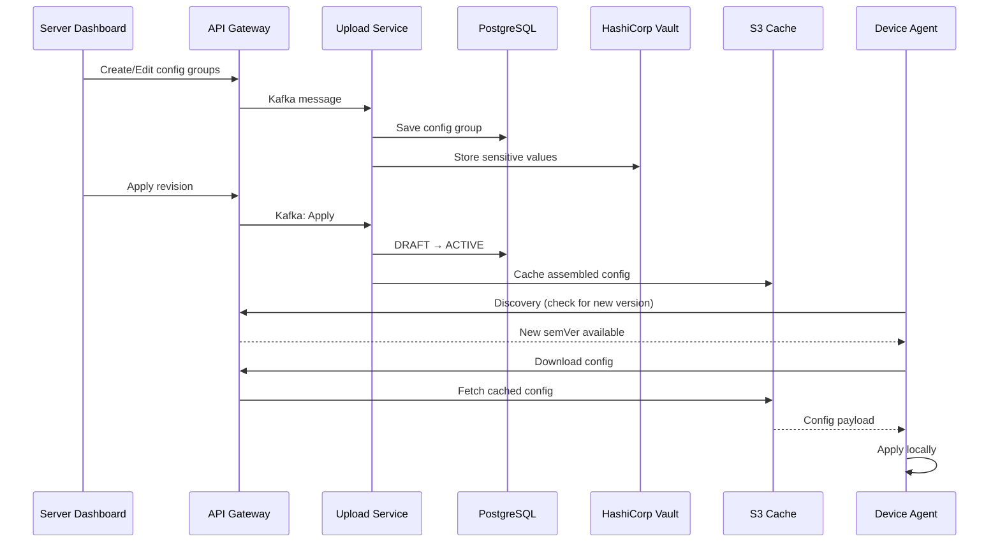
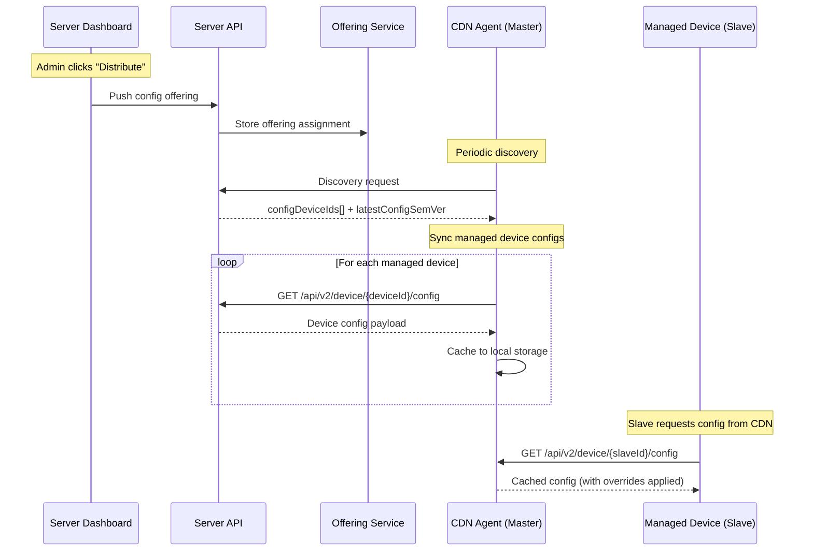

# GetConfig - Configuration Management

## Introduction

GetConfig is a centralized configuration management system that enables you to define, version, and distribute runtime configuration to your device fleet. It supports key-value configuration groups, semantic versioning, sensitive value storage (via Vault), ConfigMap inheritance, and automatic sync to agents.

## Key Concepts

### Config Projects

A **Config Project** is a project of type `CONFIG` that holds configuration intended for devices. Config projects are **created automatically** when a new device performs its first discovery — they do not need to be created manually from the Dashboard. Each config project contains revisions, and each revision contains one or more configuration groups.

### Configuration Groups

A **Configuration Group** is a named collection of key-value pairs written in YAML. Groups allow you to organize configuration logically (e.g., `network`, `logging`, `application`).

Each group has:
- **Name**: Unique identifier within the revision
- **Display Name**: Human-readable label
- **YAML Content**: The actual key-value configuration
- **Sensitive Keys**: Keys whose values are stored securely in Vault
- **Position**: Ordering within the revision

### Revisions

Revisions provide versioning for your configuration. Each revision goes through a lifecycle:

1. **DRAFT** — Editable state; only one draft can exist at a time
2. **ACTIVE** — The currently deployed revision; applied to devices
3. **ARCHIVED** — Previously active revisions kept for history

When a draft is applied, it becomes ACTIVE, the previous active revision becomes ARCHIVED, and a semantic version is automatically computed.

### ConfigMaps

A **ConfigMap** is a special project type that provides shared configuration across multiple config projects. ConfigMaps can be associated with:
- Specific **device types**
- Specific **device IDs**

When a ConfigMap revision is applied, all linked device configs are automatically refreshed.

### Local Overrides

Agents can apply **local overrides** to specific configuration keys. These overrides take precedence over server-distributed values, allowing device-specific adjustments without modifying the central configuration.

## Architecture Overview



## Managing Configurations

### Config Project Creation

Config projects are created automatically when a new device performs its first discovery against the server. There is no need to manually create them from the Dashboard. Once a device completes discovery, its corresponding config project appears in the **Devices** list, ready for you to manage its configuration.


### Working with Revisions

#### Creating a Draft

1. Open the device config page
3. Click **Edit** to start a new revision


#### Adding Configuration Groups

1. In the active draft, click **Add Group**
2. Provide a **Name** and **Display Name**
3. Enter your configuration in key value/ or YAML format
4. Mark any sensitive keys that should be stored in Vault
5. Click **Save**


#### Editing Groups

1. Select an existing group from the list
2. Modify the content or group properties
3. Click **Save**


#### Applying a Revision

1. Review all groups in the draft
2. Click **Save**

:::caution
Applying a revision immediately makes it available to all targeted devices on their next sync. Ensure you have tested the configuration before applying.
:::

#### Viewing Revision History

The history shows all past revisions with their version numbers, status, and timestamps.


### Managing Sensitive Values

Configuration values marked as **sensitive** are stored in HashiCorp Vault and are never exposed in plaintext through the API or UI. They appear masked as `***` in the interface.

To mark a key as sensitive:
1. Edit the configuration group
2. Select the key(s) to mark as sensitive
3. Save the group


### ConfigMap Management

ConfigMaps allow you to define shared configuration that can be inherited by multiple config projects.

#### Creating a ConfigMap Project

1. Navigate to **Projects** > **Create Project**
2. Select project type **CONFIG_MAP**
3. Define your shared configuration groups


#### Associating ConfigMaps

1. Open your ConfigMap project
2. Navigate to **Associations**
3. Link the ConfigMap to specific **device types** or **device IDs**
4. Select which Config projects should inherit this ConfigMap


#### ConfigMap Cascade Behavior

When a ConfigMap revision is applied:
- All linked Config projects are automatically refreshed
- Device configs are reassembled with the updated ConfigMap values
- Agents receive the updated configuration on their next sync

## Device Configuration View

### Assembled Device Config

The Dashboard provides a view of the final assembled configuration for each device, showing the merged result of:
- Device-specific config groups
- Inherited ConfigMap groups
- Global groups


### Table View — Multi-Device Config Editing

The Dashboard provides a **Table View** that lets you view and edit configuration across multiple devices at once. Switch to it from the **Devices** list by changing the view mode to **Config**.

The table displays a matrix of **devices (rows) × config keys (columns)**, grouped under their config group headers. Click any editable cell to modify its value inline — ConfigMap-inherited groups are read-only. Modified cells are highlighted, and clicking **Save** applies all pending changes across all affected devices at once.


## Server API Reference

### Config Endpoints

| Method | Endpoint | Description |
|--------|----------|-------------|
| `GET` | `/api/v1/get_config/:id/config/revisions` | List all revisions |
| `GET` | `/api/v1/get_config/:id/config/revisions/:revisionId` | Get specific revision |
| `POST` | `/api/v1/get_config/:id/config/revisions/draft` | Create new draft |
| `DELETE` | `/api/v1/get_config/:id/config/revisions/draft` | Delete current draft |
| `POST` | `/api/v1/get_config/:id/config/revisions/apply` | Apply draft (DRAFT → ACTIVE) |
| `PUT` | `/api/v1/get_config/:id/config/groups` | Create/update group in draft |
| `DELETE` | `/api/v1/get_config/:id/config/groups` | Delete group from draft |
| `GET` | `/api/v1/get_config/:id/config/device-config/:deviceId/version/:semver` | Get assembled device config |

### ConfigMap Endpoints

| Method | Endpoint | Description |
|--------|----------|-------------|
| `GET` | `/api/v1/get_config/:id/config-map/associations` | List associations |
| `POST` | `/api/v1/get_config/:id/config-map/associations` | Add associations |
| `DELETE` | `/api/v1/get_config/:id/config-map/associations/:associationId` | Remove association |
| `GET` | `/api/v1/get_config/:id/config/config-maps` | List ConfigMaps for a project |

### Agent-Side Configuration

On the device, the agent exposes configuration to local applications through its local API:

| Endpoint | Description |
|----------|-------------|
| `GET /api/v2/config/file` | Complete device config (all groups) |
| `GET /api/v2/config/groups` | List all group names |
| `GET /api/v2/config/group/{name}` | Get all key-values for a group |
| `GET /api/v2/config/group/{name}/env/{key}` | Get a single value |
| `GET /api/v2/config/overrides` | View all local overrides |
| `PUT /api/v2/config/overrides/{group}/{key}` | Set a local override |
| `DELETE /api/v2/config/overrides/{group}/{key}` | Remove a local override |

### Local Overrides

Agents can override individual configuration values locally without affecting the server-side configuration. Overrides are managed via the agent's local API:

| Method | Endpoint | Description |
|--------|----------|-------------|
| `GET` | `/api/v2/config/overrides` | View all local overrides |
| `GET` | `/api/v2/config/overrides/{group}` | View overrides for a specific group |
| `PUT` | `/api/v2/config/overrides/{group}/{key}` | Set a local override |
| `DELETE` | `/api/v2/config/overrides/{group}/{key}` | Remove a local override |

:::info
Local overrides persist across config syncs. They take precedence over server-distributed values until explicitly removed.
:::

## The `getapp_config` Reserved Group

The `getapp_config` group is a **reserved configuration group** that directly controls the behavior of the GetApp agent itself. Unlike regular groups that are simply exposed via the local API, values in `getapp_config` are **automatically merged into the agent's own `config.yaml`** on every sync.

This provides a powerful mechanism for remotely managing agent settings across your device fleet from the Dashboard, without needing to manually update each device.

### How It Works

1. The server always includes `getapp_config` as a default group in every config project
2. When the agent syncs its configuration, it extracts the `getapp_config` group
3. Each key-value pair is **validated** against expected types
4. Valid values are **deep-merged** into the agent's `config.yaml`
5. Affected subsystems are **hot-reloaded** — no agent restart required

### Merge Behavior

- **Deep recursive merge** — nested settings are merged at the leaf level
- **Only provided keys are affected** — keys absent from `getapp_config` are left untouched in the local config
- **Type safety** — known keys are type-checked; mismatched types are rejected and logged as errors
- **Unknown keys** are accepted and passed through without type validation

### `local_config_priority` Flag

The agent has a special `device.local_config_priority` setting (default: `false`) that controls merge precedence:

| `local_config_priority` | Behavior |
|--------------------------|----------|
| `false` (default) | **Server wins** — `getapp_config` values overwrite local values |
| `true` | **Local wins** — only keys *absent* locally are written from the server |

:::caution
The `device.local_config_priority` flag itself is **protected** — it cannot be overwritten remotely via `getapp_config`. It can only be changed directly on the device.
:::

### Available Settings

The following agent settings can be controlled remotely via the `getapp_config` group:

#### Device Settings

| Key | Type | Description |
|-----|------|-------------|
| `device.device_id` | String | Device identifier |
| `device.device_type_token` | Array | Device type tags |
| `device.platform` | String | Platform type |
| `device.platform_id` | String | Platform identifier |
| `device.meta_data.name` | String | Device display name |
| `device.meta_data.misc` | String | Misc metadata |

#### Network Settings

| Key | Type | Description |
|-----|------|-------------|
| `network.getapp_server_urls` | Array | Server URLs |
| `network.availability_url` | String | Network availability check URL |
| `network.net_tcp_stream_timeout_sec` | Number | TCP stream timeout (seconds) |

#### Discovery Settings

| Key | Type | Description |
|-----|------|-------------|
| `discovery.periodic_interval_min` | Number | Discovery interval (minutes) |
| `discovery.stale_after_mins` | Number | Discovery staleness threshold (minutes) |
| `discovery.component_last_run` | String | Last component discovery timestamp |

#### Delivery Settings

| Key | Type | Description |
|-----|------|-------------|
| `delivery.delivery_auto_trigger` | Bool | Auto-trigger delivery after discovery |
| `delivery.delivery_storage_buffer_bytes` | Number | Storage buffer size (bytes) |
| `delivery.use_only_artifacts_size_for_storage_calculation` | Bool | Artifact size calculation mode |
| `delivery.max_parallel_deliveries` | Number | Maximum parallel downloads |
| `delivery.delivery_timeout_mins` | Number | Delivery timeout (minutes) |
| `delivery.delivery_retry_count` | Number | Number of delivery retries |

#### Deploy Settings

| Key | Type | Description |
|-----|------|-------------|
| `deploy.deploy_auto_on_pull` | Bool | Auto-deploy after pull |
| `deploy.deploy_timeout_sec` | Number | Deploy timeout (seconds) |

#### Release Health Check Settings

| Key | Type | Description |
|-----|------|-------------|
| `releases.health_check_timeout_secs` | Number | Health check timeout (seconds) |
| `releases.health_check_interval_mins` | Number | Health check interval (minutes) |

#### General & Logging Settings

| Key | Type | Description |
|-----|------|-------------|
| `general.query_status_interval_sec` | Number | Status polling interval (seconds) |
| `logs.logs_run_dispatch_job` | Bool | Enable log dispatch job |

#### Analytics (Matomo) Settings

| Key | Type | Description |
|-----|------|-------------|
| `matomo.matomo_use_buffer` | Bool | Buffer analytics events |
| `matomo.matomo_server_url` | String | Matomo server URL |
| `matomo.matomo_site_id` | Number | Matomo site ID |
| `matomo.matomo_dimension_id` | Number | Matomo dimension ID |
| `matomo.matomo_max_retention_hours` | Number | Matomo retention period (hours) |
| `matomo.matomo_max_buffer_size_mb` | Number | Matomo buffer size (MB) |

### Hot-Reload Behavior

After merging `getapp_config` values, the agent hot-reloads affected subsystems:

- **Network/Delivery changes** — refresh the HTTP client pool immediately
- **Discovery changes** — reset the discovery scheduler interval
- **Other settings** — picked up automatically on the next loop iteration

### Example

A `getapp_config` group with the following YAML content:

```yaml
discovery:
  periodic_interval_min: 10
delivery:
  max_parallel_deliveries: 3
  delivery_auto_trigger: true
network:
  net_tcp_stream_timeout_sec: 30
```

This would configure all devices receiving this config to:
- Run discovery every 10 minutes
- Allow up to 3 parallel deliveries with auto-trigger enabled
- Set TCP stream timeout to 30 seconds

## Configuration Sync

### How Sync Works

1. During **discovery**, the agent compares its local config version with the server-advertised version
2. If a newer version is available, the agent downloads the updated configuration
3. The new config is cached locally and made available through the local API
4. If a `getapp_config` group exists, its values are [merged into the agent's settings](#the-getapp_config-reserved-group)

### Sync Triggers

- Automatic periodic discovery cycle
- Manual sync initiated from the Agent UI
- Device restart

### Offline Behavior

Configuration is cached locally on the device. If the device loses connectivity:
- The last synced configuration remains available
- Local overrides continue to function
- The agent will sync the latest version once connectivity is restored

## CDN Configuration Distribution

A **CDN agent** (also called a master node) can act as a local configuration server for managed devices (slave nodes). This enables configuration distribution in environments where managed devices don't have direct connectivity to the GetApp server.

### How CDN Config Distribution Works



### Distributing Config to CDN Agents

From the Server Dashboard, you can push a device's configuration to CDN agents so they can serve it to managed devices:

1. Navigate to the **Devices** list
2. Select the target device(s) or device group
3. Click **Distribute**
4. Select the config project(s) to distribute
5. Confirm the action


This creates an **offering assignment** in the server, which the CDN agent picks up during its next discovery cycle.

### CDN Agent Config Sync Process

During discovery, the CDN agent receives two pieces of config-related information from the server:

1. **`latestConfigSemVer`** — the version of the CDN agent's own config
2. **`configDeviceIds`** — a list of config catalog IDs for all devices whose configs should be cached locally

The CDN agent then:

1. **Syncs its own config** — downloads and applies its self-config (including `getapp_config` if present)
2. **Syncs managed device configs** — for each device ID in the combined list (server-provided IDs + locally known managed devices), downloads the config from the server and caches it locally as `devices-config/{device_id}.json`

### Serving Config to Managed Devices

Managed devices (slaves) connect to the CDN agent and request their configuration through the same endpoint used for direct server communication:

```
GET /api/v2/device/{deviceId}/config
```

The CDN agent serves the locally cached config with any applicable overrides applied. This means managed devices don't need to differentiate between connecting to a CDN agent or the server — the API is the same.

### CDN Agent API Endpoints

The CDN agent exposes the following endpoints for managing CDN-specific configuration:

| Method | Endpoint | Description |
|--------|----------|-------------|
| `GET` | `/api/cdn/config` | Get CDN settings (TTL, platform management) |
| `PUT` | `/api/cdn/config` | Update CDN settings |
| `POST` | `/api/cdn/config/devices/sync` | Trigger bulk config sync for specific device IDs |
| `GET` | `/api/cdn/device` | Get device data for CDN-connected devices |
| `GET` | `/api/cdn/device/offering` | Get per-device offering with metadata |
| `POST` | `/api/cdn/devices/action` | Dispatch actions to managed devices (Push, Discovery, etc.) |
| `GET` | `/api/cdn/events/managed/{device_id}` | SSE stream for managed device commands |

### Managed Device Connectivity

Managed devices maintain a connection to the CDN agent via **Server-Sent Events (SSE)**:

```
GET /api/cdn/events/managed/{device_id}
```

The CDN agent tracks which managed devices are currently connected. This connectivity status is used to determine which devices are online and can receive pushed actions (e.g., triggering a discovery or delivery).

### CDN Settings

CDN-specific settings are stored separately in `cdn-config.yaml` on the CDN agent. Key settings include:

| Setting | Default | Description |
|---------|---------|-------------|
| `inactive_device_hours` | 24 | Hours before a device is considered inactive |
| `device_delete_after_days` | 30 | Days before an inactive device record is removed |
| `platform_management` | — | Platform-specific management configuration |
| `cdn_node_id` | — | Unique identifier for this CDN node |


## Best Practices

### Configuration Organization

- **Group by domain**: Separate configuration into logical groups (e.g., `network`, `security`, `application`)
- **Use meaningful names**: Group and key names should be self-explanatory
- **Keep groups focused**: Each group should have a single responsibility

### Security

- **Mark sensitive values**: Always mark passwords, tokens, and secrets as sensitive
- **Limit access**: Use role-based permissions to control who can modify configurations
- **Audit changes**: Review revision history regularly

### Rollout Strategy

- **Test before applying**: Validate configuration changes on test devices first
- **Use ConfigMaps for shared config**: Avoid duplicating the same values across multiple projects
- **Version awareness**: Use semantic versioning to track meaningful changes

### Local Overrides

- **Use sparingly**: Local overrides make central management harder
- **Document overrides**: Keep track of which devices have overrides and why
- **Clean up**: Remove overrides once the central config is updated

## Troubleshooting

### Configuration Not Syncing

1. Verify the revision is in **ACTIVE** status
2. Check that the device is connected and discovery is running
3. Confirm the config project is associated with the device (via offering)
4. Check agent logs for sync errors

### Sensitive Values Not Resolving

1. Verify Vault connectivity from the server
2. Check that the keys are correctly marked as sensitive
3. Review Upload service logs for Vault errors

### ConfigMap Changes Not Propagating

1. Ensure the ConfigMap revision has been **applied**
2. Verify associations are correctly configured
3. Check that linked Config projects have active revisions

## Next Steps

- [Managing Policies](./managing-policies.md) — Control which devices receive specific releases
- [Managing Restrictions](./managing-restrictions.md) — Define device-level installation rules
- [GitOps Releases](../gitops-releases.md) — Automate configuration via Git workflows
