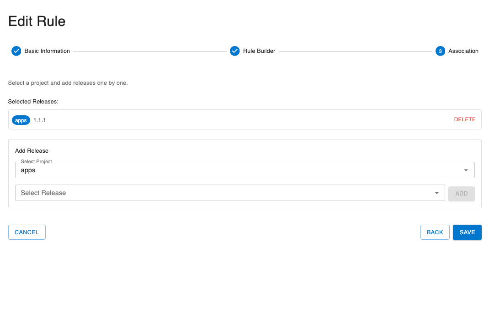

# Managing Policies

This guide provides step-by-step instructions for creating, viewing, editing, and deleting policies using the GetApp Dashboard.

## Prerequisites

Before managing policies, ensure you have:
- Access to the GetApp Dashboard
- Appropriate user permissions (Policy management roles)
- At least one project with releases
- Basic understanding of [policy concepts](./understanding-policies.md)

## Accessing Policy Management

Policies and restrictions are managed together on the same page.

### Navigation Path

1. Log in to the GetApp Dashboard
2. Navigate to **Rules** in the main menu
3. Both policies and restrictions are displayed in the same list

**Note**: The Rules page displays both policies and restrictions together.

## Viewing Policies

### Policies List View

The policies list displays all policies associated with releases in your projects.

**Information Displayed:**
- **Name**: Policy identifier
- **Type**: "Policy"
- **Version**: Current version number
- **Association**: Which releases the policy applies to
- **Status**: Active or Inactive
- **Actions**: Edit, Delete, Duplicate, View buttons

### Viewing Policy Details

To view detailed information about a policy:

1. Click on the **policy name** in the list
2. A details panel opens showing:
   - Full policy name
   - Description
   - Type (Policy)
   - Version number
   - Creation date
   - Last modified date
   - Active/Inactive status
   - Associated releases (project name and version)
   - Complete rule definition

### Understanding the Rule Display

The rule is displayed in a structured format:
- **Simple rules**: Show field, operator, and value
- **Complex rules**: Show nested conditions with AND/OR operators
- **Visual indicators**: Different colors for operators and values

## Creating a New Policy

### Opening the Create Dialog

1. Navigate to the Rules page
2. Click the **Create** or **Add Rule** button
3. A popup dialog opens with a 3-step wizard

### Step 1: Basic Information

In the first step, configure the basic policy details:

**Name** (Required):
- Enter a descriptive name
- Must be unique within your policies
- Examples: "Production Servers Only", "US Region Rollout"

**Description** (Optional):
- Add a detailed explanation
- Explain why this policy exists
- Document any special considerations

**Type** (Required):
- Select **Policy** from the dropdown
- (Restriction is the other option)

**Status** (Required):
- **Active**: Policy takes effect immediately upon creation
- **Inactive**: Policy is created but not enforced (for testing or future use)

Click **Next** to proceed to step 2.

### Step 2: Build the Rule

In the third and final step, select which releases this policy should apply to.

**Single Release Association**:
1. Click **Add Release**
2. Select **Project Name** from dropdown
3. Select **Version** from dropdown
4. Click **Add**

**Multiple Release Association**:
1. Repeat the above steps for each release
2. The policy will apply to all selected releases
3. All listed releases will be subject to this policy's rules

**Remove Association**:
- Click the **DELETE** button next to a release to remove it

### Review and Save

In the second step, create the rule expression that defines when this policy matches.

The rule builder provides:
- **Visual Rule Builder**: A graphical interface for building rules
- **JSON Preview**: Real-time JSON representation of your rule

#### Simple Rule

For a simple field comparison:

1. Select **Simple Rule** option
2. Choose a **Field** from the dropdown (e.g., "deviceType")
3. Choose an **Operator** (e.g., "equals")
4. Enter the **Value** (e.g., "ServerDevice")
5. See the JSON preview update automatically

#### Complex Rule with AND

To require multiple conditions:

1. Select **Complex Rule** option
2. Choose **AND** operator
3. Click **Add Condition**
4. For each condition:
   - Select field
   - Select operator
   - Enter value
5. Add more conditions as needed

**Example**: Device type is "ServerDevice" AND environment is "production"

#### Complex Rule with OR

To match any of multiple conditions:

1. Select **Complex Rule** option
2. Choose **OR** operator
3. Click **Add Condition**
4. For each condition:
   - Select field
   - Select operator
   - Enter value
5. Add more conditions as needed

**Example**: Region is "us-east" OR region is "us-west"

#### Nested Conditions

For advanced logic combining AND and OR:

1. Start with an outer operator (AND or OR)
2. Add conditions
3. For nested logic, click **Add Group**
4. Within the group, select operator (AND or OR)
5. Add conditions to the nested group
6. Nest multiple levels as needed

**Example**: Device type is "ServerDevice" AND (environment is "staging" OR environment is "production")

Click **Next** to proceed to step 3.

### Step 3: Associate with Releases

1. Review all entered information across all three steps
2. You can navigate back to any step to make changes
3. Preview the rule JSON one final time
4. Click **Save**
5. The popup closes and the new policy appears in the list

### Common Creation Errors

**Error: "Policy name already exists"**
- Solution: Choose a unique name

**Error: "No releases selected"**
- Solution: Associate at least one release

**Error: "Invalid rule expression"**
- Solution: Check that all fields, operators, and values are properly filled in

**Error: "Insufficient permissions"**
- Solution: Contact your administrator for policy creation permissions

## Editing an Existing Policy

### Step 1: Open Edit Dialog

1. Locate the policy in the policies list
2. Click the **Edit** button (pencil icon)
3. The Edit Policy dialog opens with current values populated

### Step 2: Modify Policy Details

You can modify:
- **Name**: Change the policy name
- **Description**: Update the description
- **Release Associations**: Add or remove releases
- **Rule Expression**: Modify the rule logic
- **Status**: Activate or deactivate

**Note**: Changing the rule expression or associations will increment the version number automatically.

### Step 3: Update the Rule

To modify the rule:

**Simple Changes**:
- Update field, operator, or value
- Changes are previewed in real-time

**Add Conditions**:
- Click **Add Condition** to add more criteria
- Select the field, operator, and value

**Remove Conditions**:
- Click the **X** or **Remove** button next to a condition

**Change Logic**:
- Switch between AND/OR operators
- Reorganize nested groups

### Step 4: Save Changes

1. Review all modifications
2. Click **Update Policy** or **Save**
3. Version number increments automatically (if rule or association changed)
4. Confirmation message appears
5. Changes take effect immediately (if policy is active)

## Activating and Deactivating Policies

### Activate a Policy

To make an inactive policy active:

**Method 1: From Details View**
1. Click on the policy name to open details
2. Toggle the **Status** switch to Active
3. Confirm the action
4. Policy immediately begins affecting release offerings

**Method 2: From Edit Dialog**
1. Click **Edit** on the policy
2. Check the **Active** checkbox
3. Click **Save**

### Deactivate a Policy

To temporarily suspend a policy without deleting it:

**Method 1: From Details View**
1. Click on the policy name
2. Toggle the **Status** switch to Inactive
3. Confirm the action
4. Policy stops affecting release offerings immediately

**Method 2: From Edit Dialog**
1. Click **Edit** on the policy
2. Uncheck the **Active** checkbox
3. Click **Save**

**When to Deactivate**:
- Testing other policies
- Temporarily suspending a policy
- Troubleshooting issues
- Maintenance windows

## Duplicating a Policy

Duplicating creates a copy of an existing policy, which is useful for creating similar policies.

### Step 1: Duplicate

1. Locate the policy to duplicate
2. Click the **Duplicate** button (copy icon)
3. A new policy is created with:
   - Name: "Copy of [Original Name]"
   - Same rule expression
   - Same associations
   - Status: Inactive (by default)
   - Version: 1 (new policy)

### Step 2: Modify the Copy

1. Edit the duplicated policy
2. Change the name
3. Modify the rule or associations as needed
4. Activate when ready

## Deleting a Policy

**Warning**: Deleting a policy is permanent and cannot be undone. The policy will no longer filter releases.

### Step 1: Delete

1. Locate the policy to delete
2. Click the **Delete** button (trash icon)
3. A confirmation dialog appears

### Step 2: Confirm Deletion

1. Review the warning message
2. Confirm you want to delete the policy
3. Optionally, enter the policy name for additional confirmation
4. Click on **Ok**
5. Policy is permanently removed

### After Deletion

- Associated releases are no longer filtered by this policy
- If a release has no other policies, it becomes unavailable to all devices

### Alternative to Deletion

Instead of deleting, consider: 
- **Deactivating**: Temporarily suspend without removing
- **Documenting**: Add notes about why it's no longer needed

## Testing Policies

Before activating a policy, test it to ensure it works as expected.

### Test Rule Evaluation

Some Dashboard implementations provide a testing feature:

1. Open the policy details or edit dialog
2. Click **Test Rule** or **Evaluate** button
3. Enter sample device properties
4. Click **Evaluate**
5. See if the rule matches (true/false)
6. Adjust the rule if needed

### Test on Non-Production Devices

1. Create the policy but keep it **Inactive**
2. Review the rule logic carefully
3. Activate the policy
4. Monitor discovery on test devices
5. Verify the expected releases are offered or filtered
6. Deactivate if issues are found
7. Fix and re-test

### Monitor Logs

After activating a policy:
1. Check server logs for policy evaluations
2. Monitor which devices match the policy
3. Verify expected behavior
4. Watch for unexpected filtering

## Viewing Policy History

Policy version history helps track changes over time.

### Version Number

Each policy displays its current version number. The version increments when:
- The rule expression is modified
- The associations change

## Policy Management Best Practices

### Naming Conventions

Use clear, consistent naming:
- **Good**: "Production-Servers-Only", "US-East-Region-Rollout"
- **Avoid**: "Policy1", "test", "tmp"

### Documentation

Always add descriptions:
- Explain the purpose
- Document the business reason
- Note any dependencies or related policies
- Include contact information for questions

### Start Inactive

When creating new policies:
1. Create with **Inactive** status
2. Review and test thoroughly
3. Activate when confident

### Regular Reviews

Periodically review your policies:
- Remove obsolete policies
- Update outdated criteria
- Consolidate overlapping policies
- Document changes

### Testing Workflow

1. Create policy (inactive)
2. Review rule logic
3. Test on development devices
4. Activate for staging
5. Monitor results
6. Roll out to production
7. Continue monitoring

### Version Control

Track policy versions:
- Note why changes were made
- Keep records of major updates
- Document the impact of changes

## Troubleshooting

### Policy Not Taking Effect

**Problem**: Created/updated policy but devices still receive unexpected releases.

**Solutions**:
1. Verify policy is **Active**
2. Check that associations include the correct releases
3. Verify rule logic matches device properties
4. Ensure devices have the expected field values
5. Clear any caches on the server
6. Trigger a new discovery from test devices
7. Check server logs for evaluation errors

### Can't Create Policy

**Problem**: Create button doesn't work or error when saving.

**Solutions**:
1. Check user permissions
2. Verify all required fields are filled
3. Check rule syntax is valid
4. Ensure at least one release is associated
5. Try a different browser if UI issues persist

### Policy Conflicts

**Problem**: Multiple policies on same release causing unexpected behavior.

**Solutions**:
1. List all policies for the release
2. Understand that ALL policies must match (AND logic)
3. Review each policy's rule
4. Consider consolidating policies
5. Test the combined effect

### Rule Not Matching

**Problem**: Policy rule doesn't match expected devices.

**Solutions**:
1. Use the test evaluation feature
2. Check device field values
3. Verify operator usage (== vs contains, etc.)
4. Review case sensitivity
5. Check for typos in values
6. Test with simplified rule first

## Next Steps

- Learn about [Managing Restrictions](./managing-restrictions.md)
- Understand [Rule Fields and Expressions](./rule-fields-expressions.md)
- Review [Best Practices](./best-practices.md)
- Read about [Understanding Policies](./understanding-policies.md)
