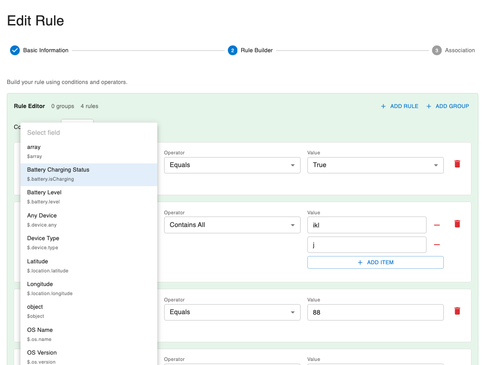

# Rule Fields and Expressions

This guide provides a comprehensive reference for building rule expressions used in both policies and restrictions.

## Overview

Rules are built using **fields**, **operators**, and **values**. The rule engine evaluates these expressions to determine whether a policy or restriction matches.

**Basic Structure**:
```
field operator value
```

**Example**:
```
$.device.type equals "agent"
```

## Available Rule Fields

Rule fields represent properties of devices, software, and other system entities. Fields are dynamically registered by devices during discovery and stored in the system's rule field registry.

### How Rule Fields Work

**Field Registration**:
- Devices report their available fields during discovery using the `supportedFields` property
- Each field includes a name, type, optional label, and optional description
- The server automatically registers new fields in the `rule_fields` database table
- Once registered, fields become available for use in policy and restriction rules

**Field Types**:
The system supports the following field data types:
- `string`: Text values (e.g., "Linux", "production", "device-123")
- `number`: Numeric values (e.g., 16384, 4.5, 100)
- `boolean`: True/false values (e.g., true, false)
- `object`: Complex nested objects (advanced use)
- `array`: Arrays of values (advanced use)

**Field Naming**:
- Fields can use JSONPath format (e.g., `$.battery.level` for nested properties)
- Simple field names (e.g., `deviceId`, `osType`) are also supported
- Field names are case-sensitive

### Standard Device Fields

These are commonly reported fields that most devices provide:

#### Device Information Fields

These fields describe the device itself:

| Field Name | Type | Description | Example Values |
|------------|------|-------------|----------------|
| `$.os.name` | string | Operating system name| "windows", "macos" |
| `$.os.version` | string | Operating system version | "10.0", "11.0"  |
| `$.location.latitude` | number | Device location latitude | 40.741895 |
| `$.location.longitude` | number | Device location longitude| -73.989308 |
| `$.device.type` | string | Type of device| "agent", "agent_linux" |
| `$.battery.isCharging` | boolean | Indicates whether the device battery is currently charging| true, false |
| `$.battery.level` | number | Current battery level as a percentage (0-100) | 80.0 |
| `$.device.any` | boolean | When set to true, policy evaluation will pass regardless of other conditions. Use this to display components without special checks. | true, false  |


#### Viewing Available Fields

To see all available fields in your system:

1. Navigate to Policies or Restrictions in the Dashboard
2. Click **Create** or **Edit**
3. In the rule builder, click the **Field** dropdown
4. All available fields are listed with descriptions
5. Or navigate to **Settings** → **Rule Fields** (if available)



#### Adding New Fields

**Automatic Addition**:
Fields are automatically added when devices report them during discovery. The agent includes the `supportedFields` array in the discovery message with all fields it can provide.

**Manual Addition**:
Administrators can also manually add fields through the API:

**API Endpoint**: `POST /api/v1/upload/policies/fields` 

**Request Body**:
```json
{
  "name": "customField",
  "type": "string",
  "label": "Custom Field",
  "description": "A custom field for special use cases"
}
```

**Field Properties**:
- `name` (required): Field identifier (e.g., "region", "$.battery.level")
- `type` (required): Data type (string, number, boolean, object, array)
- `label` (optional): Human-readable display name
- `description` (optional): Detailed explanation of the field's purpose

#### Removing Fields

**API Endpoint**: `DELETE /api/v1/upload/policies/fields/{name}` 

**Note**: Removing a field does not delete it from existing rules, but it prevents it from being used in new rules.

#### Field Validation

When creating or updating rules:
1. The system validates that all referenced fields exist in the registry
2. Fields not in the registry will cause rule validation to fail
3. This ensures rules only reference fields that devices can actually provide

### Field Usage in Rules

**Field Reference Format**:
```json
{
  "field": "fieldName",
  "operator": "equals",
  "value": "expectedValue"
}
```

**Examples**:

Simple field:
```json
{
  "field": "$.os.name",
  "operator": "equals",
  "value": "windows"
}
```

Numeric field:
```json
{
  "field": "$.battery.level",
  "operator": "greater-than-or-equals",
  "value": 50
}
```

Boolean field:
```json
{
  "field": "$.battery.isCharging",
  "operator": "equals",
  "value": "true"
}
```

JSONPath field (nested):
```json
{
  "field": "$.battery.level",
  "operator": "greater-than",
  "value": 20
}
```


## Operators

Operators define how field values are compared. Different operators work with different data types.

### Comparison Operators

Used for comparing values:

#### Equals (`equals`)

Checks if field exactly matches the value.

**Syntax**: `field equals value`

**Examples**:
```json
{ "field": "$.device.type", "operator": "equals", "value": "agent" }
{ "field": "$.os.name", "operator": "equals", "value": "windows" }
{ "field": "$.battery.isCharging", "operator": "equals", "value": "true" }
```

**Use Cases**:
- Match specific device types
- Target specific OS types
- Filter by environment

#### Not Equals (`not-equals`)

Checks if field does NOT match the value.

**Syntax**: `field not-equals value`

**Examples**:
```json
{ "field": "$.os.name", "operator": "not-equals", "value": "macos" }
{ "field": "$.device.type", "operator": "not-equals", "value": "agent_linux" }
```

**Use Cases**:
- Exclude specific values
- Block all except certain types
- Negative filtering

#### Greater Than (`greater-than`)

Checks if field is greater than the value (numeric comparison).

**Syntax**: `field greater-than value`

**Examples**:
```json
{ "field": "$.battery.level", "operator": "greater-than", "value": 50 }
{ "field": "$.location.latitude", "operator": "greater-than", "value": 40.0 }
```

**Use Cases**:
- Minimum hardware requirements
- Resource-based filtering
- Version comparison (for sortable version strings)

#### Less Than (`less-than`)

Checks if field is less than the value (numeric comparison).

**Syntax**: `field less-than value`

**Examples**:
```json
{ "field": "$.battery.level", "operator": "less-than", "value": 20 }
{ "field": "$.location.longitude", "operator": "less-than", "value": -70.0 }
```

**Use Cases**:
- Maximum limits
- Blocking on low-resource devices
- Legacy version blocking

#### Greater Than or Equal (`greater-than-or-equals`)

Checks if field is greater than or equal to the value.

**Syntax**: `field greater-than-or-equals value`

**Examples**:
```json
{ "field": "$.battery.level", "operator": "greater-than-or-equals", "value": 80 }
{ "field": "$.os.version", "operator": "greater-than-or-equals", "value": "11.0" }
```

**Use Cases**:
- Minimum requirements (inclusive)
- Version requirements

#### Less Than or Equal (`less-than-or-equals`)

Checks if field is less than or equal to the value.

**Syntax**: `field less-than-or-equals value`

**Examples**:
```json
{ "field": "$.battery.level", "operator": "less-than-or-equals", "value": 30 }
{ "field": "$.location.latitude", "operator": "less-than-or-equals", "value": 45.0 }
```

**Use Cases**:
- Maximum limits (inclusive)
- Resource constraints

### String Operators

Used for string pattern matching:

#### Contains (`contains`)

Checks if field contains the substring.

**Syntax**: `field contains value`

**Examples**:
```json
{ "field": "$.os.name", "operator": "contains", "value": "win" }
{ "field": "$.os.version", "operator": "contains", "value": "11" }
{ "field": "$.device.type", "operator": "contains", "value": "agent" }
```

**Use Cases**:
- Partial string matching
- Finding devices with naming patterns
- Version suffix matching (beta, alpha, dev)

#### Starts With (`starts-with`)

Checks if field starts with the substring.

**Syntax**: `field starts-with value`

**Examples**:
```json
{ "field": "$.os.name", "operator": "starts-with", "value": "mac" }
{ "field": "$.device.type", "operator": "starts-with", "value": "agent" }
{ "field": "$.os.version", "operator": "starts-with", "value": "10" }
```

**Use Cases**:
- Namespace filtering
- Naming convention matching
- Version major version filtering

#### Ends With (`ends-with`)

Checks if field ends with the substring.

**Syntax**: `field ends-with value`

**Examples**:
```json
{ "field": "$.os.name", "operator": "ends-with", "value": "os" }
{ "field": "$.device.type", "operator": "ends-with", "value": "_linux" }
{ "field": "$.os.version", "operator": "ends-with", "value": ".0" }
```

**Use Cases**:
- Domain matching
- Version suffix matching
- Naming convention filtering

#### Matches (`matches`)

Checks if field matches a regular expression pattern.

**Syntax**: `field matches pattern`

**Examples**:
```json
{ "field": "$.os.version", "operator": "matches", "value": "^[0-9]+\\.[0-9]+$" }
{ "field": "$.device.type", "operator": "matches", "value": "^agent(_linux)?$" }
{ "field": "$.os.name", "operator": "matches", "value": "^(windows|macos)$" }
```

**Use Cases**:
- Complex pattern matching
- Version format validation
- Advanced string filtering

**Note**: Regex patterns use standard regular expression syntax. Remember to escape special characters.

### Collection Operators

Used for checking membership in lists:

#### In (`in`)

Checks if field value is in the provided list.

**Syntax**: `field in [value1, value2, ...]`

**Examples**:
```json
{ "field": "$.os.name", "operator": "in", "value": ["windows", "macos"] }
{ "field": "$.device.type", "operator": "in", "value": ["agent", "agent_linux"] }
```

**Use Cases**:
- Multiple value matching
- List-based filtering
- Alternative to multiple OR conditions

#### Not In (`not-in`)

Checks if field value is NOT in the provided list.

**Syntax**: `field not-in [value1, value2, ...]`

**Examples**:
```json
{ "field": "$.os.name", "operator": "not-in", "value": ["linux", "unix"] }
{ "field": "$.device.type", "operator": "not-in", "value": ["agent_legacy", "agent_deprecated"] }
```

**Use Cases**:
- Exclusion lists
- Blacklisting
- Multiple value negation

### Existence Operators

Used for checking if fields exist or have values:

#### Exists (`exists`)

Checks if the field exists and has a non-null value.

**Syntax**: `field exists`

**Examples**:
```json
{ "field": "$.battery.level", "operator": "exists" }
{ "field": "$.location.latitude", "operator": "exists" }
```

**Use Cases**:
- Check if custom field is set
- Require specific properties
- Validate field presence

#### Not Exists (`not-exists`)

Checks if the field does not exist or has a null value.

**Syntax**: `field not-exists`

**Examples**:
```json
{ "field": "$.battery.isCharging", "operator": "not-exists" }
{ "field": "$.location.longitude", "operator": "not-exists" }
```

**Use Cases**:
- Exclude devices with certain flags
- Check for missing properties
- Validate field absence

### Logical Operators

Used for combining multiple conditions:

#### AND (`and`)

All conditions must be true.

**Syntax**:
```json
{
  "and": [
    { "field": "field1", "operator": "equals", "value": "value1" },
    { "field": "field2", "operator": "equals", "value": "value2" }
  ]
}
```

**Examples**:
```json
{
  "and": [
    { "field": "$.device.type", "operator": "equals", "value": "agent" },
    { "field": "$.os.name", "operator": "equals", "value": "windows" }
  ]
}
```

**Use Cases**:
- Combining multiple requirements
- All criteria must match
- Intersection of conditions

#### OR (`or`)

At least one condition must be true.

**Syntax**:
```json
{
  "or": [
    { "field": "field1", "operator": "equals", "value": "value1" },
    { "field": "field2", "operator": "equals", "value": "value2" }
  ]
}
```

**Examples**:
```json
{
  "or": [
    { "field": "$.os.name", "operator": "equals", "value": "windows" },
    { "field": "$.os.name", "operator": "equals", "value": "macos" }
  ]
}
```

**Use Cases**:
- Alternative conditions
- Any criteria matches
- Union of conditions

#### NOT (`none`)

Negates a condition or group of conditions.

**Syntax**:
```json
{
  "none": [
    { "field": "field1", "operator": "equals", "value": "value1" }
  ]
}
```

**Examples**:
```json
{
  "none": [
    { "field": "$.battery.isCharging", "operator": "equals", "value": "false" }
  ]
}
```

**Use Cases**:
- Inversion of logic
- Negating complex conditions
- Exclusion logic

## Building Complex Rules

### Simple Rule Example

Match Windows devices:

```json
{
  "field": "$.os.name",
  "operator": "equals",
  "value": "windows"
}
```

### AND Rule Example

Match Windows devices with battery level above 50%:

```json
{
  "and": [
    {
      "field": "$.os.name",
      "operator": "equals",
      "value": "windows"
    },
    {
      "field": "$.battery.level",
      "operator": "greater-than-or-equals",
      "value": 50
    }
  ]
}
```

### OR Rule Example

Match devices running Windows or macOS:

```json
{
  "or": [
    {
      "field": "$.os.name",
      "operator": "equals",
      "value": "windows"
    },
    {
      "field": "$.os.name",
      "operator": "equals",
      "value": "macos"
    }
  ]
}
```

### Nested Rule Example

Match agent devices running Windows or macOS:

```json
{
  "and": [
    {
      "field": "$.device.type",
      "operator": "equals",
      "value": "agent"
    },
    {
      "or": [
        {
          "field": "$.os.name",
          "operator": "equals",
          "value": "windows"
        },
        {
          "field": "$.os.name",
          "operator": "equals",
          "value": "macos"
        }
      ]
    }
  ]
}
```

### Complex Nested Example

Match devices meeting multiple criteria:

```json
{
  "and": [
    {
      "or": [
        {
          "field": "$.device.type",
          "operator": "equals",
          "value": "agent"
        },
        {
          "field": "$.device.type",
          "operator": "equals",
          "value": "agent_linux"
        }
      ]
    },
    {
      "and": [
        {
          "field": "$.battery.level",
          "operator": "greater-than-or-equals",
          "value": 30
        },
        {
          "field": "$.os.version",
          "operator": "greater-than-or-equals",
          "value": "10.0"
        }
      ]
    },
    {
      "none": [
        {
          "field": "$.battery.isCharging",
          "operator": "equals",
          "value": "false"
        }
      ]
    }
  ]
}
```

This matches:
- (agent OR agent_linux) AND
- (battery level >= 30 AND OS version >= 10.0) AND
- (battery IS charging)

## Common Rule Patterns

### Pattern 1: Device Type Filtering

Target specific device types:

```json
{
  "field": "$.device.type",
  "operator": "in",
  "value": ["agent", "agent_linux"]
}
```

### Pattern 2: OS and Battery-Based

Different rules for different operating systems with battery requirements:

```json
{
  "and": [
    { "field": "$.os.name", "operator": "equals", "value": "windows" },
    { "field": "$.battery.level", "operator": "greater-than-or-equals", "value": 50 }
  ]
}
```

### Pattern 3: Version Range

Allow OS versions within a range:

```json
{
  "and": [
    { "field": "$.os.version", "operator": "greater-than-or-equals", "value": "10.0" },
    { "field": "$.os.version", "operator": "less-than", "value": "12.0" }
  ]
}
```

### Pattern 4: Exclusion List

Block specific device types:

```json
{
  "field": "$.device.type",
  "operator": "not-in",
  "value": ["agent_legacy", "agent_deprecated", "agent_test"]
}
```

### Pattern 5: Battery Requirements

Require minimum battery level and charging:

```json
{
  "and": [
    { "field": "$.battery.level", "operator": "greater-than-or-equals", "value": 50 },
    { "field": "$.battery.isCharging", "operator": "equals", "value": "true" }
  ]
}
```

### Pattern 6: Location-Based Restrictions

Limit devices based on location:

```json
{
  "and": [
    {
      "field": "$.location.latitude",
      "operator": "greater-than",
      "value": 40.0
    },
    {
      "field": "$.location.longitude",
      "operator": "less-than",
      "value": -70.0
    }
  ]
}
```

### Pattern 7: Display Without Checks

Display components without special conditions:

```json
{
  "field": "$.device.any",
  "operator": "equals",
  "value": "true"
}
```

### Pattern 8: OS-Specific

Different rules for different operating systems:

```json
{
  "and": [
    { "field": "$.os.name", "operator": "equals", "value": "windows" },
    { "field": "$.os.version", "operator": "greater-than-or-equals", "value": "10.0" }
  ]
}
```

### Pattern 9: Legacy OS Version Blocking

Block old OS versions:

```json
{
  "and": [
    { "field": "$.os.name", "operator": "equals", "value": "windows" },
    { "field": "$.os.version", "operator": "less-than", "value": "10.0" }
  ]
}
```

### Pattern 10: Charging Device Requirements

Require devices to be charging:

```json
{
  "and": [
    { "field": "$.battery.isCharging", "operator": "equals", "value": "true" },
    { "field": "$.battery.level", "operator": "greater-than", "value": 20 }
  ]
}
```

## Value Types and Formats

### String Values

Enclosed in quotes:
```json
"value": "StringValue"
```

Case-sensitive by default (depends on operator and field).

### Numeric Values

Not enclosed in quotes:
```json
"value": 12345
```

Used for memory, CPU cores, disk space, etc.

### Boolean Values

Use string representation:
```json
"value": "true"
```
or
```json
"value": "false"
```

### Array Values

For `in` and `notIn` operators:
```json
"value": ["value1", "value2", "value3"]
```

### Version Strings

Versions as strings:
```json
"value": "1.2.3"
```

Comparison depends on whether semantic versioning is supported.

## Testing Rule Expressions

### Manual Testing

Test rules manually:

1. Create policy/restriction as inactive
2. Activate on test device
3. Check evaluation results in logs
4. Verify expected behavior
5. Adjust rule if needed

### Common Testing Scenarios

**Test Device Properties**:
- Set known device properties
- Create rule matching those properties
- Verify it evaluates correctly

**Test Edge Cases**:
- Empty strings
- Null values
- Missing fields
- Boundary values (0, negative numbers)

**Test Complex Logic**:
- Test each branch of OR conditions
- Verify AND conditions require all to match
- Test nested conditions thoroughly

## Best Practices

### Keep Rules Simple

- Prefer simple rules over complex nested rules when possible
- Break complex logic into multiple simpler policies/restrictions
- Use readable field and value names

### Use Appropriate Operators

- Use `in` instead of multiple OR conditions for lists
- Use `contains` for substring matching instead of regex when possible
- Use `greater-than-or-equals`/`less-than-or-equals` for inclusive ranges

### Document Complex Rules

- Add clear descriptions explaining the rule's purpose
- Document why specific values are used
- Note any dependencies or related rules

### Test Thoroughly

- Test rules before activating
- Verify all branches of complex conditions
- Test with real device data
- Monitor initial rollout

### Optimize for Performance

- Put most selective conditions first in AND chains
- Avoid deeply nested conditions when possible
- Use indexed fields when available

### Version Strings

- Use semantic versioning (1.2.3)
- Be consistent with version formats
- Document version comparison behavior

### Custom Fields

- Use descriptive field names
- Document custom field meanings
- Set defaults for custom fields
- Validate field values

## Troubleshooting Rules

### Rule Not Matching

**Check**:
- Field names are spelled correctly
- Values match exactly (case-sensitive)
- Operator is appropriate for the data type
- Device actually has the field set

### Rule Matching Unexpectedly

**Check**:
- Operator logic (equals vs not-equals)
- Nested conditions and logical operators
- String matching (contains vs equals)
- Case sensitivity

### Performance Issues

**Check**:
- Overly complex nested rules
- Inefficient regex patterns
- Too many conditions
- Unindexed field queries

### Syntax Errors

**Check**:
- JSON syntax validity
- Quotes around strings
- Comma placement
- Bracket matching

## Next Steps

- Practice with [Managing Policies](./managing-policies.md)
- Practice with [Managing Restrictions](./managing-restrictions.md)
